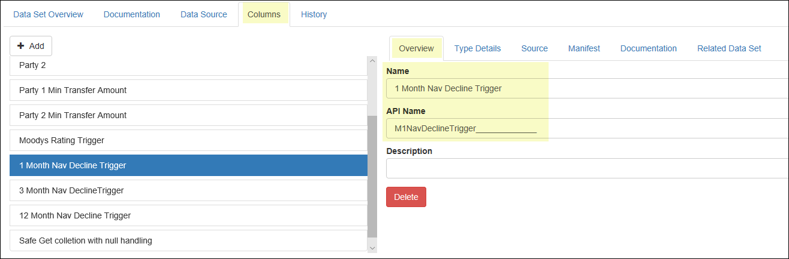

Appendix - API Naming-Conventions
=================================

A few rules help keep the system humming along. When (re-)naming *API Names*, there are a few non-obvious rules that should be followed.

-  Please only use alphanumeric characters and the hyphen (-). Do not use other special characters or spaces.
-  Please do not use 'source' or 'Source' as an *API Name*. The regular *Name* can be called either of these.
-  Please do not start your *API Name* with a number. The regular *Name* field can start with a number. An Example of this would be

-  Plural Names: the system needs both a singular name and a plural name for *Data Sets*. In general, when the system wants to find something, it uses the singular, and if it wants to list something, it uses the plural. Pluralization is typically a systemic function (the system code already uses a pluralizer). However, you may wish to override the generated plural name in some cases.

-  It is recommended, but not required to use camelCase (a.k.a camel caps or medial capitals). This is the practice of writing compound words or phrases such that each word or abbreviation begins with a capital letter. In the **Platform**, as is often the case in programming languages, we start the name of various objects and entities with a lowercase letter, no spaces, and then use an upper case letter for each new word that we want to make part of the name. For example bondYieldMethodology, bookingDate, loan1, bankLoan2 and brokerName.
