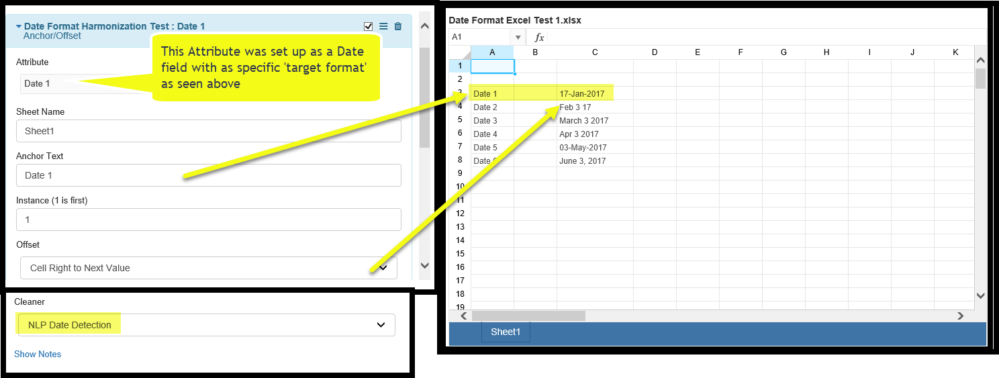
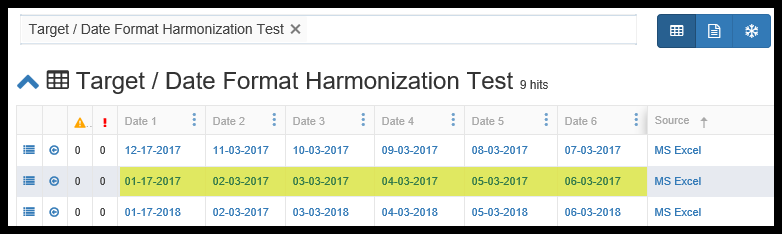

.. _appendix_date:

Appendix - Date and Time Formatting and Parsing Options.
========================================================

Reminder: there is in-app, context sensitive help available while mapping. See Please see :ref:`context` **A 'heads up' notification:**

Date/Time fields have two behaviors, depending on the screen you are on:

1. In the *Document Class Mapping* preview of data\_ or the *Attachment Preview* screens, the date and time will be formatted as specified, but will be sorted as string. Remember, this is just a preview, we have not actually moved the data to the *Target Data Set*.

2. AFTER an *Attach* has been run, if the date mapping was correctly formulated and is being saved to a properly date formatted *Column*, when you search on a *Target Data Set*, the date data type is respected and true date/time sorting is supported.

Date and Time Formatting and Parsing
------------------------------------

The *Pendo Platform* uses the java class DateTimeFormatter thus giving the user a great deal of flexibility in formatting and parsing date and time information. Full documentation of this java class can be found at  <https://docs.oracle.com/javase/8/docs/api/java/time/format/DateTimeFormatter.html>

Note: com.pendosystems.DateHelper has moved and can now be accessed at com.pendosystems.api.doc.DateHelper

Below are the high level formatting options and some examples.

Date and Time Patterns
~~~~~~~~~~~~~~~~~~~~~~

Patterns are based on a simple sequence of letters and symbols. A pattern is used to create or convert a Date or Date/Time into a desired format. For  example, "d MMM uuuu" will format 2011-12-03 as '3 Dec 2011'.

All letters 'A' to 'Z' and 'a' to 'z' are reserved as pattern letters. The following pattern letters are defined:

+--------+---------------------------+--------------+----------------------------------------------+
| Symbol | Meaning                   | Presentation | Examples                                     |
+========+===========================+==============+==============================================+
| G      |era                        |text          |AD; Anno Domini; A                            |
+--------+---------------------------+--------------+----------------------------------------------+
| u      |year                       |year          |2004; 04                                      |
+--------+---------------------------+--------------+----------------------------------------------+
| y      |year-of-era                |year          |2004; 04                                      |
+--------+---------------------------+--------------+----------------------------------------------+
| D      |day-of-year                |number        |189                                           |
+--------+---------------------------+--------------+----------------------------------------------+
| M/L    |month-of-year              |number/text   |7; 07; Jul; July; J                           |
+--------+---------------------------+--------------+----------------------------------------------+
| d      |day-of-month               |number        |10                                            |
+--------+---------------------------+--------------+----------------------------------------------+
| Q/q    |quarter-of-year            |number/text   |3; 03; Q3; 3rd quarter                        |
+--------+---------------------------+--------------+----------------------------------------------+
| Y      |week-based-year            |year          |1996; 96                                      |
+--------+---------------------------+--------------+----------------------------------------------+
| w      |week-of-week-based-year    |number        |27                                            |
+--------+---------------------------+--------------+----------------------------------------------+
| W      |week-of-month              |number        |4                                             |
+--------+---------------------------+--------------+----------------------------------------------+
| E      |day-of-week                |text          |Tue; Tuesday; T                               |
+--------+---------------------------+--------------+----------------------------------------------+
| e/c    |localized day-of-week      |number/text   |2; 02; Tue; Tuesday; T                        |
+--------+---------------------------+--------------+----------------------------------------------+
| F      |week-of-month              |number        |3                                             |
+--------+---------------------------+--------------+----------------------------------------------+
| a      |am-pm-of-day               |text          |PM                                            |
+--------+---------------------------+--------------+----------------------------------------------+
| h      |clock-hour-of-am-pm (1-12) |number        |12                                            |
+--------+---------------------------+--------------+----------------------------------------------+
| K      |hour-of-am-pm (0-11)       |number        |0                                             |
+--------+---------------------------+--------------+----------------------------------------------+
| k      |clock-hour-of-am-pm (1-24) |number        |0                                             |
+--------+---------------------------+--------------+----------------------------------------------+
| H      |hour-of-day (0-23)         |number        |0                                             |
+--------+---------------------------+--------------+----------------------------------------------+
| m      |minute-of-hour             |number        |30                                            |
+--------+---------------------------+--------------+----------------------------------------------+
| s      |second-of-minute           |number        |55                                            |
+--------+---------------------------+--------------+----------------------------------------------+
| S      |fraction-of-second         |fraction      |978                                           |
+--------+---------------------------+--------------+----------------------------------------------+
| A      |milli-of-day               |number        |1234                                          |
+--------+---------------------------+--------------+----------------------------------------------+
| n      |nano-of-second             |number        |987654321                                     |
+--------+---------------------------+--------------+----------------------------------------------+
| N      |nano-of-day                |number        |1234000000                                    |
+--------+---------------------------+--------------+----------------------------------------------+
| V      |time-zone ID               |zone-id       |America/Los_Angeles; Z; -08:30                |
+--------+---------------------------+--------------+----------------------------------------------+
| z      |time-zone name             |zone-name     |Pacific Standard Time; PST                    |
+--------+---------------------------+--------------+----------------------------------------------+
| O      |localized zone-offset      |offset-O      |GMT+8; GMT+08:00; UTC-08:00;                  |
+--------+---------------------------+--------------+----------------------------------------------+
| X      |zone-offset 'Z' for zero   |offset-X      |Z; -08; -0830; -08:30; -083015; -08:30:15;    |
+--------+---------------------------+--------------+----------------------------------------------+
| x      |zone-offset                |offset-x      |+0000; -08; -0830; -08:30; -083015; -08:30:15;|
+--------+---------------------------+--------------+----------------------------------------------+
| Z      |zone-offset                |offset-Z      |+0000; -0800; -08:00;                         |
+--------+---------------------------+--------------+----------------------------------------------+
| p      |pad next                   |pad modifier  |1                                             |
+--------+---------------------------+--------------+----------------------------------------------+
| \'     |escape for text            |delimiter     |                                              |
+--------+---------------------------+--------------+----------------------------------------------+
| \''    |single quote               |literal       |'                                             |
+--------+---------------------------+--------------+----------------------------------------------+
| \[     | optional section starts   |              |                                              |
+--------+---------------------------+--------------+----------------------------------------------+
| \]     | optional Section End      |              |                                              |
+--------+---------------------------+--------------+----------------------------------------------+
| \#     | reserved for future use   |              |                                              |
+--------+---------------------------+--------------+----------------------------------------------+
| \{     | reserved for future use   |              |                                              |
+--------+---------------------------+--------------+----------------------------------------------+
| \}     | reserved for future use   |              |                                              |
+--------+---------------------------+--------------+----------------------------------------------+

The count of pattern letters determines the format.
---------------------------------------------------

Text:
~~~~~

The text style is determined based on the number of pattern letters used. Less than 4 pattern letters will use the short form. Exactly 4 pattern letters will use the full form. Exactly 5 pattern letters will use the narrow form. Pattern letters 'L', 'c', and 'q' specify the stand-alone form of the text styles.

Number:
~~~~~~~

If the count of letters is one, then the value is output using the minimum number of digits and without padding. Otherwise, the count of digits is used as the width of the output field, with the value zero-padded as necessary. The following pattern letters have constraints on the count of letters. Only one letter of 'c' and 'F' can be specified. Up to two letters of 'd', 'H', 'h', 'K', 'k', 'm', and 's' can be specified. Up to three letters of 'D' can be specified.

Number/Text:
~~~~~~~~~~~~

If the count of pattern letters is 3 or greater, use the Text rules above. Otherwise use the Number rules above. **Fraction:** Outputs the nano-of-second field as a fraction-of-second. The nano-of-second value has nine digits, thus the count of pattern letters is from 1 to 9. If it is less than 9, then the nano-of-second value is truncated, with only the most significant digits being output.

Year:
~~~~~

The count of letters determines the minimum field width below which padding is used. If the count of letters is two, then a reduced two digit form is used. For printing, this outputs the rightmost two digits. For parsing, this will parse using the base value of 2000, resulting in a year within the range 2000 to 2099 inclusive. If the count of letters is less than four (but not two), then the sign is only output for negative years as per SignStyle.NORMAL. Otherwise, the sign is output if the pad width is exceeded, as per SignStyle.EXCEEDS\_PAD.

ZoneId:
~~~~~~~

This outputs the time-zone ID, such as 'Europe/Paris'. If the count of letters is two, then the time-zone ID is output. Any other count of letters throws IllegalArgumentException.

Zone names:
~~~~~~~~~~~

This outputs the display name of the time-zone ID. If the count of letters is one, two or three, then the short name is output. If the count of letters is four, then the full name is output. Five or more letters throws IllegalArgumentException.

Offset X and x:
~~~~~~~~~~~~~~~
This formats the offset based on the number of pattern letters. One letter outputs just the hour, such as '+01', unless the minute is non-zero in which case the minute is also output, such as '+0130'. Two letters outputs the hour and minute, without a colon, such as '+0130'. Three letters outputs the hour and minute, with a colon, such as '+01:30'. Four letters outputs the hour and minute and optional second, without a colon, such as '+013015'. Five letters outputs the hour and minute and optional second, with a colon, such as '+01:30:15'. Six or more letters throws IllegalArgumentException. Pattern letter 'X' (upper case) will output 'Z' when the offset to be output would be zero, whereas pattern letter 'x' (lower case) will output '+00', '+0000', or '+00:00'.

Offset O:
~~~~~~~~~

This formats the localized offset based on the number of pattern letters. One letter outputs the short form of the localized offset, which is localized offset text, such as 'GMT', with hour without leading zero, optional 2-digit minute and second if non-zero, and colon, for example 'GMT+8'. Four letters outputs the full form, which is localized offset text, such as 'GMT, with 2-digit hour and minute field, optional second field if non-zero, and colon, for example 'GMT+08:00'. Any other count of letters throws IllegalArgumentException.

Offset Z:
~~~~~~~~~

This formats the offset based on the number of pattern letters. One, two or three letters outputs the hour and minute, without a colon, such as '+0130'. The output will be '+0000' when the offset is zero. Four letters outputs the full form of localized offset, equivalent to four letters of Offset-O. The output will be the corresponding localized offset text if the offset is zero. Five letters outputs the hour, minute, with optional second if non-zero, with colon. It outputs 'Z' if the offset is zero. Six or more letters throws IllegalArgumentException.

Optional section:
~~~~~~~~~~~~~~~~~

The optional section markers work exactly like calling DateTimeFormatterBuilder.optionalStart() and DateTimeFormatterBuilder.optionalEnd().

Pad modifier:
~~~~~~~~~~~~~

Modifies the pattern that immediately follows to be padded with spaces. The pad width is determined by the number of pattern letters. This is the same as calling DateTimeFormatterBuilder.padNext(int).

  - For example, 'ppH' outputs the hour-of-day padded on the left with spaces to a width of 2.

Any unrecognized letter is an error. Any non-letter character, other than '[', ']', '{', '}', '#' and the single quote will be output directly. Despite this, it is recommended to use single quotes around all characters that you want to output directly to ensure that future changes do not break your application.

Examples
--------

Example Formats
~~~~~~~~~~~~~~~

The following examples show how date and time patterns are interpreted in the U.S. locale. The given date and time are 2001-07-04 12:08:56 local time in the U.S. Pacific Time time zone.

+---------------------------------------+--------------------------------------+
|Date and Time Pattern                  |Result                                |
+=======================================+======================================+
|yyyy.MM.dd G 'at' HH:mm:ss z           |2001.07.04 AD at 12:08:56 PDT         |
+---------------------------------------+--------------------------------------+
|EEE, MMM d, ''yy                       |Wed, Jul 4, '01                       |
+---------------------------------------+--------------------------------------+
|h:mm a                                 |12:08 PM                              |
+---------------------------------------+--------------------------------------+
|hh 'o''clock' a, zzzz                  |12 o'clock PM, Pacific Daylight Time  |
+---------------------------------------+--------------------------------------+
|K:mm a, z                              |0:08 PM, PDT                          |
+---------------------------------------+--------------------------------------+
|yyyyy.MMMM.dd GGG hh:mm a              |02001.July.04 AD 12:08 PM             |
+---------------------------------------+--------------------------------------+
|EEE, d MMM yyyy HH:mm:ss Z             |Wed, 4 Jul 2001 12:08:56 -0700        |
|yyMMddHHmmssZ                          |010704120856-0700                     |
+---------------------------------------+--------------------------------------+
|yyyy-MM-dd'T'HH:mm:ss.SSSZ             |2001-07-04T12:08:56.235-0700          |
+---------------------------------------+--------------------------------------+
|yyyy-MM-dd'T'HH:mm:ss.SSSXXX           |2001-07-04T12:08:56.235-07:00         |
+---------------------------------------+--------------------------------------+
|YYYY-'Week of Year 'w-'Week of Month 'W|2001-Week of Year 27-Week of Month 3  |
+---------------------------------------+--------------------------------------+

Special *Mapping Cleaner*
-------------------------

  - There may be times when several different data formats exist in a *Document Set* and you wish to standardize them, thus making it easy to put the ata into a *Target Data Set*. You would then be able to sort on it despite the fact that the original source may have been text or in a different format.

  - The method used is NLP (Natural Language Processing), which is powerful but not foolproof. There is a rich syntax available for this, but you may also be able to take advantage of the **Mapping Cleaner called *NLP Date Detection***.

There are a three simple steps to this.

1. Create a *Column* in a *Target Data Set* and you must be sure the type is set to Date or Date/Time and fill in a format that you want to standardize on.

.. image:: appendix_datetime/12962a5feba03881cb9421c82cbe2870.png

2. In a *Mapping*, use any of the various methods to navigate to a date in your documents. Below, we used 'Anchor Offset' to find the dates in my document and map that to a preformatted column. The same process was used for the other dates, all of a different original format.

3. Once an *Attach* has been run, all dates have been harmonized into the same format as seen below.

Example of Advanced Coding
--------------------------

  Here’s some sample code that uses some of the many tools available in the *Platform*.

  This will search thru an Excel sheet, find a date and reformat it.

-  from com.pendosystems import ExcelHelper
-  from java.time.format import DateTimeFormatter
-  from java.time import LocalDate

-  helper = ExcelHelper(document)
-  ws = helper.getWorkBook().getSheet(“Master”)
-  cell = ws.findCellByRegEx(“30-Nov-2016")

-  inputFormatter = DateTimeFormatter.ofPattern(“d-MMM-yyyy”)
-  date = LocalDate.parse(cell.getValue(), inputFormatter)
-  outputFormatter = DateTimeFormatter.ofPattern(“MM/d/yyyy”)
-  value = outputFormatter.format(date)

-  rows.append({“colA”:value, “colB”:value})

Basically, the solution is just use the Java classes, since all the Java classes are available to the python interpreter.
