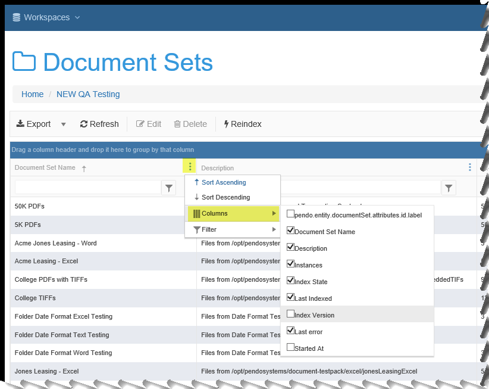

Appendix - High Level Screen State and Behaviors
================================================

*Users* can:

- Select to see display selected *Columns*.
- Select *Columns* on which to sort.
    - you can do primary, secondary, tertiary, etc. sorting as well as ascending/descending.
- Select certain *Columns* to 'Group By'.
- Adjust *Column* widths when using a given grid. When you leave the grid, the *Columns* return to default widths.
- Move *Columns* around.
- When exporting data from a screen, the displayed state is exported (what you see is what you get, a.k.a WYSIWYG).

Resize and Move Popup Screens
-----------------------------

Many screens in the *Platfrom* are popup screens. Many, but not all, of these popup screens are 'modal', meaning it can be resized and / or moved.

  - Movement is done by left-click and hold and drag on the blue topmost part of the window.

  - Re-sizing is done by clicking in the shaded area at the bottom-right of the window.

Column Selection
----------------

You may select which columns appear on your grid. Your available options will depend on the grid being viewed.

-  Click on the |image0| icon in any column header to invoke a menu with many options. Select which sort method you want.

-  Select which columns you would like to see.

*Columns* may also be moved around. With your cursor on a *Column* header, left-click and drag the *Column* to it's new location.

Column Sorting
--------------

Most but not all *Columns* can be sorted on. You can sort *Columns* two different ways.

**Sorting Method 1:**

The first way is the simplest. Click on the |image1| icon in any column header to invoke a menu with many options.

.. image:: appendix_high_level_behaviors/e10c440d90ae5eaa6ffd574001476d3b.png

-  Select Sort Ascending or Sort Descending. The grid will only use the *Column* selected by which to sort.

**Sorting Method 2:**
Using the *Column* header area, you can click just to the left of a *Column* name to invoke sorting of a column.

**Sequence is important**:

  - There is a cycle of ascending ↑, descending↓, and no sort that goes in that order

  - You may perform this on more than one *Column*. The order you do this will dictate which *Column* is primary, secondary, tertiary etc. sort. For example, you may want to sort first by a Date (descending so latest date is up top) and then a Name (ascending so that the rows are alphabetical)

Below, you can see the *Column* ‘Purpose’ was sorted first and is in descending order. The *Column* Name was sorted second and is in ascending order. The *Column* sorted first makes it the primary sort, and *Column* sorted second would make it the secondary sort.

Column Filtering
----------------

Many *Columns* can be filtered to aid in a search or to limit results. You can filter *Columns* two different ways. Both methods have the same effect.

**Filter Method 1:**

Click on the 3 dots icon in a *Column* header and follow that down to your filter options. Mouse over the right arrow by the word ‘Filter’ and select / enter your criteria. Note you can have more than *Column* being filtered at the same time.

**Filter Method 2:**

Click on the Funnel icon, select a filter type and then enter the text in the box to the left of the funnel icon.

**NOTE:** Even though both methods are equivalent, we have added a special filter row to the header for each *Column* that can be filtered and it comes with the funnel icon. This was done to make it very easy to see when one or more columns are being filtered. When we used only Method 1 and there was no filter row, it was not possible to see when a filter was in play.

.. image:: appendix_high_level_behaviors/a667751f94a626abf375969f557260a3.png

Column Width
------------

You may change the *Column* width. As you paginate, the width you select will remain. HOWEVER, when you leave the grid, the *Column* widths will revert to the default width. Move the cursor on the line in-between two columns. You will see the cursor change to:

.. image:: appendix_high_level_behaviors/90c7bbba67daa1b45148911b946871d5.png

On the mouse, Left-click and hold - you may then drag the *Column* divider to whatever size you desire.

Grouping on a grid
------------------

Many but not all *Columns* can be used to 'Group By' the grid. To group a grid by a column, drag each *Column* header to the Group By area at the top. Any given grid may or may not have grouping set up as a default. The default groupings may be simple (one column) or more complex (maybe multiple columns or even requiring coding). In either case, new groupings can be made and default groupings can be dropped or modified for the duration of your screen session.

Below you see a grid that has no grouping. The highlighted area does not show any *Column* names and the instructions are straightforward.

Put your cursor over the *Column* title and left-click-drag to the grouping line as seen below. Below you can see on the right that *Index State* will be made a 'Group By'.

**Hint 1:** To save screen space, since you are grouping by one or more *Columns*, you may wish to stop displaying those *column(s)*.

**Hint 2:** Clicking on the triangle next to a grouped item will collapse/expand the rows for that particular group.

**Hint 3:** Clicking the arrow by the *Column* in the Group By row at the top of the grid determines the sorting of the grouping.

Number of Rows Displayed
------------------------

- Search Grids of *Data Sets* have a default of 20 rows. Options are 10, 20, 50 rows at a time with pagination. For *Document Sets*, you can select from All, 5, 10 or 20 with pagination. Note that sorting works and the results are against the entire result set, not just what you see on the screen. Just remember sorting 50 rows is a bit faster than sorting 500,0000 rows.
- Non-Search Grids that are accessed via clicking on a component have a default display of 20 rows. Options are 5, 10, 20 or ALL rows.
- In a search result gid, the ‘Document Classes’ column has been removed.

Date/ Time Columns in Grids
---------------------------

Date/Time fields have two behaviors, depending on the screen you are on. This is expected behavior of the *Platform*, but could cause confusion for the User.

1. In the *Document Class Mapping* preview of data or the *Attachment Preview* screens, the date and time will be formatted as specified, but will be sorted as string. Remember, this is just a preview, we have not actually moved the data to the *Target Data Set*.

2. AFTER an *Attach* has been run, if the date mapping was correctly formulated and is being saved to a properly date formatted *Column*, when you search on a *Target Data Set*, the date data type is respected and true date/time sorting is supported.

Expected Functionality in each Grid
-----------------------------------

