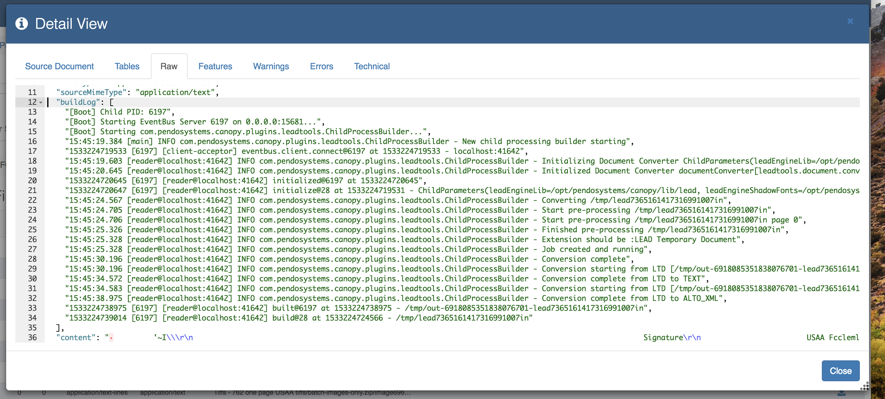

.. role:: raw-latex(raw)
   :format: latex
..
.. _appendix_plugin:

Appendix – Data Plugins
=======================

Introduction
------------


The *Pendo Platform’s* architecture supports *Plugins*. Among other benefits, this allows *Pendo Systems* to both enhance existing features and incorporate brand new functionality, often without needing a full release. This section will walk through some of the different types of *Plugins* and how they fit together and work. A *Plugin* typically focuses around enabling a specific function. Each *Plugin* has a name and a version number. Data related *Plugins* usually support one of the extension points detailed below.

Keep in mind that there is extensive in-app, context sensitive help while mapping for all the *Helper Extensions*. Please see :ref:`contexthelp`.

**IMPORTANT NOTES**

  - When Importing or Editing *Document Sets*, the *Platform* will ensure that at least one *Plugin* is a *Document Builder* so that the *Indexing* will work.
  - There are many cases where you will want to select two *Plugins* that will work together to give you the results you want.
  - Whatever decisions you make about which *Plugins* and any options you select can be changed without you having to import the documents again.

|

Plugin Types
------------

Builder
~~~~~~~

A *Document Builder* is an extension point that allows a *Plugin* to work as part of the indexing process for unstructured data. When any unstructured *Data Source* is being indexed, each data file that is found is passed to all the *Document Builders* that are enabled on the *Platform*. This means that if you have a *Document Set* that has multiple *Plugins* enabled, each *Document Builder* will create its own separate ‘\ *document* instance’ within the index. Usually, only one *Builder* is needed. That *Builder* may or may not need one or more *Enrichers* to accomplish the desired outcome. There may, however, be times where more than one *Builder* is required.

To clarify, a single data file, e.g. a PDF document that has images in it, may have more than one ‘\ *document instance*\ ’ within the index.

Since each ‘\ *document instance’* was created by a different *Document Builder Plugin*, it has different data from or about the original file.


*Indexer*
~~~~~~~~~

An *Indexer* allows a *Plugin* to define the back-end support for storage of *Unified* *Search* indexes.

The **Platform** ships with *ElasticSearch* as part of the core, not as a *Plugin*.


*Enricher*
~~~~~~~~~~

The purpose of a *Document Enricher* is to allow a *Plugin* to add additional information to a *Document Instance*. Each time a *Document Builder* creates a *Document Instance* it is passed to all the registered and enabled *Document Enrichers*. A *Plugin* can register a *Document Enricher*.

For example, you might use a *PDF to Text Extractor’ Plugin* to look at a PDF document to see if the **Platform** can extract all text and store them in the structuredContent section of the *Document Instance*. Another common example of an *Enricher* is a scripting *Plugin* (such as *Groovy* or *Python*), useful when you want to manipulate the *Document Instance* that a *Builder* has created before writing it to the *Indexer*.


Cleaner
~~~~~~~

A *Plugin* can also register any number of *Cleaners* that can be used in *Documents Class Mapppigs*. In general, the *Mapping Value* will be a string value as opposed to a numeric or other type of value. This allows the *Pendo Platform* to keep formatting i.e. a dollar sign. If you wish to reformat dates, extract actual numbers for any reason, including doing math as part of extracting using *Expressions*, you will need to use the correct *Cleaner* or modify it within an expression.

Please see :ref:'cleaners' for much more detail on the types of *Cleaners* available to the *User*.


Other Extensions
~~~~~~~~~~~~~~~~

Other *Plugin Extensions* are not presented directly to the *User* to configure, but are nonetheless present.

Current examples of other *Plugin Extensions* are:

+--------------------+------------------+--------------------------------------+
| Name               | Type             | Description                          |
+====================+==================+======================================+
| OCR Helpers        | Helper Extension | collection of helpers for working    |
|                    |                  | with OCRed Documents                 |
+--------------------+------------------+--------------------------------------+
| Stanford NED       | Trainable Model  | Provides trainable model support for |
| Plugin             | Extensions       | Stanford NER. Stanford NER is a Java |
|                    |                  | implementation of a Named Entity     |
|                    |                  | Recognizer. Named Entity Recognition |
|                    |                  | (NER) label sequences of words in a  |
|                    |                  | text which are names of things, such |
|                    |                  | as person and company names and      |
|                    |                  | locations.                           |
+--------------------+------------------+--------------------------------------+
| Stanford NLP       | NLP Extension    | NLP- Natural Language Processing.    |
| Plugins            |                  | Provides Stanford NLP integration    |
|                    |                  | with the Query Language allowing     |
|                    |                  | things like findType to be used.     |
+--------------------+------------------+--------------------------------------+
| Text helpers       | Helper Extension | A collection of custom *Pendo*       |
|                    |                  | helpers for working with text        |
|                    |                  | documents.                           |
+--------------------+------------------+--------------------------------------+

|

Available Plugins in the UI
---------------------------

Here is a list of available *Plugins* in the *Platform*.


Excel Classification/Parsers (Builder)
~~~~~~~~~~~~~~~~~~~~~~~~~~~~~~~~~~~~~~


This powerful *Plugin* serves multiple purposes. It converts Excel© spreadsheets into cells in structured content by working with the *Document Classes* component. If you are working withspreadsheets and you want to extract data, you must select this *Plugin* and then work with the *Document Classes* component.

This *Plugin* is a special *Document Builder* that is able to turn Excel© files into a hierarchical XML structure that matches the cells from the spreadsheet workbook. This can be used with an ExcelHelper (also part of the same *Plugin*) to script a *Document Enricher* such as *Groovy* or *Python Plugins* to support capturing information from the Excel© spreadsheet into the structured content part of the indexed document instance.

For instruction on how to use this *Plugin*, see :ref:`appendix_excel`.


Groovy (Enricher)
~~~~~~~~~~~~~~~~~
 |groovyplugin|

This plugin adds a *Document* *Enricher* that allows for Groovy scripting. The script will automatically have the document instance created by the builder as a variable you can use in the script called instance.

The Groovy *Plugin* also adds a Groovy *Comparator* and Python *Cleaner* allowing you to use Python to script these functions. The *Cleaner* Groovy script will have a value variable that you can change to represent the cleaned value.

For the *Comparator*, the script needs to return the similarity as a double representation between 0-1.


MS Word Classification/Parsers (Builder)
~~~~~~~~~~~~~~~~~~~~~~~~~~~~~~~~~~~~~~~~

|image2|

Supports *Classification* based on Microsoft Word providing enrichment with intelligent text structure.


OCR Classification/Parsers (Document Builder)
~~~~~~~~~~~~~~~~~~~~~~~~~~~~~~~~~~~~~~~~~~~~~~

This is a very complex *Plugin* as there are many options and many different use case. In many cases, you may need to use another *Plugin* in conjunction with the *OCR Plugin*, usually the `Text Classification/Parsers (Enricher)`_.


**PDF files that have scanned images of text are supported using this Plugin as are other types of image files such as .jpg, .tif, etc.**.

Note that in general, the fewer options selected the faster the processing per document. While a great deal of the processing time required depends on the document characteristics such as if it is a PDF that contains images or text, length of document, quality of images and so on, the OCR options will also impact the time involved.

The order and defaults have been set to reflect, but not restrict you to, the most common use case which is:Many PDF and/or Tiff files are multi-page with embedded images. Also, we assume that gray scale should be used as very few images are pure black and white (two and only two tones of color). The goal in this use case is to perform OCR, output and classify the resulting text.

| The *Plugin* options are:
|

- Remove Horizontal or Vertical Lines Options: You may have boxes around text. If the original results are not satisfactory you may wish to remove vertical lines pre-OCRing.
- Deskew Images: If images inside of the document are more than approximately three degrees from straight, the OCR can run into difficulties. This option can help that use case.
- DPI (Dots per inch): Pendo recommends 600 DPI. Less runs the risk of bad quality images resulting in poor OCRing. Higher will impact time and size of files with little impact on letter identification in the OCR process.
- Auto-Enlarge Images: This option can be useful when images inside of a document are small compared to the size of the document page.
- Image Type: Gray scale should be used as very few images are pure black and white (two and only two tones of color).
- Capture Layout with hOCR: Please only use this option after consulting with Client Services. - Preserve Whitespaces: Keeps the visual aspect of the OCR (spacing between words, sentences, etc.) compared to the original document intact, making it easier for humans to read on-screen.
- Convert PDF Pages (mixed text & images) to Images: Other use case could include documents that have both plain text AND embedded images and a specific need to have both as part of the classification process. Keep in mind that you may want to only OCR on the image, only the text or both. Please consult with Client Services before utilizing this option.
- Save Preprocessed Image Path: As part of the iterative process of making the OCR output as good as possible, it may be useful, when requested, to be able to see intermediates images that are created during the overall process. You will have been asked by Client Services specifically to do this option. These intermediate images will be stored in ‘Files and Folders’. When you enter a path, understand that the server is Linux, therefore you would use forward slashes (‘/’) for a directory or subdirectory name. The following is therefore correct behavior:

  - (**Recommended**) Entering /Tom/Jones creates a two level directory structure. There would be a folder called Tom, under that, a folder called Jones and under that is where the files would go.
  - (**Not Recommended**) Entering ':raw-latex:`\Tom`:raw-latex:`\Jones' would simply create a Folder called ‘Tom:raw-latex:`\Jones`’ and put the files there. Also, please note that after these images have been used, you may, and should, delete them to release the storage space.

- Tesseract Properties (Advanced Users Only): There are many Tesseract properties available for configuration. These can be a bit challenging to wade through. Always feel free to reach out to Client Services for help. Some documentation links are provided below.

|
| https://github.com/tesseract-ocr/tesseract/blob/2cc531e6bf0288fc8a9ad1c123a252395f00bf56/ccmain/tesseractclass.h
|
| https://github.com/tesseract-ocr/tesseract/wiki/Command-Line-Usage
|
| https://github.com/tesseract-ocr/docs/blob/master/tesseracticdar2007.pdf
|
| http://www.sk-spell.sk.cx/tesseract-ocr-parameters-in-302-version
|

-  Enable Caching
   This would be used to help debug OCR results and would be specifically requested by Client Services. This feature allows the platform to write OCR results to disk - you would provide a path where you want to store the OCR results which will be JSON representations of the documents. Files created using this option are written to the server, not *Files and Folders*. In this directory, the *Platform* recreates the source directory structure and store the input file name with the .json extension. As an option that can save time in certain circumstances, you may preserve these files and not create them again in the event of a need to restart indexing of OCR documents.

   -  If checked, the ‘Clear Cache on Start’ sub-option would empty the directory and start from scratch creating the JSON files in the event of a restart.
   -  If turned off, existing files would be kept and new JSON files would only be created for documents not previously processed.

Note 1: Non-Intuitive requirement: The DPI and Image Type options are only used if the ‘Convert PDF Pages to Images’ is used. They are otherwise ignored.

Note 2: **Very Very Important**: If you are not using the ‘Convert PDF Pages to Images’, please be sure to use the ‘Text Classification/Parsers’ plugin IN ADDITION TO the OCR plugin.


PDF to Text (Builder)
~~~~~~~~~~~~~~~~~~~~~

.. image:: appendix-plugins/fe26394561f49c7882d8310bfa4f07a8.png
   :alt:

-  This *Plugin* is geared to those PDFs that do NOT have images in them. Whenever possible, use this option as opposed to the *OCR  Plugin* as it is a big time saver in processing speed.
-  You must also use the *Text Classification/Parser* in order to parse PDF documents. In essence, it is a *Document Builder.* The two options are:

   -  'Maintain Layout': Keeps the visual aspect of the PDF (spacing
      between words, sentences, etc.) compared to the original document
      intact, making it easier for humans to read on-screen.

   -  There are two different ways to process this *Plugin*. To use the
      newest option, leave the 'Use pdftotext Executable' unchecked. This
      option has been kept for backwards compatibility. All releases prior
      to version 4.0.0 used the 'Use pdftotext Executable' code. *Pendo*
      does not want to interfere with existing *Document Classes*. It also
      provides a second option if the results of not using it are not
      satisfactory.


Python (Enricher)
~~~~~~~~~~~~~~~~~
 |pythonplugin|

This *Plugin* adds a *Document Enricher* that allows for Python scripting. The script will automatically have the *document instance* created by the *Document Builder* as a variable called ‘instance’ that you can use in the script.

The *Python Plugin* also adds a Python *Comparator* and Python *Cleaner*, allowing you to use Python to script these functions. The *Cleaner* Python script will have a value variable that you can change to represent the cleaned value.


Simple Keyword Feature Plugin (Enricher)
~~~~~~~~~~~~~~~~~~~~~~~~~~~~~~~~~~~~~~~~
   **NOT CURRENTLY IN USE**


Text Classification/Parsers (Enricher)
~~~~~~~~~~~~~~~~~~~~~~~~~~~~~~~~~~~~~~

|image4|

This *Plugin* supports *Classification* based on text, and enrichment with intelligent text structure.

**This Plugin works in conjunction with Builders such as OCR, PDF To Text and Tika.** For example, using the *OCR Plugin* to create a *Text Document Instance* which is then parsed by this *Enricher*.

The only option for this *Plugin* is the Max Line Length. This has been set with a default of 15,000 characters in order to ensure that the parser will then break up lines that are longer than this to prevent oversized tokens breaking the indexing.

Using the *Text Classification/Parsers* for *Mapping* in a *Document Class* lets you use a Line Query in Markers. In *Mappings*, you may select *RegEx* or *Text Anchor/Offset*. Here you may take advantage of *Text Expressions* as well as a series of more simple navigation options. An example would be 'down().value', meaning go down from the anchor one line and get what is there.


Tika (Builder)
~~~~~~~~~~~~~~

.. image:: appendix-plugins/a123b1be2bf0150a1bf7df7ea0a9518d.png
   :alt:

The *Tika* *Plugin* uses *Apache Tika* to support parsing of a wide range of document types for metadata and content. It is used as a *Document Builder* and pulls all text content from the documents. It can also be configured to extract metadata (such as the author, date of creation, date last modified) into the metadata section of the unstructured document index or extract as XML rather than text.

It should always be used with the `Text Classification/Parsers (Enricher)`_.

Groovy Builder Plugin
~~~~~~~~~~~~~~~~~~~~~

This *Plugin* supports building documents right in the Platform.  Used in conjunction with the existing *Text Classification/Parsers* Plugin, you may create documents with the desired content.  The examples below would create a Document Set, each file of which would contain the word ‘Hello’.


LeadTools Plugin
~~~~~~~~~~~~~~~~

.. image:: appendix-plugins/leadtools.png

This *Plugin* supports the use of LeadTools OCR

Disable SVG conversion
``````````````````````

- This option allows you to disable the LT plugin to determine if the document needs OCRing

Document Object build log when using LeadTools
``````````````````````````````````````````````

As a user, there are times when you may wish to be able to see logging from the build process of any LeadTools Document Object. This can assist so that you can see and share with Client Support any errors or messages from the build process specifically on LeadTools.  This information can be accessed by a Search of any available Document Set that was processed with LeadTools.




ALTO Structure of documentSets
```````````````````````````````

ALTO (Analyzed Layout and Text Object) is a XML Schema that details technical metadata for describing the layout and content of physical text resources, such as, in the case of the Pendo Platform, pages in a Document Set.  It is under functional evaluation by the Pendo Systems.

NOTE: At the moment, using ALTO will significantly increase process time - up to double.

ALTO output consists of three major sections as children of the root <alto> element:

1. <Description> section contains metadata about the ALTO file itself and processing information on how the file was created.
2. <Styles> section contains the text and paragraph styles with their individual descriptions:
    - <TextStyle> has font descriptions
    - <ParagraphStyle> has paragraph descriptions, e.g. alignment information
3. <Layout> section contains the content information. It is subdivided into <Page> elements.

Select the option ’Attach ALTO’ that is in the LeadTools plugin.
The results of the schema, metadata and build log can all be found after a Search of any available Document Set that was processed with LeadTools and had the option turned on after this release.  Open the Detail view, go to the RAW  tab and search (Ctrl-F)  for ‘alto’.


.. |image2| image:: appendix-plugins/0a85681479cda9a8a807bfca32f076ac.png

.. |image4| image:: appendix-plugins/e5a83f8d30849162b2d50c6bf03fbd1f.png
