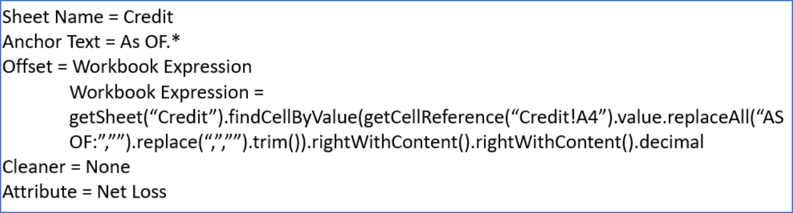

.. _appendix_excel:

Appendix - Excel Plugin and Mapping Information
===================================================

Introduction
------------

The *Excel Classification Parser Plugin* is able to extract the data structure from Excel and then present it back to the **Platform** index for storage. Then, during the  *Classification* process, the *Platform* is able take this structure and expose it in the UI for visualization, the creation of *Markers* and to specify and extract data to *Target Data Sets / Columns* via *Mapping*.

Note: When using the Excel Plugin and using a Mapping of Type = Excel Workbook Expression, Safe Navigation returns a null when unable to handle the expression, allowing more mapping flexibility.

| For example:
|
|       getSheet('cheese')?.find('hello')?.rightToDate()?.getDateHelper()?.format()?: "Missing Date".  
|
| Previously, if this expression was run and there was no date to the right, an exception occurred. Now, by returning a null, we can populate the *Column* or variable with a text such as 'Missing Date'.
|

More Details
~~~~~~~~~~~~

One of the more advanced parts of the extraction process is the use of the internal *Excel Object Model (EOM)*. This Object Model is available both in the *Workbook Expressions* and the *Python* scripting language.

You are able to use either the expression language or Python to traverse the EOM in order to perform more complex queries to extract data.

In app Help
~~~~~~~~~~~~~

**Please remember that there is extensive in-app, context-sensitive help available while mapping for the  Excel Object Model (node movement), Expressions, Helpers and Variables.**

Invoking the Plugin Selection of the Excel Classification/Parsers Plugin
-------------------------------------------------------------------------

You can select this *Plugin* while importing from either *Files and Folers* or *Remote Sources*. Also, when you Edit a *Document Set*, the *Indexing Plugin* tab gives access to all available *Plugins* including this one.

As this *plugin* is a *Builder*, no other *Plugin* is needed for your spreadsheets. Further, the functionality of this *plugin*, as exposed in the *Classification* component, allows you to use Python expressions as  part of an Excel Workbook Expression (explained below) without having to specifically enable the *Python Plugin*.

When selecting this *Plugin*, you have several options. Many, but not all, of the options revolve around memory management for very large spreadsheets as well as optimizing the total processing time,especially when *Importing* a large number of files.

-  **Recalculate Value based on formula**: This forces the **Platform** to re-evaluate formulas before extracting the value. **WARNING**: Only use this if you are sure that all data needed to re-evaluate the formulas exist in the spreadsheet.
-  **Use last cached value**: This tells the **Platform** to use existing cached values for each cell in the spreadsheet. Use this if you are comfortable that the spreadsheet calculations were updated. Also, be sure to use this if data in formulas comes from someplace other than the spreadsheet itself.
-  **Extract Text Representation**: Use if you wish the system to extract the raw data content of the spreadsheet as well as structured data. **Note** that this will double the amount of space used on the **Platform**, so only do this if required to due so by the project on    which you are working.
-  **Password**: If the spreadsheets require passwords to gain access, supply the passwords. Passwords are never visible or retrievable by the UI and are stored encrypted on the server.
-  **Sheet name whitelist (Regular expression)**: This is a spreadsheet display filter based on worksheet names. Use this if you wish to view or classify based on data in specified worksheets rather than entire spreadsheets. Use of RegEx is supported, allowing multiple sheet selection and other logic to decide on what will be imported. For example, entering (Summary\|Sheet2) would display only the sheets named Summary OR Sheet2. The purpose of this option is memory management and time management while importing.
-  **Sheet index whitelist (i.e.1,2)**: This means the **Platform** will only index the listed worksheets. This helps when you have some worksheets that have enormous amounts of data that are not needed for searching or extraction. An example would be enormous spreadsheets that have some worksheets that have lots of data that is not actually needed in the extraction project. Rather, you would be interested in the worksheets that have summary information. This can save considerable indexing time and disk space. Supports positive and negative numbers. For example 1 means first sheet, -1 means last sheet, 2 means second sheet, -2 means second to last sheet.
-  **Maximum Rows to Import**: Clients sometimes have very large spreadsheets. This can create problems when being indexed. The default limit is 100,000 rows of data per spreadsheet. If the *Platform* detects that there are more rows than that, based on the dimensions of the sheets, then it will flag a warning on the document instance and will not try and build the index since once it is in place it abends ElasticSearch.
-  **Maximum Cells to Import**: Clients sometimes have very large spreadsheets. This can create problems when being indexed. The default limit is 100,000 cells per spreadsheet. If the *Platform* detects that there are more cells than that, based on the dimensions of the sheets, then it will flag a warning on the document instance and will not try and build the index since once it is in place it abends ElasticSearch.

**Looking for the formulas ?**

You might notice that there is not a "raw" option for Excel parsing. If you want the formula for a cell you use syntax like this in a workbook expression:  sheets0.getCellReference("B2").formula

Excel *Markers*, *Mapping* and *Cleaners*
-------------------------------------------

*Excel Markers*
~~~~~~~~~~~~~~~~~

If you are dealing with a large quantity of files for a particular project, there is a very good chance that there are variations in the layout that have occurred over time. The more time that has passed since the initial use of the file, and the more users involved, the higher the chances of variations occurring. Examples would be that new rows, new columns and/or new worksheet tabs have been added to a spreadsheet or there may have simply been a reordering of some of the columns.

In order to extract the data you want and only the data you want, care must be taken to take these variations into consideration. This a core concept in play when creating *Document Classes*.

In an different use case, the *Document Set* may contain files from several different clients, lines of business or companies. If your particular project needs to only deal with a subset of the data, *Marker* would be used as to filter the *Document Set*

*Markers*  as explained in :ref:`marker`, are used to uniquely identify a sub-set of the files, in this case spreadsheets. You may use one or more *Markers*, however one *Marker*, even if complex, is usually all that is needed.

| There are three types of *Markers* currently supported:

 - **Excel Fixed Reference** – meaning that the specified  reference cell within a specified Sheet must contain exactly the value that is in the ‘Target Value’.

 - **General Query Marker** - placeholder.

 - **Regular Expression Cell and Values** – meaning that you may write Regular Expressions (RegEx) in either or both of the *Reference* or *Target Value* fields. Please go to '<http://www.regular-expressions.info>'_ for all available syntax options. This has a very powerful and feature rich syntax. Please be sure to select **Java** as the flavor of RegEx.

Select which of these types of *Markers* you wish to use via the dropdown box and then click the + sign.

You may use as many *Markers* as needed to classify a group of files. You will get immediate feedback on how many documents would be classified by the *Markers* you have made by noticing the tab heading *Document Preview (x/y)*.

AND vs. OR logic for *Markers*
~~~~~~~~~~~~~~~~~~~~~~~~~~~~~~

| Multiple *Markers* are joined logically by 'AND', i.e. *marker1* AND *marker2* must be true for a match. You may want to use 'OR' logic. This can be done within a RegEx. The syntax is
| sheet!(part1\|part2\|part3)

| For example, in the 'Reference' box
  - Reference: Master!D2:D2 - Target Value: Acme.\ *\|Kroger.*\ \|"Whole Foods".\* means look in the Sheet called 'Master', cell D2. If that cell contains a string that starts with 'Acme' OR 'Kroger' OR 'Whole Foods', include them for the classification process.
|
| **THIS IS ONE OF THE WAYS YOU CAN DEAL WITH VARIATIONS IN FORMATS WHILE STILL USING ONE **CLASSIFICATION.**
|

**Hint:** If you are wondering why some of the documents are not selected, you can go back to the *Document Preview (x/y)* tab and select the *Invert Markers* checkbox. This will show you the documents that will NOT be selected. You can then open them up and see why it would not have been included and then either adjust the *Marker* or create a new *Document Class* for that *Document Set*.

These documents WOULD be included based on the current markers. You can see here that 18/30 documents would be included.

Now we invert the *Marker*. These documents WOULD NOT be included based on the current markers. You can see here that 12/30 documents would NOT be included.

Excel Mapping Overview
---------------------------

The end goal of a *Classification* is to extract data from the Excel file to a *Target Data Set* thus making structured data out of unstructured data. Now that we have identified a set of like files, we need to specify that the data that is currently in a Worksheet:Row:Column gets put into Data Set:Column.

Moving to the *Mapping* tab, you have available to you several ways of mapping the data as seen below.

.. image:: appendix-using-excel-plugin/bea3c8a37de93cefcedaa5f7affc5ba9.png

The specifics on usage are a bit different for each type of targeting option. Most of the options can make use of a *Cleaner*. All of the options have you select the specific *Data Set/Column* as the end extraction point of the Excel values.

Excel Dates
----------------

Excel Dates, the number of days since Jan 1, 1900, are supported, even if the source document is not specifically in a cell formatted as an ‘Excel Date’.

For example:

getCellReference("Sheet1!A1").getDateHelper()

can be called on a cell containing just a number and it will automatically convert to date, assuming the number is number of days since Jan 1, 1900.

Excel Hidden Rows and Columns
------------------------------

Although you can still see hidden rows and columns, they are visually distinct. - There is a new option starting in Release 4.0.0 (IgnoreHidden) in some of the expressions in the DSL for your scripting mappings. NOTE: Existing expressions were not altered to avoid harming any existing Document Classes. These are new expressions.

  - To see help and syntax for this, highlight any Excel Expression mapping, open the help and, in the Context tab, click Context->ExcelCell. This will take you to a list of find expressions, including several that deal with hidden cells such as

ExcelCell findRight (String regex, int nth, boolean ignoreHidden)

Excel Mapping Options
-------------------------

Anchor / Offset
~~~~~~~~~~~~~~~~~~~~~

The idea here is to find some text, move to that cell node and then use that node as an *Anchor* and move to the real target cell, i.e. move to the *Offset*.

- Select the *Target Column*.
- Confirm or change the *Sheet Name* to be searched.
- Type the search string. You may also use a RegEx or spEl expression.
- Enter the number of the *Instance* of the text. This allows you to specify that you want to find the 1st, 2nd, 3rd, etc. occurrence of the search string.
- Select the desired *Offset* from the dropdown. The last option lets you write a RegEx or spEl expression to deal with any needs not provided for by the other selections.

.. image:: appendix-using-excel-plugin/a4819685d7e184872d929e85340d8218.png

Multi-Cell Anchor / Offset
~~~~~~~~~~~~~~~~~~~~~~~~~~~~~~

The ‘Multi-cell Anchor / Offset’ allows the user to deal with the need to anchor using two or more cells that are either horizontally or vertically aligned. For example, you have a spreadsheet with a section that looks like this:

+--------------+--------------+------------------+-----+
| Loan         | Loan         | Loan             | etc.|
+--------------+--------------+------------------+-----+
| Number       | Date         | Officer ID       | etc.|
+==============+==============+==================+=====+
| q-4548123    | 11/17/2017   | 089752           | etc.|
+--------------+--------------+------------------+-----+

Let's say you wish to extract the Loan Officer ID. Before this *Mapping Type* was introduced, when the two words ‘Loan’ and ‘Officer ID’ were adjacent to each other but each in their own cells and you wanted the value underneath, it was difficult and required scripting. The concept is the same when data is horizontally aligned but in different cells.

Now, you can use a ‘Multi-cell Anchor/Offset’ Mapping to provide this capability. You can look for two Anchor Text values: ‘Loan’ and ‘Officer ID’, tell the systems that you are looking for the cells to be next to each other, in this case, vertically, that that you have a desired offset of ‘Cell Down’. This would give you 089752, the Loan Officer ID.

**Note that the two anchor cells must be adjacent and go either from   top-to-bottom or left-to-right.**

Excel Fixed Reference
~~~~~~~~~~~~~~~~~~~~~~~~~~~~~~

Works the same as in *Markers*. Exact matching only.

Excel Workbook Expression
~~~~~~~~~~~~~~~~~~~~~~~~~~~~~~

Advanced formula and math capabilities. The available options for syntax and functions are discussed below.

Fixed Value
~~~~~~~~~~~~~~~~~~~~~~~~~~~~~~

Very useful for tracking various metadata items that are not actually in the document such as the file name, *Classification Name*, etc. and even enables using an *Approved List of Values*. Please see :ref:`appendix_fixed`.

Python Expression (with Excel Workbook)
~~~~~~~~~~~~~~~~~~~~~~~~~~~~~~~~~~~~~~~~~~~~

Use Python scripting to search and extract data. Advanced option.

.. image:: appendix-using-excel-plugin/2f88544d36c276a7ec23f32805405546.png

Groovy Script (Column)
~~~~~~~~~~~~~~~~~~~~~~~~~~~~~~

Allows the user to write scripts directed at a *Column*. Advanced option.

Groovy Script (Row)
~~~~~~~~~~~~~~~~~~~~~~~~~~~~~~

Allows the user to write scripts directed at an *Data Set*. Advanced Option.

Groovy Script (Loop)
~~~~~~~~~~~~~~~~~~~~~~~~~~~~~~

Looping and Conditional Logic is now supported in *Mappings*.

Previous to Release 4.0.0, if there was a conditional logic or the need to loop over a set of mappings (such as mapping rows for a table) you were forced to use a script or row mapping. This made it harder to see and understand what is happening since the logic can become opaque.

Now, you can create logic loops. This is done through an implementation of new Mapping Types. This includes a ‘Groovy Script (Loop)’ and a ‘Excel, Text or Word' Expression (Loop)’. The expression returns either a list of objects or a boolean value.

* After creating a main Loop mapping, you are able to add ‘child mappings’, which can include another loop, variables, scripts or mappings that populate columns or rows.
* When you return a list of objects, your child mappings are called once for each object. You are then able to choose a variable name that will be set in the variables for each run.
* If you return a boolean from the expression, then the platform will execute the child mappings once if it is True or not at all if False.
* If you update an existing variable in a loop then its value is maintained and can be iterated properly between mappings. Note, ‘new’ variables declared within the loop variables will reinitialize during each iteration.
* Iterating variables now reflect the mapping values (seen on left side of screen under each mapping when you are enable ‘Show Mapping Paths’) in the order of iteration as does the log. Previously, the mapping values did not shop up in order.

Regular Expression
~~~~~~~~~~~~~~~~~~~~~~~~~~~~~~

Works the same as in *Markers*. JAVA RegEx syntax is supported. Advanced Option.

Triangulated Data Set
~~~~~~~~~~~~~~~~~~~~~~~~~~~~~~

Using contents of a cell to determine a Row Header and a Column Header, find the cell that intersects with that Row and Column.

-  Select the *Target Column*.
-  Select the Sheet Name to be searched.
-  Enter in the text to look for that will define the search row. JAVA RegEx is also supported.
-  Specify if you are searching for the 1st, 2nd, etc. occurrence of the text to define the row.
-  Enter in the text to look for that will define the search column. JAVA RegEx is also supported.
-  Specify if you are searching for the 1st, 2nd, etc. occurrence of the text to define the column.
-  The **Platform** will find the intersection of the row and the column to determine the value found - triangulation.

.. image:: appendix-using-excel-plugin/ceea2ce9773170449dbc7a291faeca44.png

Mapping Errors
----------------

If you enter an invalid expression, will see the exception flag when looking at any grid and get the full details by opening a *Detail Screen* and going to the *Errors* or *Warnings* tab.

*Cleaners*
------------

If desired, you may also employee a *Cleaner* after you have navigated to the desired cell. The available options for *Cleaners* are:

Workbook Expression
~~~~~~~~~~~~~~~~~~~~

Get the value in the specified cell(s) and perform advanced formatting or math. The available options for syntax and functions is discussed below.

Convert to Decimal
~~~~~~~~~~~~~~~~~~~

As data is by default extracted as a string, if you wish to extract the numbers into a *Column* that is numeric, use this option. This will also cleanup extra decimal characters (e.g. 123.123.67 will be converted to 123123.67)

Trimmed
~~~~~~~~~~~~
Remove all blank spaces at the beginning and end of the value.

Change Date Format
~~~~~~~~~~~~~~~~~~

If you have found a date, use this option to reformat the date as needed.

NLP Date Detection
~~~~~~~~~~~~~~~~~~~
When you set up *Target Data Set*, you may specify that a *Column* be a Date column and specify the target date format, for example MM/dd/yyyy. When this cleaner has a value, it will try to determine if is a date in any of several formats using Natural Language Processing (NLP).

|
| For example, the *Cleaner* would recognize
|   Jan 12, 2018
|   January 12, 2018
|   01/12/18
|   01/12/2018 and
|   1/12/2018
|   as valid dates, no matter the format.
|

Convert to upper case
~~~~~~~~~~~~~~~~~~~~~~~~~~
Converts the value to all upper case.

Convert to lower case
~~~~~~~~~~~~~~~~~~~~~~~~~~~~~

Converts the value to all lower case.

Capitalize
~~~~~~~~~~~~~~~

Capitalizes all the whitespace separated words in a string. If a word is hyphenated, the word after the hyphen will also be capitalized. E.g sub-directory becomes Sub-Directory.

Capitalize Fully
~~~~~~~~~~~~~~~~~~~~~~~~~~~

Only the first character of each word in a string is made upper case, the rest of each word will become lower case, including hyphenated words. E.g sub-directory becomes Sub-directory.

Excel Object Model (EOM)
------------------------

The EOM is typically available from its root object, which is an instance of ExcelWorkbook. Below that is a simple hierarchical structure:

|
| - ExcelWorkbook
|   - Collection of ExcelSheet
|     - Collection of ExcelRow
|       - Collection of ExcelCell
|         - text-segments
|

Here are the methods that are available for the objects in each level.

ExcelWorkbook
~~~~~~~~~~~~~~

The root object is basically a collection of sheets, which are available as a list.

+-------------------------------------------------------------------------------+------------------------------+
| Goal                                                                          | Syntax                       |
+===============================================================================+==============================+
|Determine if the value could be number by removing non-numeric (except period) | boolean isNumeric()          |
+-------------------------------------------------------------------------------+------------------------------+
|Convert the cell value to a big decimal (good for arithmetic)                  | BigDecimal getDecimal()      |
+-------------------------------------------------------------------------------+------------------------------+
|Get the value of the cell                                                      | String getValue()            |
+-------------------------------------------------------------------------------+------------------------------+
|Get the cell to the right of this cell                                         | ExcelCell right()            |
+-------------------------------------------------------------------------------+------------------------------+
|Get the cell to the left of this cell                                          | ExcelCell left()             |
+-------------------------------------------------------------------------------+------------------------------+
|Get the next cell to the right that contains a value                           | ExcelCell rightWithContent() |
+-------------------------------------------------------------------------------+------------------------------+
|Get the next cell to the left with content                                     | ExcelCell leftWithContent()  |
+-------------------------------------------------------------------------------+------------------------------+
|Get the cell up one row from this cell                                         | ExcelCell up()               |
+-------------------------------------------------------------------------------+------------------------------+
|Get the cell down one row from this cell                                       | ExcelCell down()             |
+-------------------------------------------------------------------------------+------------------------------+
|Get the cell at the end of the row this cell is on                             | ExcelCell toEndOfRow()       |
+-------------------------------------------------------------------------------+------------------------------+
|Convert the cell value to a big decimal (good for arithmetic)                  | BigDecimal getDecimal()      |
+-------------------------------------------------------------------------------+------------------------------+

ExcelSheet
~~~~~~~~~~~~

The next object down is ExcelSheet. (May be known to Excel users as Worksheets or Worksheet Tabs)

+--------------------------------------------------------------+----------------------------------------+
| Goal                                                         | Syntax                                 |
+==============================================================+========================================+
|Get a list of rows                                            |List<ExcelRow> getRows()                |
+--------------------------------------------------------------+----------------------------------------+
|Access a cell on the sheet using a standard reference, e.g. A1|ExcelCell getCellReference(String path) |
+--------------------------------------------------------------+----------------------------------------+
|Get a row at a position (zero indexed)                        |ExcelRow getRowAtPosition(int row)      |
+--------------------------------------------------------------+----------------------------------------+
|Get a cell at a specific X Y co-ordinate (zero indexed)       |ExcelCell getCellByXY(int x, int y)     |
+--------------------------------------------------------------+----------------------------------------+
|Find a cell on the sheet using a value                        |ExcelCell findCellByValue(String value) |
+--------------------------------------------------------------+----------------------------------------+
|Find a cell on a sheet using a value regular expression       |ExcelCell findCellByRegEx(String regex) |
+--------------------------------------------------------------+----------------------------------------+

ExcelRow
~~~~~~~~~~

The next level down object is ExcelRow.

+--------------------------------------------------------------+------------------------------------------+
| Goal                                                         | Syntax                                   |
+==============================================================+==========================================+
|Get a complete list of the available cells on the row (note   | List<ExcelCell> getCells()               |
|that this is sparsely populated, only cells with a value exist|                                          |
|here)                                                         |                                          |
+--------------------------------------------------------------+------------------------------------------+
|There are also helpers again at this level to support         | ExcelCell getLastCell()                  |
|accessing the cells. Get the last cell with a value           |                                          |
+--------------------------------------------------------------+------------------------------------------+
|Get the first cell with a value                               | ExcelCell getFirstCell()                 |
+--------------------------------------------------------------+------------------------------------------+
|Get the cell at a specific position (zero indexed)            | ExcelCell getCellAtPosition(int position)|
+--------------------------------------------------------------+------------------------------------------+

ExcelCell
~~~~~~~~~~~

At the lowest level is the Cell object. This has no children but supports many ways in which you are able to navigate the spreadsheet's structure.

+------------------------------------------+-----------------------------+
| Goal                                     | Syntax                      |
+==========================================+=============================+
|Determine if the value could be number by |boolean isNumeric()          |
|removing non-numeric (except period)      |                             |
+------------------------------------------+-----------------------------+
|Convert the cell value to a big decimal   |BigDecimal getDecimal()      |
|(good for arithmetic)                     |                             |
+------------------------------------------+-----------------------------+
|Get the value of the cell                 |String getValue()            |
+------------------------------------------+-----------------------------+
|Get the cell to the right of this cell    |ExcelCell right()            |
+------------------------------------------+-----------------------------+
|Get the cell to the left of this cell     |ExcelCell left()             |
+------------------------------------------+-----------------------------+
|Get the next cell to the right that       |ExcelCell rightWithContent() |
|contains a value                          |                             |
+------------------------------------------+-----------------------------+
|Get the next cell to the left with content|ExcelCell leftWithContent()  |
+------------------------------------------+-----------------------------+
|Get the cell up one row from this cell    |ExcelCell up()               |
+------------------------------------------+-----------------------------+
|Get the cell down one row from this cell  |ExcelCell down()             |
+------------------------------------------+-----------------------------+
|Get the cell at the end of the row this   |ExcelCell toEndOfRow()       |
|cell is on                                |                             |
+------------------------------------------+-----------------------------+
|Convert the cell value to a big decimal   |BigDecimal getDecimal()      |
|(good for arithmetic)                     |                             |
+------------------------------------------+-----------------------------+

Interacting with the helper in a *Workbook Expression*
------------------------------------------------------

*Workbook Expressions* have been introduced in order to make it easier to work with the custom helpers as a way of getting to targeted data and of cleaning that value.

| A *Workbook Expression* is based on the *Spring Expression Language* (spEl). Here is a good link on the subject: <http://docs.spring.io/spring/docs/current/spring-framework-reference/html/expressions.html>.  *spEl* allows for a wide range of functions to be applied quickly and effectively in order to manipulate the data or leverage helpers.

If you are using a *Workbook Expression*, the *Platform* bases the root object as the instance of ExcelWorkbook, therefore you can write expressions as though that object is in context. For example:

::

     sheets[1].getCellReference("A1").value

This expression would use the list of sheets and get the one in position 1 (which is the second sheet in Excel) and then get the cell references by A1 and get the value.

You can also use the cell helpers. For example:

::

    sheets[1].getCellReference("A1").decimal + sheets[1].getCellReference("A2").decimal

All of the helpers on the objects are available from before. You can also use some special helpers for example:

::

    ["Master"]["0"]["-1"]

This would allow you to treat the workbook, sheet and row as a dictionary in order to access the data, and using -1 as a way to get the last cell in the row.

Date Handling in Workbook Expressions
-------------------------------------

Here are several functions that allow you to find or manipulate dates:

+--------------------------------------------------------+
| Description                                            |
+========================================================+
| ``#cell.getDateHelper().lastDayOfMonth().format()``    |
+--------------------------------------------------------+
| ``#cell.getDateHelper().firstDayOfMonth().format()``   |
+--------------------------------------------------------+
| ``#cell.getDateHelper().addMonths(1).format()``        |
+--------------------------------------------------------+
| ``#cell.getDateHelper().addDays(1).format()``          |
+--------------------------------------------------------+
| ``#cell.getDateHelper().addYears(1).format()``         |
+--------------------------------------------------------+

You can use negative numbers in the 'add' function to subtract dates or part of data fields. For example:

``#cell.getDateHelper().addMonths(-1).format()``

You can use JAVA date formats to reformat a date. For example:

``#cell.getDateHelper().format("mmm yyyy")``

You can take a string value and turn it into a date helper. For example:

``getDateHelper("01-05-1900","mm-dd-yyyy").lastDayOfMonth().format()``

Working with Expressions in *Cleaners*
--------------------------------------

You may optionally make use of a *Cleaner* while *Mapping*. When you are working with a *Cleaner*, you would be manipulating a value found from the core *Mapping* in some way. In this case the value that is extracted is the result of your *Mapping* plus the effect of the *Cleaner*.

.. image:: appendix-using-excel-plugin/2e018c23ac8ed00d79864b019df62020.png

**Workbook Expressions** gives the power of RegEx or spEl to be used against the previously found *value*. For example, if you wanted to put dashes in front of and after the *Value* you would enter:

::

     '-'+.value+'-'

**Convert to Decimal** A mapping returns values that are a string by default. This preserves some formatting such as the $ in $10. If you wish to extract the value into a *Target Column* that is numeric, you will need to first convert it to decimal.

**Trimmed** Removes extra spaces the may proceed or trail the desired string.

**Change Date Format** allows you to change the format of a data field to which you mapped. When selected, this option opens additional fields for your use:

+----------------------------+----------------+
| Examples of Date Formats   | Result         |
+============================+================+
| dd-mm-yyyy                 | 15-12-2017     |
+----------------------------+----------------+
| dd/mm/yyyy                 | 15/12/2017     |
+----------------------------+----------------+
| mm-dd-yyyy                 | 12-15-2017     |
+----------------------------+----------------+
| mm/dd/yyyy                 | 12/15/2017     |
+----------------------------+----------------+
| mmm dd, yyyy               | Dec 15, 2017   |
+----------------------------+----------------+

Syntax for Excel expressions
~~~~~~~~~~~~~~~~~~~~~~~~~~~~

There are two syntaxes available to you: Method Syntax and Notation Syntax.

- When you use the Method Syntax, you use parentheses () and the first row or column starts with 0. When you use Notation Syntax, you use straight brackets [] and the first row or column starts with 1.

- Notation syntax may be a bit easier to use for Excel users, but there are a few things it cannot do - like leftWithContent. And the Method syntax lines up with the EOM.

Lots of Examples
----------------

-  These two examples are equivalent:

   Method Syntax: getRowAtPosition(0)

   Notation Syntax: sheets[1][“1”][“1”]

There are certain things that the Method syntax can do that Notation cannot handle - like leftWithContent or sheet[1][“1”].getFirstCell()

-  | Keep in minds that there are difference. For example:
   | sheet[1][“1”][“1”]
   | would return the value in the first cell (the cell at position 1)
   | while
   | sheet[1][“1”].getFirstCell()
   | would return the first cell that has a non-null / non-blank value.

-  Returning a fix value (called a literal) 'hello', or a number 45.

-  Use either method to get the value in the cell at the first position.

+----------------------------------------------------------------------+------------------------------------------------------------------------------------+
|Goal                                                                  |Notation Syntax                                                                     |
+======================================================================+====================================================================================+
|What if I didn't know the sheet name - just that it is the first one? | getSheet(1)['1']['1'].value                                                        |
+----------------------------------------------------------------------+------------------------------------------------------------------------------------+
|What about doing math?                                                | ['Retail']['44']['6'].decimal - ['Retail']['45']['6'].decimal                      |
|What about a cell reference?                                          | getSheet(1)['A1'].value or with row/column broken up gettSheet(1)['1']['A'].value  |
|What about a sheet index?                                             | \[1][1][1].value                                                                   |
+----------------------------------------------------------------------+------------------------------------------------------------------------------------+

+--------------------------+-----------------+
| Popular Cell functions   |                 |
+==========================+=================+
| rightToError             | rightToNumber   |
+--------------------------+-----------------+
| rightToBoolean           | rightToDate     |
+--------------------------+-----------------+

+-------------------------+---------------+
| Popular Row functions   |               |
+=========================+===============+
| firstError              | lastError     |
+-------------------------+---------------+
| firstNumber             | lastNumber    |
+-------------------------+---------------+
| firstBoolean            | lastBoolean   |
+-------------------------+---------------+
| firstDate               | lastDate      |
+-------------------------+---------------+

Workbook level functions:
~~~~~~~~~~~~~~~~~~~~~~~~~~

A sum function at the workbook level.

| * For example:
|      sum(sheets[0].getCellReference("B2"), sheets[0].getCellReference("B11"))
|      which would go to the first sheet and add B2 and B11.
| * If you want to work with the decimal value:
|      sheets[0].getCellReference("B2").numberValue
|      This is the actual number - not the cleaned representation from a string (therefore it must be a number in Excel)
| * Also you have the following workbook functions available.  The examples below all reference the first sheet and cell B2:
|      sheets[0].getCellReference("B2").dateValue
|      sheets[0].getCellReference("B2").booleanValue
|      sheets[0].getCellReference("B2").errorValue
| * SumIf(regEx) which conditionally sums a range of values in Excel document.
| * CountIf(RegEx) - Count the number of cells in the range which meet the criteria.
| * AvgIf(RegEx) -Averages the number of cells in the range which meet the criteria.
| * MaxIf(RegEx) - Determines the maximum numerical value from cells in the range which meet the criteria.
| * MinIf(RegEx) - Determines the minimum numerical value from the number of cells in the range which meet the criteria.

Semi-complex Full Mapping examples
----------------------------------

Here is an example of a spreadsheet that you would get each month. Perhaps a new row is added each month or perhaps the latest info is on the bottom with a trailing 11 months data above. In this case, it does not matter as the approach is the same. We want to extract only the latest information from a spreadsheet each month, not the older data.

The goal is to get a row into a table for each month/year that also has Net Credit Losses and Net Investment Value. Of course we would be doing this for thousands or millions of files, which is the beauty of classification.

.. image:: appendix-using-excel-plugin/ec4a55ee78dbcbf8f5857010fcfa1dbd.png

| Marker: You could use a Regular Expression
|       *Marker*\ = Credit!A4:A4
|       and a *Target Value*\ =AS OF.\*
| This would tell the *Platform* to look at all spreadsheets in the dataset that have a sheet called “Credit” and then see if cell A4 starts with “AS Of”.
|

We would obviously want several mappings including the Date and the Net Credit and Net Investment numbers. Focusing on getting a number, not text, for ‘Net Investment’ we can use an Anchor/Offset Mapping:

In English, the expression means: Go to the Sheet named "Credit" and locate cell A4. It has contents of “AS OF: Month, Day” but we want to strip the AS OF: and the comma and replace those with nothing in order to leave the month and year and then trim to take off any blank spaces at the end. We now have a value that looks like “mmmmmm yyyy”. Now take whatever is in that cell and use it to find that particular month/year combination in the spreadsheet ( findCellByValue) and then go to the right until you find a cell with something in it (not a blank cell), repeat that (rightWithContent) twice, take what is in that cell turn it into a decimal.

Additional Excel *Mapping* functions

Note: There may be more options or some options may change from release to release. Please be sure to
use the in-app help while mapping for all the latest details.

.. image:: appendix-using-excel-plugin/9935cfe93ec8d90f0d8173c9fed56acd.png
