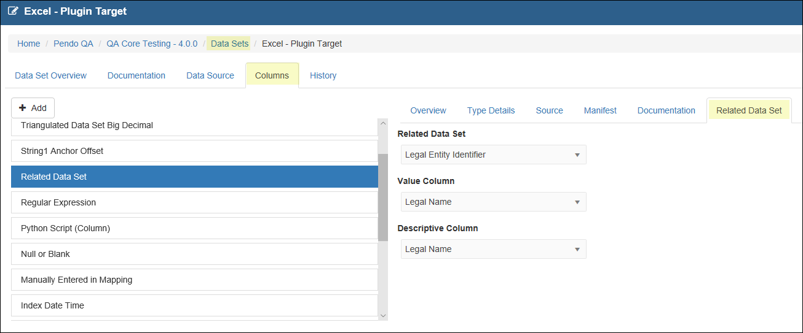

.. _appendix_fixed:

Appendix- Using Fixed Values
=============================

introduction
------------

While *Mapping* a *Document Class*, you will mostly be concentrating on extracting data from *Document Sets*. However, you may sometimes need to input *Fixed Values*. This may take the form of:

  - *Approved Lists of Values* provided to you by an *Administrator*.

  - *Manually Entered* text wanted in the *Target Data Set*.

  - Selecting from several common values such as *File Name, Classification Name*, etc. to aid in auditing, especially when the *Target Data Set* has been extracted from the **Platform**.

The workflow behind using an *Approved List of Values (LOV)* is:

  1. Optional: Import a database that has specific data, i.e. the ‘approved values’, which you want to be part of a *Classification* project.

  2. Set up a *Target Data Set* to receive data being extracted from a *Document Set* as is normal for a *Classification*.

  3. Allow a *User* to link any *Source Data Set Column* imported in Step 1 or any other *Target Data Set* in your *Workspace*.

  4. Allow any *User* to access a *Mapping Type* of *Fixed Values* and select the values set up in the *Target Data Set* using the *Related Data Set* tab..

 The areas of the *Platform* affected by this functionality include:

 • *Remote Sources*
 • *Data Sets/Columns*
 • *Document Class Mappings*

High-Level Workflow for using an *Approved List of Values*
----------------------------------------------------------

Remote Source
~~~~~~~~~~~~~

You may optionally *Create* a *Remote Data Source of Type=Source* which links to a database that contains the approved values in one of its tables. Know which *Data Set/Column* has the values you wish to use.

Data Sets
~~~~~~~~~

As is normal for a *Platform* project, a *Data Set of Type = Target* must be created to receive the data being extracted from the *Document Sets*.

Data Columns
~~~~~~~~~~~~
 The key difference is the use of the *Related Data Sets* tab while *Editing an Column in a Target Data Set*.

1. *Edit* the *Target Data Set* and then *Edit Columns*.
2. When you are creating a *Column* that you wish to be populated from an approved list of values, enter in the normal information on the *Overview* tab and move to the *Related Data Set* tab.

 a. The dropdown for *Related Data Set* will show you all of the *Data Sets* in the *Workplace*. Select the desired *Data Set*. This may be a *Source Data Set* or another *Target Data Set*.

 b. The *Value Column* dropdown displays all the *Columns* in the *Related Data Set*. Select the *Column* that contains the **values** that will be placed in the *Target Data Set* as part of *Document Class Mapping*.

 c. The *Descriptive Column* dropdown displays all the *Columns* in the *Related Data Set*. Select the *Column* that contains the **Displayed Values** that will be seen while *Mapping* a *Classification*.

For example, your source could have a table called "Countries" that looks like this:

+-----------+-------------------+
| **ISO**   | **Description**   |
+===========+===================+
| US        | United State      |
+-----------+-------------------+
| CA        | Canada            |
+-----------+-------------------+
| UK        | United Kingdom    |
+-----------+-------------------+

You may wish to display the **Description** during *Mapping*, but actually store the **ISO** code in the *Target Data Set*. If not, the *Value* and *Display Columns* can be the same.

*Document Class Mapping*
~~~~~~~~~~~~~~~~~~~~~~~~

**You may make use of the Mapping Types of Fixed Value, which is available no matter which type of document you are mapping. There are three main ways in which you use a *Fixed Value*.**

Accessing an Approved List of Values from a *Data Set* {#LOV}

  - Add a *Fixed Value Mapping*.

  - Select a *Target Column* has been set up as *Related to a Data Set* as described above.

  - Select *List of Values / Manual Entry* from the *Type* dropdown.
  - The *Value* dropdown will then show all the values in the *Display Column* for the *Related Data Set* as mentioned above. Select the desired *Value*.

    - If the target data is a date, e.g. *Index Date and Time*, you will be need to enter the desired date format to be stored. Please see :ref:`appendix_date` for various options.

*Manually Entering* a single *Fixed Value*

  - Add a *Fixed Value Mapping*.

  - Select a *Target Column* that has NOT been set up as *Related to an Data Set* as described above.

  - Select *List of Values / Manual Entry* from the *Type* dropdown.

  - You may then type in any desired string.

Other Types of *Fixed Values*
-----------------------------

  The *Platform* also provides for an easy selection of some common *Mapping* needs.

  1. *Full Path*: Useful for showing the full location, including the name, of the source document.

  2. *File Name*: Useful if you just need the name of the source document.

  3. *Index Date and Time*: The date and time when the *Attach Classification*
     was run. **Note: the Target Column must be Type=DateTime for this option to work properly.**

  4. *Classification Name* and *Classification Version* Number: Especially useful when you have multiple *Classifications* populating a *Target Data Set*. You will be able to ascertain which rows got mapped from which *Classification*. **Note: the Target Column*must be Type=Integer for a Classification Version map to work properly.**
