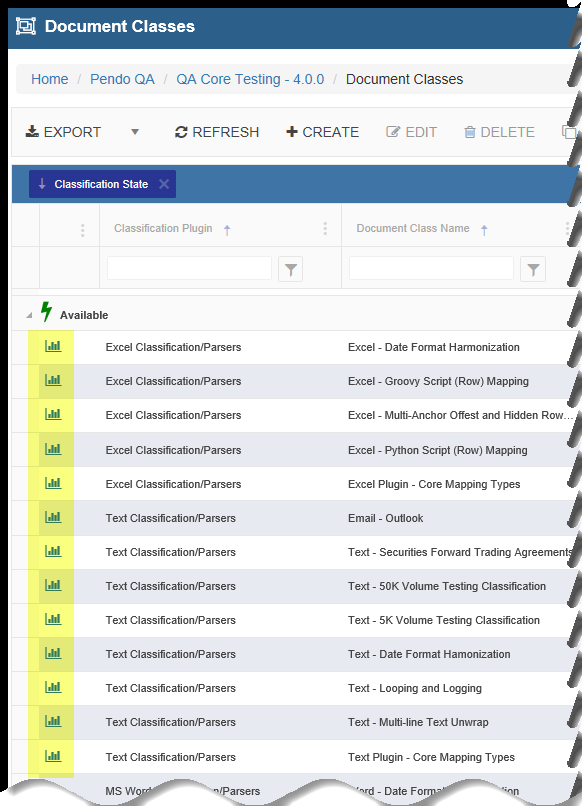
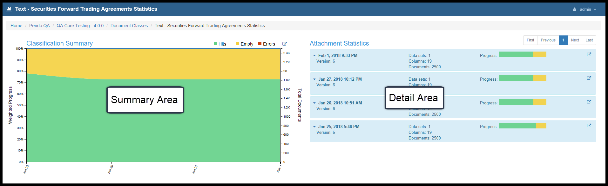
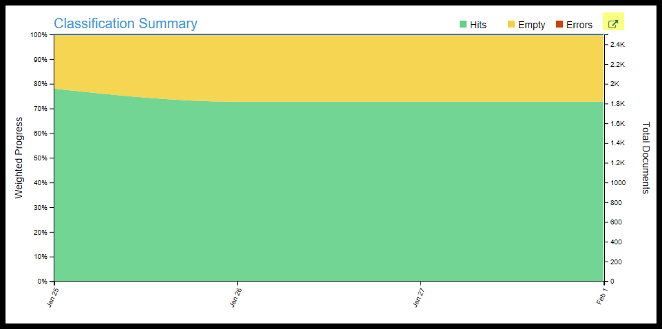
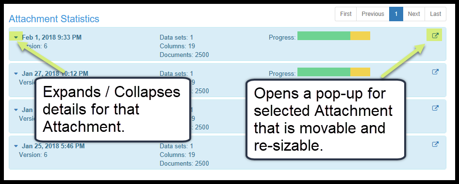
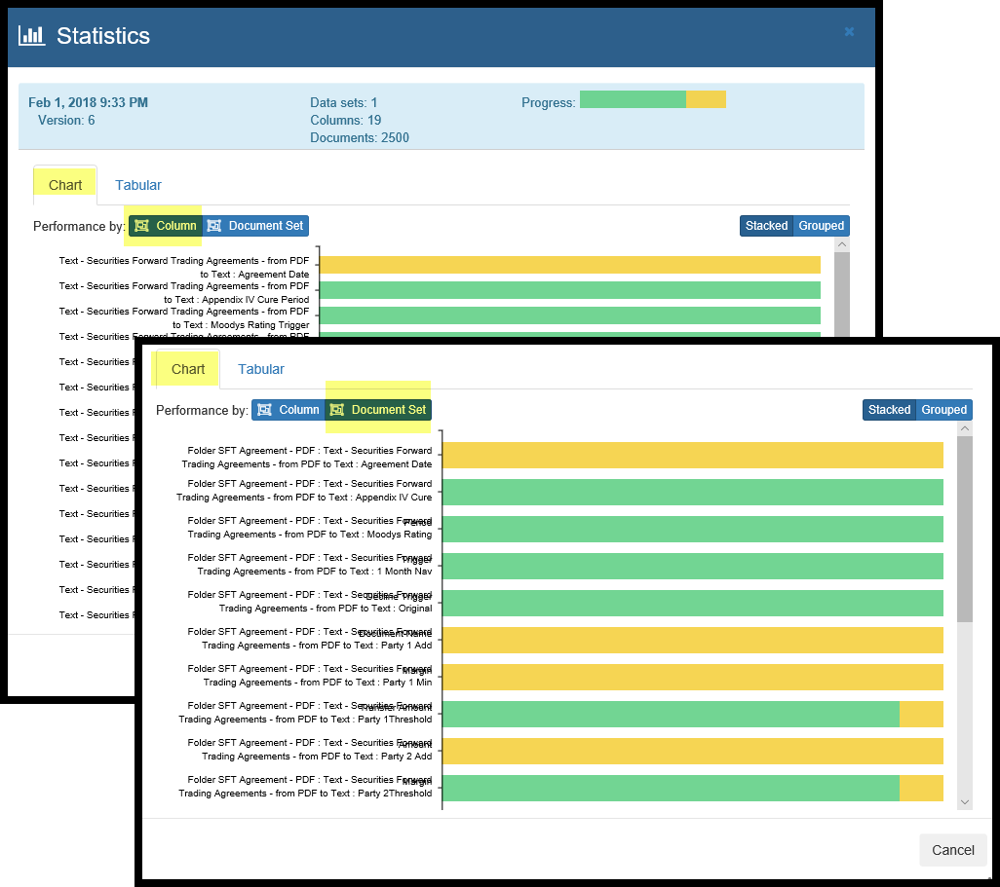
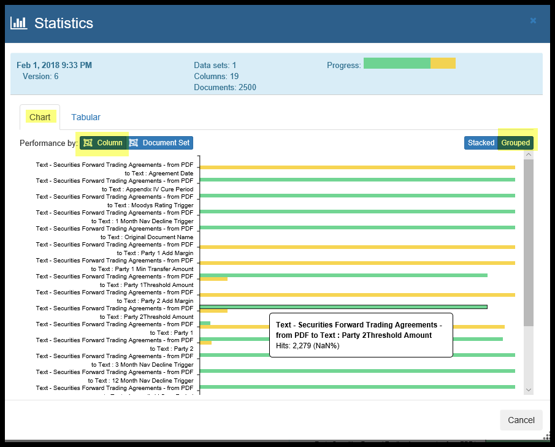
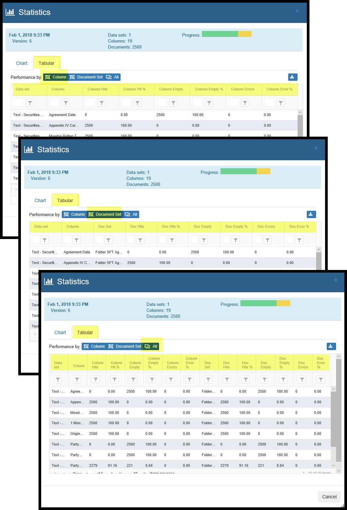
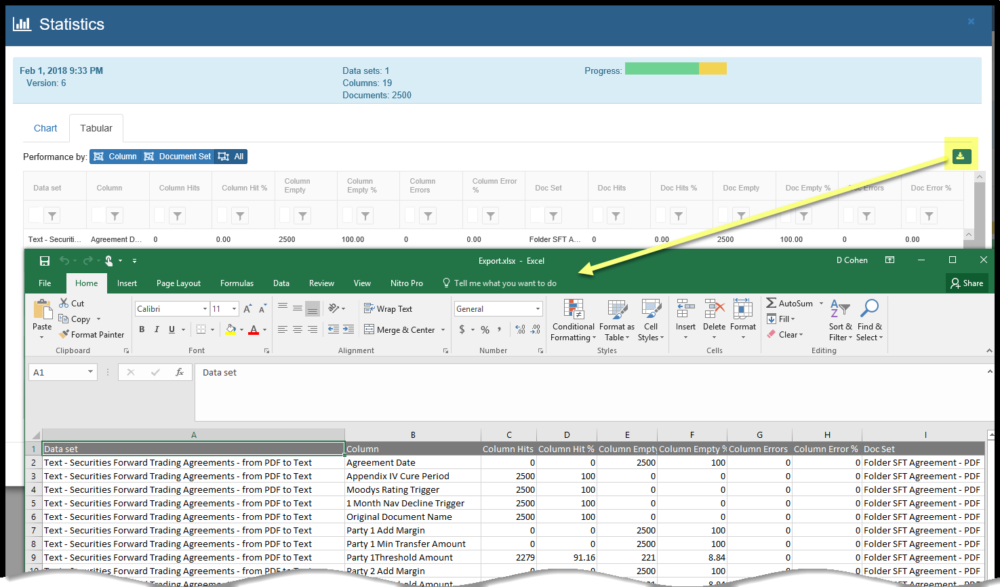

Classification Statistics
================================

Introduction
------------

During the ‘Attach’ process for any *Document Class*, statistics are captured. These statistics can be accessed by clicking the leftmost icon in the *Document Class* grid.

There are two main areas on the main screen:

* *Classification Summary* and
* *Attachment Statistics*.

Classification Summary
------------------------

|
| This is a time-series chart showing trends of key information for each *Attachment* that was completed. A minimum of two *Attaches* are required for a trend to appear.  If only one *Attach* has been run, data points for that date/time will appear. Percentages of Mapping Hits, Empties, Errors, the number of documents processed and the   number of *Target Data Sets* involved over time will be shown in a popup as you mouse over the chart.
|      - Each *Attach* serves as a point on the x-axis.
|      - The highlighted icon at the upper-right is a button that will open a popup screen showing the chart. This popup is modal, meaning it can be resized and / or moved.
| Movement is done by left-click hold and drag on the blue topmost part of the window.
| Re-sizing is done by clicking in the shaded area at the bottom-right of the window.
|

Attachment Statistics
-----------------------

Each time an *Attach* is run, the detailed statistics captured are organized into a tile. These attachment specific statistics can be viewed both graphically and in tabular form. The information in the tabular form can be downloaded into an Excel© spreadsheet for management reporting. Each of these two sections can pop-up into their own windows and be moved and resized as needed to see details more clearly.

*Charting* Statistics options
~~~~~~~~~~~~~~~~~~~~~~~~~~~~~~

Below, one of the 'Attachment Statistics' has been selected tiles and the icon clicked to open the popup window to make it easier to read.

* Movement is done by left-click hold and drag on the blue topmost part of the window.

* Re-sizing is done by clicking in the shaded area at the bottom-right of the window.

Here you can see the Charting options for the *Attachment Statistics*.

The legend is:
  - Green means the *Column* is populated.
  - Tan means the *Column* is empty. Remember that an empty column does not necessarily mean there is an error.
  - Red means there is an error.

You have a couple of choices here:

  - You can look at the graph sorted by *Target Data Set / Columns* or we can sort by *Data Source* and *Document Set*.
  - You can look at the bar graph either Stacked or Grouped:
    - Stacked means that each *Column* takes up one row.
    - Grouped means that each *Column* will have a separate row for Green, Tan, Red (if applicable).

Moving your cursor over any part of the graph row pops up information about that piece of the chart.

*Tabular* Statistics options
~~~~~~~~~~~~~~~~~~~~~~~~~~~~~

* Information can also be displayed in a tabular fashion and downloaded to Excel as desired.
* Below you can see that the tabular option include a focus on:

  * *Column/Data Set* Statistics
  * *Document Set* Statistics or
  * *All*   Statistics

There is also a *Download* button for taking the current tabular display and downloading it to a spreadsheet.

