.. _dataset:

*Data Sets*
=========================

This sub-section of the manual deals with **Data Sets** and the **Columns** within them.

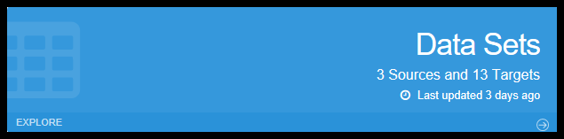

Click *Explore* OR the words 'Data Sets' on the *Data Sets* component. This will take you to the main *Data Sets* grid screen, which lists all the *Data Sets* in your *Workspace*.

Usage
-----

The *Data Sets* component has two main purposes:

* It allows you to see the structure of *Data Sets* and *Columns* that were created when a database or flat file was imported. *Data Sets* created by importing databases are referred to as **Source Data Sets**.
* Allows for user creation, deletion and modification of *Target Data Sets* AND *Columns* which are used to store the data that is extracted from **Documents Sets** during an *Attach* of a *Document Class*.

A *Data Set* represent logical groupings of *Columns*.

* If the original data source was a flat file (e.g. .csv), a single *Data Set* would have been created.
* If the source was a JDBC compliant database, many *Data Sets* were probably created: one *Data Set* per table you elected to *Import*.

*Data Sets*
-----------

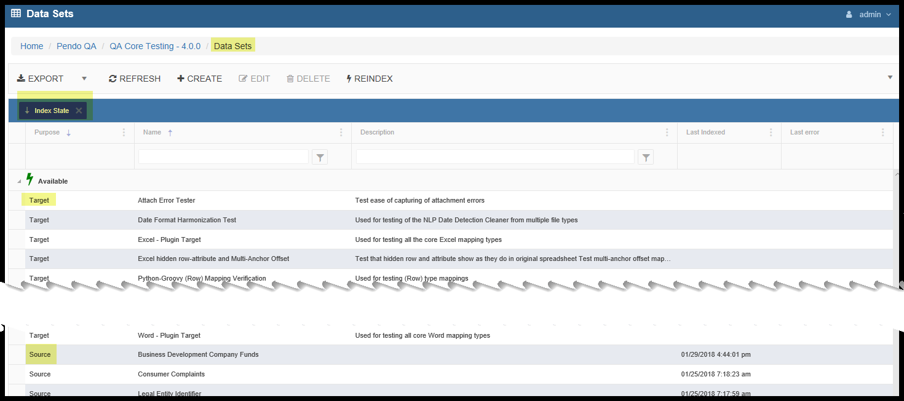

Here you see a grid listing all of the *Data Sets* in your *Workspace*. The grid is 'grouped-by' the Index State and sorted first by Type and then by Name. The various functions available to you depends on the *Roles* you have been assigned. If you need additional permissions, please contact your administrator. *Pendo* does not have any access to adjust *Permissions* on your on-premises installation of the *Pendo Platform*. Cloud-based project control is company specific.

Index States are:

* Available - ready to go.
* Pending / Pending Rebuild - waiting for Index options to be finalized or a Worker to become available so that it can be indexed
* Building - the Index is building. When done, it will become Available.
* Cancelling - when the user requests that the Index action be canceled.
* Failed - when the indexing process fails for some reason or is Canceled.

Select a *Data Set* by clicking on it and then select the desired function.

Refresh
-------

As you are initially indexing or re-indexing (see below), clicking this button refreshes the grid you see. This will help you track the Index State. While manual, this process prevents a lots of client-server traffic that can cause UI issues when large volumes of data are being indexed.

Create *Data Set*
-----------------

This particular function is used in conjunction with *Document Sets* and *Document Classes*. Use of these screens enable *Users* to create and alter *Target Data Sets* and *Columns*. These *User* created *Data Sets* are utilized in the indexing and storage of data that has been extracted from one or more *Document Sets* such as Excel, PDF or Text files during a *Document Class Attach*. See :ref:`document_set`.

The screens you will see are the same as the *Edit Data Set* below with one exception. You will not see the *History* option during a *Create* process. Here you will also *Create Columns* for those *Data Sets*.

Understand that *Data Sets* can also be imported as opposed to being created. When a *Data Set* is *Imported as a Data Source*, you have a choice of what the purpose of the *Data Set* is:

* *Source Data Sets* are populated with data and cannot be altered.
* *Target Data Sets* are empty and simply provide the structure into which you wish to extract data and behave exactly the same as a *Data Set* created using the *Platform*.

Edit *Data Set*
----------------

Below you will see all of the fields on each of the tabs of the Edit screen.

A *Create* tab will not have the *History* tab and will also be a smaller popup window which can be moved around and resized.

The *Edit* tab will be full screen.

*Data Set* Overview Tab
~~~~~~~~~~~~~~~~~~~~~~~~~~~~

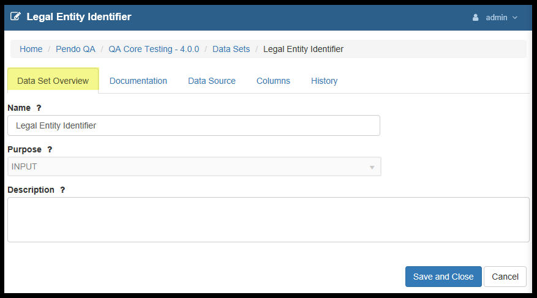

Here you may edit a user friendly *Data Set Name*, see the purpose of the *Data Set (Source (Output)* or *Target (Input)* and optionally add a *Description*.

Documentation Tab
~~~~~~~~~~~~~~~~~~~~

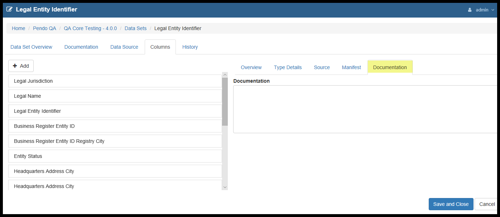

Optional free form text used for your internal purposes.

.. _datasource:

*Data Sources* Tab
~~~~~~~~~~~~~~~~~~~~~~~~~

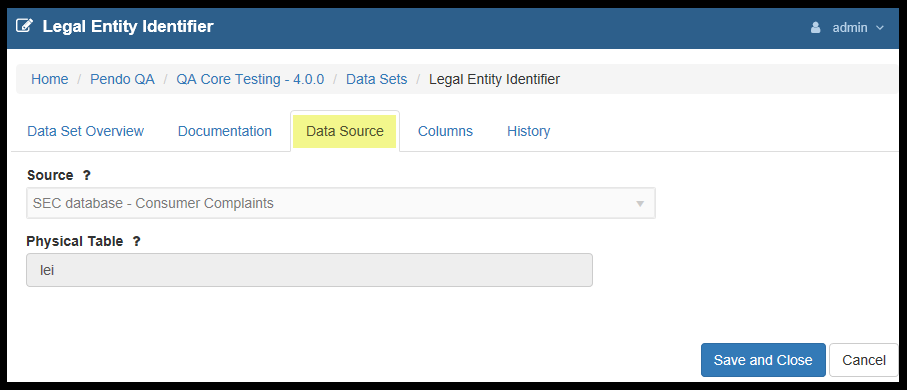

This is where you can see the *Data Source* and the actual *Physical Table* name from which the *Data Set* came if it was imported as a *Source Data Set*. This would be the *File Name* if you *Uploaded* a file, or the *Table* within the JDBC compliant database that was the data source. You cannot modify this.

*Columns* Tab
~~~~~~~~~~~~~~~

*Note:* Please see the :ref:`columns` section below for all sub-screens.

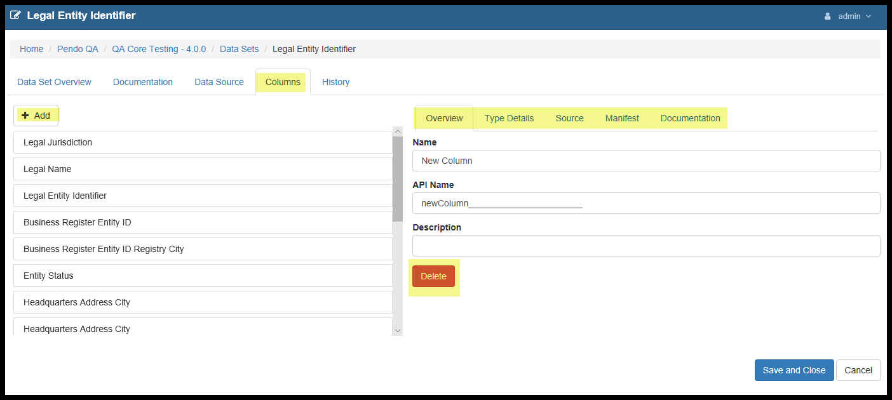

This is where you may review, create, delete or modify information about the *Columns* that are contained in the *Data Set*.

More detail on each of the *Columns* sub-tabs is at linklinklink.

*History*
~~~~~~~~~~

The *Platform* has the ability to keep a history of changes made to a *Data Set* and its *Columns*.

The function is accessed via the *History* tab while *Editing* a *Data Set*.

Note that the *History* will provide a listing of the specific sub-item(s) that changed.

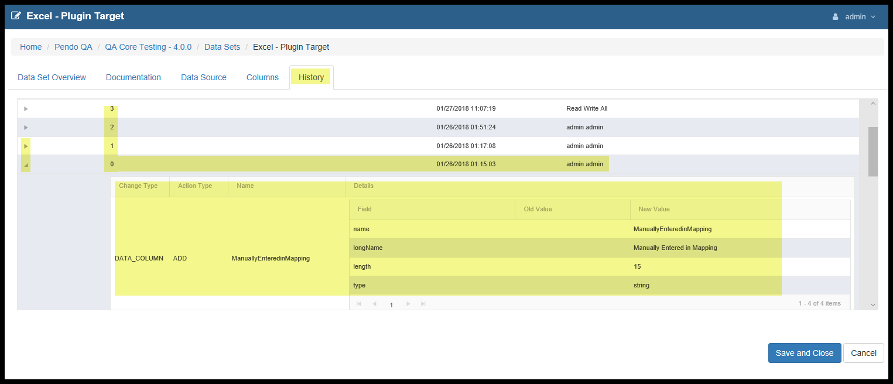

Whenever a *User* makes a change to a *Data Set Name*, *API Endpoint*, or Adds, Removes or Updates a *Column* and clicks **Save and Close**, a new *History* number is generated and the change of state of the *Data Set* is captured in the *History* log.

Items tracked include: the Version Number, Date of Change, User making the Change, the Change Type, Change Action, the name of the fields, the Type of the field and the Old and New Values.

The reader should understand that the concept of keeping a *History* of changes to the *Data Set* encompasses any changes made to the *Columns* of a *Data Set*. What this means is that *Columns* will not have their own *History* numbers, but that the *Data Set History* number will increment when changes are saved. For example, if the *Data Set History* number was 2 and a *User* modifies the length of one of the *Columns*, the new *Data Set History* version number will become 3 and the new *History* log will show what has changed. If you think about this, any change to a part of the *Data Set*, including its *Columns*, modifies the *Data Set* as a whole.

*Duplicate Target Data Set*
~~~~~~~~~~~~~~~~~~~~~~~~~~~

The Duplicate button is used to make a copy of the highlighted Target Data Set.
The new Target Data Set will have the same name as the original with "Copy of" inserted at the beginning of the name. As usual you can go in and edit the name of the Data Set.

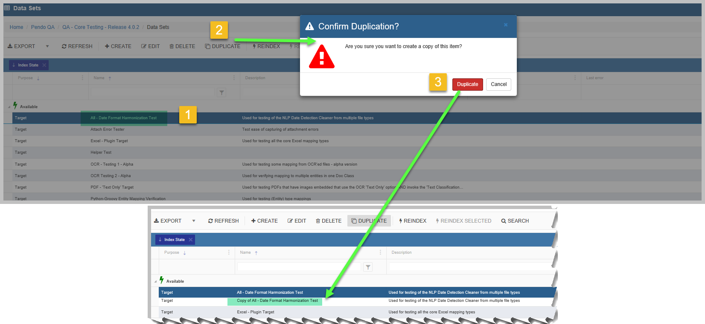

*Reindex Selected*
------------------

As you use the advanced capabilities of various *Plugins*, you may need to *Rebuild Indexes*. To rebuild a single index, highlight the *Data Set* and click '*Reindex Selected*'. When you do a *Rebuild Index*, you will get a popup screen:

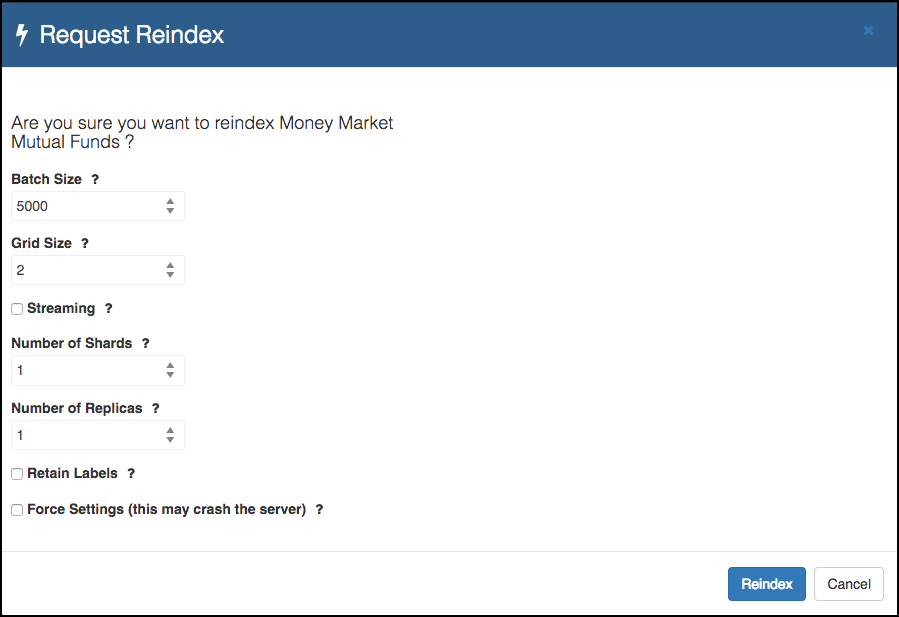

There are several options on this screen.

* *Batch Size*: When dealing with *Document Sets* the *Batch Size* is the number of files that will be brought into memory at one time.

  * The ideal batch size depends on both the amount of memory in the server and the type and sizes of data with which you are dealing. The smaller the individual file sizes and the more memory your server has, the bigger the *Batch Size* can be.
* The *Grid Size* determines the number of simultaneous threads that will be used to process the data. The ideal size will depend on the number of processors your server has and what else may be running on the server at the same time.
* *Shards* and *Replicas* allows you to use the UI to define storage settings at the index level in the platform. This is a key capability as you start to work with larger ElasticSearch clusters. Please do not change the setting for these unless advised by Client Services or you are an expert in ElasticSearch and the Pendo Platform.
* *Retain Labels*. Thru the use of the *Labels* component, you may have marked up documents and assigned various labels with the document. This allows you to clear (leave the checkbox empty) or retain these *Labels*. *Labels* and *Trainable Models* are covered in a different section of this manual.
* *Force Settings*: The *Platform* will look at your entries and validate them. If the numbers entered above are too big, a maximum recommendation will be shown. You may overwrite the *Platform* recommendations, but be aware that this increases the chance that the server will crash due to running out of memory.

*Rebuild Multiple Indices from one screen*
------------------------------------------

Instead of re-indexing one *Data Set* at a time, you may select for multiple *Data Sets* to be re-indexed. As you use the advanced capabilities of various *Plugins*, you may need to *Rebuild Idexes*. To rebuild multiple indices click '*Reindex*'. You will get a popup screen:

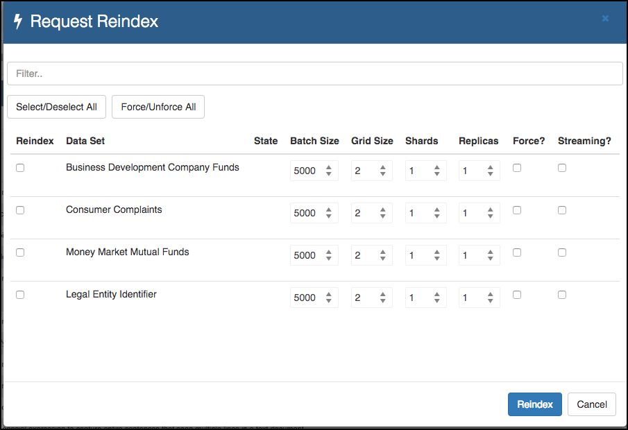

* You many select as many *Data Sets* to be re-indexed as needed. Note that there is a filter box at the top of the screen, allowing you to reduce the number of Data Sets that are displayed.
* The other options are the same as when you index a single *Data Set*.

Searching a *Data Set*
------------------------

As soon as a JDBC database or .csv file is *Imported*, it is automatically run through the *Platform’s Full-Text Search Index Engine* to allow for searching through all data in the Workplace* as if it was one big data source. Please see :ref:`Unified-Search`.

Flushing Data out of a *Data Set*
----------------------------------

You may now flush the contents of a *Source Data Set*, both thru the API and the UI.

Using the API, you can call: - PUT /v1/datasets/{datasetId}?flush

In the UI: - in *Data Sets*, if you highlight a *Source Data Set*, there is a new *Flush* icon.

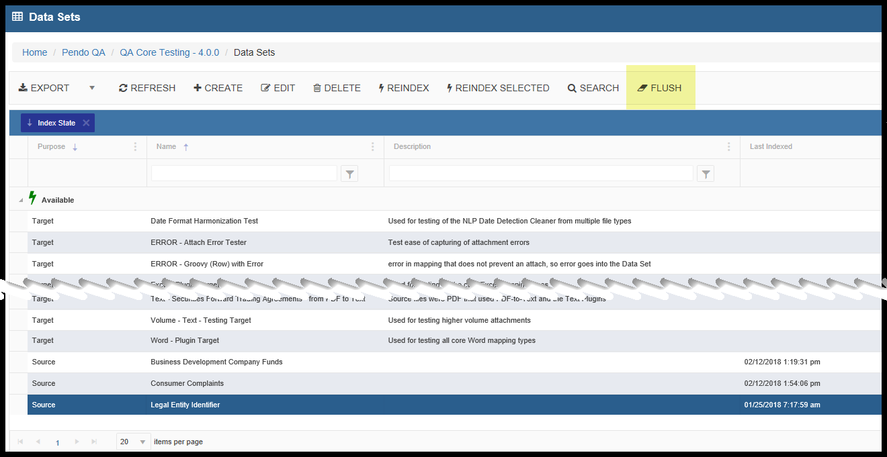

Either of these options will flush (empty) the *Data Set* while preserving its' structure.

The source of the data, a *Remote Sources* has not been altered. You may Reindex the *Data Set* if you wish. All the normal options you have with *Data Sets* are available to you.

Just like when you Reindex a non-flushed *Data Set*, data in any existing *Target Data Set* is not altered by a Flush. To update data in a *Target Data Set*, you must *Attach* a *Document Class*.

.. _columns:

*Columns*
---------

*Columns* are a logical collection of data that are part of the *Data Set* definition. A traditional way to think of this is that *Columns* are the fields to the *Data Sets* tables.

This is where you add, delete or edit the *Columns* of a *Target Data Set*. *Source Data Sets* may not be modified.

*Column* Tabs
-------------

While editing a particular *Data Set*, go to the *Columns* tab.

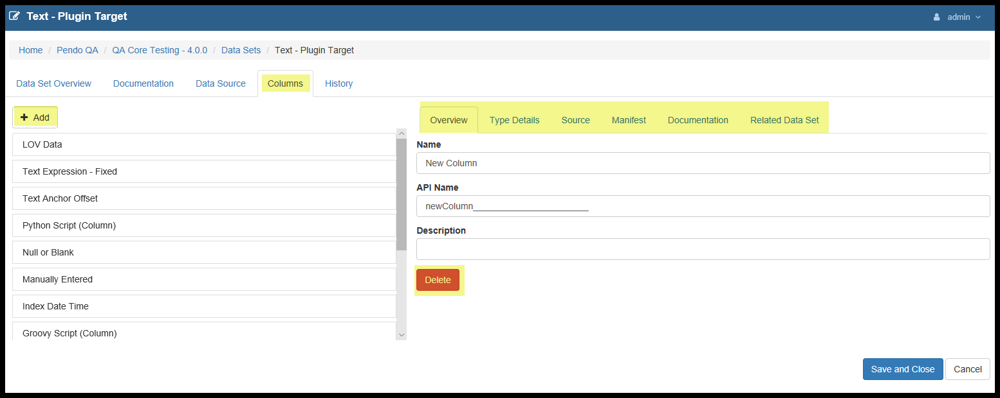

The left side is a list of all of the *Columns* in the *Data Set* and an 'Add' button. The right side is tabular and allows you to access all of the characteristics of the *Column* as well as Delete the *Column*.

Overview Tab
~~~~~~~~~~~~

The Overview tab allows you to add/edit/delete the *Column Name*, *API Name* and *Description*.

Be sure to never start an API Name with a number or to use 'source' or 'Source'.

The user friendly 'Name' field does not have these restrictions.

*Type Details* Tab
~~~~~~~~~~~~~~~~~~

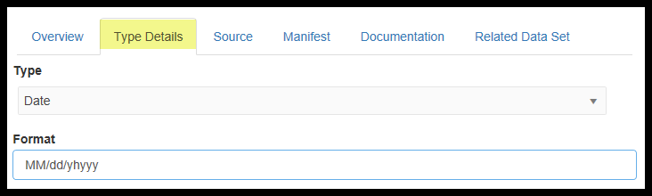

This is where you can see and edit the *Type* of the *Column*. Depending on the *Type*, other characteristics may become available. For example, with Type=String, Length becomes available. For Type=Date, the date format option becomes available.

*Source* Tab
~~~~~~~~~~~~~

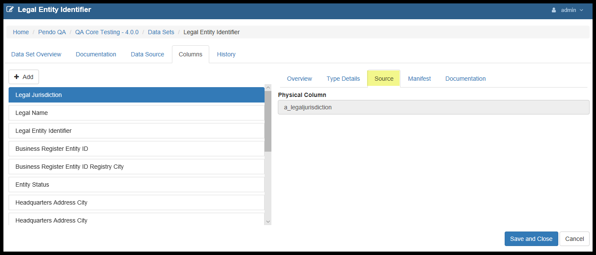

This is where you see the actual column name in the original database table if the *Data Set* was imported as a *Source*. This cannot be modified. If the *Data Set* is a *Target Data Set*, this will be blank.

*Manifest* Tab
~~~~~~~~~~~~~~~~

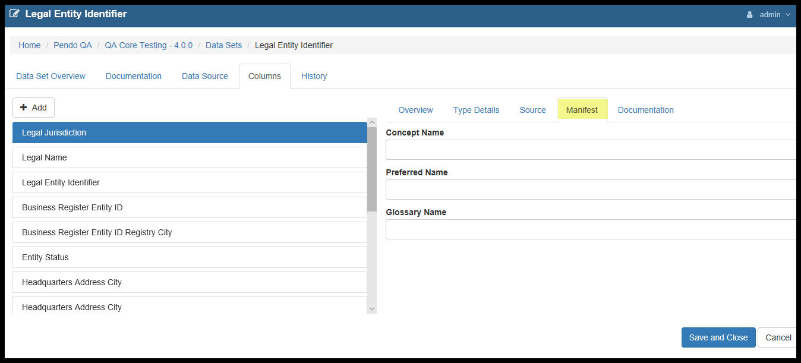

Optional: Some clients are tracking data lineage and mapping to an external consumer of the information such a *Ab Initio*. These fields are useful in such an undertaking. The user will have a chance, when exporting, to opt to export this information in a special Manifest file during a *Data Set* or *Workspace* export.

*Documentation* Tab
~~~~~~~~~~~~~~~~~~~~~~

Optionally, you may enter in any notes you wish. This is free form text.

*Related Data Set* Tab
~~~~~~~~~~~~~~~~~~~~~~~

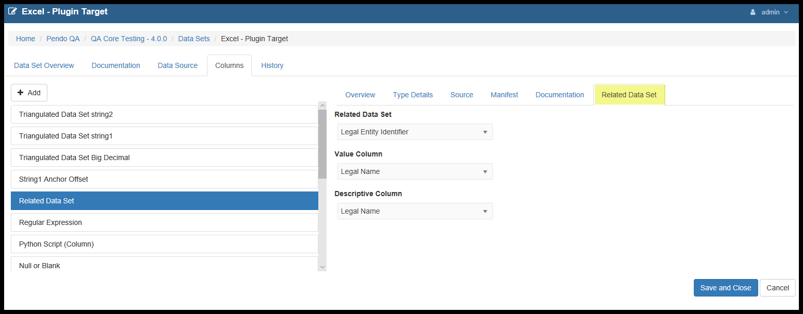

When creating a *Target Data Set*, there is an option to reference data that already exits in another *Data Set*. In order to use this feature, you would use the rest of the tabs in *Columns* as normal and then go to the *Releated Data Set* tab last. Here you can select:

* From which *Data Set* the data is coming.
* The *Value Column* which contains the values that will be stored during the *Attach Classification* process.
* The *Descriptive Column* which contains the values that will be displayed while editing a *Document Class* and Mapping to a special *Fixed Value Mapping*.
* The *Value and Descriptive Columns* can be the same if desired.
