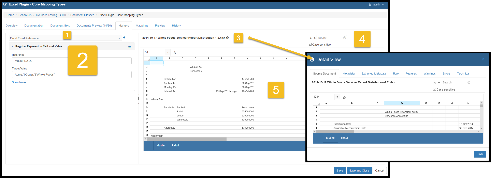
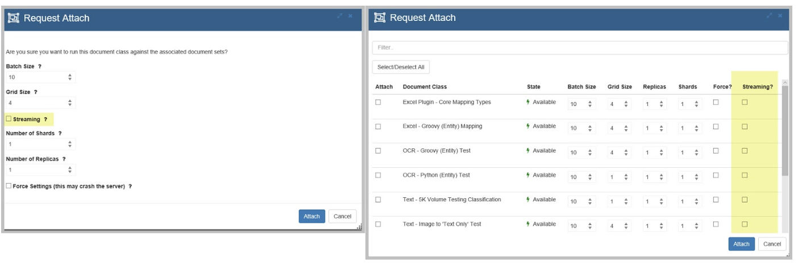

.. _documentclass:

*Document Classes*
=======================

Introduction
----------------

This section focuses on *Document Sets*, but here is a picture of the the overall project processes for extracting data.

.. image:: documentsetclass/2b4dad215ad01bd06262193ae049148d.png

Please bear in mind that the *Pendo Platform* is a toolset. The exact functional flow and selection of components and the various options selected is dependent on the needs of your project.

In other words, the *Platform* is used to access and organize data needed by the business line from sources previously deemed too difficult, just impossible or time consuming to work with efficiently.

What is the component used for?
~~~~~~~~~~~~~~~~~~~~~~~~~~~~~~~~~~~~~~

The overall goal of this component is to extract information from unstructured data - creating structured information from otherwise difficult sources. An example would be taking millions of PDF documents, targeting certain data that you want consolidated and putting it into one or more tables.

The component is designed to:
  * Analyze large numbers of files to determine which variations of files in one or more *Document Classes* meet project criteria.

  * Tweak the *Document Class* to be as inclusive of as much of the data in the Document Sets* as possible.

  * Easily identify outliers.
  * Extract the desired data elements and put them into a *Target Data Set*.

  * Track the *History* of all changes made by *Users* that would affect the data being extracted, and create a file that has all the details of the *Document Class* setting each time data is extracted.

Assumptions
~~~~~~~~~~~~~

You will need one or more *Target Data Sets* that will become the aggregated repository of all the data you extract from the targeted *Document Sets*. You can do this in two ways: you can import or create these *Target Data Sets* as described in :ref:`dataset`, but a summary is below.

  * Your technical support may have already imported an empty database that has became the *Target Data Set* and *Columns* that make sense for your project.

  * You can make the *Target Data Set* yourself by going into *Data Sets* and creating one, as covered in that *Data Sets* portion of the manual.

  * You may modify these *Data Sets* and *Columns* as needed during the course of your project.

You may or may not have a good understanding of contents the of the files in the *Document Sets* which you are going to be using. That's ok as we can use the tools of *Platform* to help us understand what the trapped data actually is, how unlock it and extract it for your use.

Flexibility
~~~~~~~~~~~~

 **Note the flexibility of the Platform to conform to your project needs. Everything has a 'many-to-many relationship'**.

* You can map to as many *Target Data Sets* as desired.
* Within any given *Document Class*, data may be mapped to more than one *Target Data Set*, meaning you may wish to extract data from a group of documents into two or more different *Target Data Sets*.
* You may use as many *Document Sets* for the data as desired. And you can change your mind about which *Document Sets* to use at any point in time.
* More than one *Document Class* can mapped to the same *Target Data Set*. For example, one *Document Class* looking at Word documents and another *Document Class* looking at Excel files may extract data into the same *Target Data Set* for better aggregation.

Key Concepts
~~~~~~~~~~~~~~~~~

The high level workflow in this component is:

  * ***Create***.
  * Create a *Document Class* for a type of file (Excel, Text, etc.) and select from any of the *Document Sets* from which you wish to extract information.
  * **Identify** a group of files by using *Markers*.
  * Select a representative file to use as a template of the other files in a *Document Set*. Create and modify *Markers* that will be used to correctly target many files.
  * The *UI* allows you to interactively view the selected files (e.g. Excel© files) and test Markers, showing the number of hits/miss across the selected *Document Sets*.
  * ***Map* the documents and test the proposed data extraction**.
  * Using various methods, intelligently search and navigate through the document to select the data you desire to extract. See real-time results, allowing you to verify your mapping and understand any outliers.
  * **Iterate** until you are satisfied you have extracted as much data as desired with the quality you demand.
  * **Extract your Data**.
  * Run *Attach* to extract the data from all the eligible files in your selected *Document Sets*. Go to the *Target Data Set* to *Search* an *Download* the data.
  * **Satisfy Auditors and Internal Compliance**.
  * Document the *Document Class* on demand and automatically whenever an *Attach* is run. All modifications to any *Document Class* are stored along with an Attach History in readily accessible *History* files and a downloadable PDF.

*Document Classes* Component
---------------------------------

*Document Classes* Screens and Functions
-------------------------------------------

Document Classes Grid
~~~~~~~~~~~~~~~~~~~~~~~~

This is the main *Document Classes* grid. By default, it is grouped-by' the *Classification State* and then sorted by *Documentation Plugin* and then *Documentation Class Name*. The will keep all your classifiction sorted alphabetically with the type of file (Excel, Text, etc.). The concept presented is to quickly see which *Document Classes* are available vs. what is actively being *Attached*, has stale data or has encountered a problem while indexing.

You can also see the number of 'rows' in the *Document Class*, which equates to the number of rows of data that will be put into the *Target Data Set*.

*Create*  Tab
~~~~~~~~~~~~~~~~~~~

Setting up a *Document Class* is a two-step process: *Create* and then *Edit*. Click *Create* from the grid screen. When creating a *Document Class*, you will only see two tabs.

.. image:: documentsetclass/e37d60a03bda8c9f390e917c2cd7cf7b.png

* Enter the name of your new *Document Class*, select the desired *Classification Plugin* and type in any descriptive information you desire.
* You may optionally go to the *Documentation* tab and enter any project internal documentation you wish.

Click *Create* at the bottom right. You will go back to the main grid.

*Edit* a *Document Class* Tab
~~~~~~~~~~~~~~~~~~~~~~~~~~~~~~~~

Highlight the *Document Class* and click *Edit*.

*Overview* and *Documentation* Tabs
^^^^^^^^^^^^^^^^^^^^^^^^^^^^^^^^^^^^^

* These are exactly the same as when creating the *Document Class*.

*Document Sets* Tab
^^^^^^^^^^^^^^^^^^^^^^

Click on the *Document Sets* tab.

* The *Document Sets* are shown in alphabetical order. If there are more   than fit on one screen, navigate using the buttons directly above the list.
* This is where you select from one or more of the *Document Sets* that contain the files that have the data you want to extract.
* Note that:
  * You may pick as many *Document Sets* as you wish.

  * You may change the *Document Sets* you are using whenever you need to for your project.

  * Be aware that if you change the *Document Sets* used for a *Document
    Class*, the *Attachment State* will be reset to "Stale", indicating that you must run the *Attach* again to extract all the desired information.

*Helpers* Tabs
^^^^^^^^^^^^^^^

The Helpers Tab allows you to select from previously defined workspace level helpers.
Please see :ref:`helpers` for details.

*Documents Preview* Tab
^^^^^^^^^^^^^^^^^^^^^^^^

Click the *Documents Preview* tab

.. image:: documentsetclass/docclassdocpreviewtab.png

Here is where you will select a file that you will use as a template for *Markers* and *Mappings*. You may change this selection at any time.
  * Area 1 is a filter where you may search for a document by it's content or by name.
  * Area 2 is a column whose icon opens up the standard *Document Detail* screen seen in any *Search*.
  * Area 3 is a column that allows you to select that particular document to be displayed in the *Markers* and *Mappings* tabs.
  * Area 4 The *Hits* column shows you any results from either the filter in this screen, or, if you have entered any, the *Markers* from the *Markers* tab.
  * Area 5 is a column that shows all the *Document Classes* associated with this document. Remember, you can have many *Document Classes* extracting data from any document and you can have many *Document Sets* participating in any *Document Class*. If you have not yet made a *Document Class* that uses that document, the column will be blank.
  * Area 6 clicking the download icon allows you to download that particular file to your PC.

.. _marker:

*Markers* Tab
^^^^^^^^^^^^^^^^^

*Markers* act as filters against all the files in the selected *Document Sets*.

Above, you can see that we are using a RegEx to look at documents that have any of a few specific company names in them and that these names must be located in a specific cell.

The goal of using *Markers* is to correctly identify a group of files so that targeted data can be extracted. Remembering that the format/layout of your source files may have changed over time, clever *Markers* can be quit useful. *Markers*, acting as filters, change the *Document Preview* tab count update. In this case, 'Document Preview (18/30)'' means that 18 of the total 30 documents in this set meet the criteria of the *Marker*.

| The main sections on this tab are:

 1: Where you can filter if you have multiple *Markers*.

 2: Where you select the Type and enter the details of the *Marker*.

 3: Clicking the 'i' icon opens up the standard *Detail View* of the selected document.

 4: Where you can enter text or numbers to search the selected document. You may make the search case sensitive or not, as you wish.

 5: which is the document viewing area. The exact document you selected earlier is displayed here.

When you start a new *Document Class* that has no *Markers* the *Document Preview* tab indicates 100% hits since there is no filter in place.

**Note**: For details on the syntax available to you to create *Markers*, please see the appropriate article on Zendesk. Different selections will be available depending on the type of file with which you are working. For example, you will have *Regular Expression* available to you for all files types, but you would have additionally have *Excel Fixed Value* and *General Query Marker* for Excel, *Text Fixed Value* for PDF and so on.

To make a *Marker* in Excel: Highlight the cell that will be evaluated in the spreadsheet on the right. On the left, select what type of expression to use in the *Target Value* box and click the + icon.
For help with *Regular Expressions*, please go to http://www.regular-expressions.info. This is a very feature rich syntax. Please be sure to select **Java** as the flavor of RegEx.

.. image:: documentsetclass/c88734008a60c6ea586c79ac2d5ca7b4.png

In this example, we have elected to use a *Regular Expression* so as to make use of a wildcard in the *Target Value*.

  * In the *Reference* field, you see the name of the *Worksheet* (Master) and the absolute value of the cell or range of cells.
  * In the *Target Value*, you enter the allowed values that will be * searched for in that Cell. In the first part of the example, you see that the word Jones is followed by a period and an asterisk, which is RegEx syntax for "anything starting with Jones". So "Jones Report 1" or "Jones Dealership" would both be found.
  * The second part of the *Target Value* is the pipe and then Acme followed by the period and asterisk. The pipe symbol (\|) means OR.

So the entire text means that any spreadsheet that has a worksheet called *Master* and has text that starts with either *Jones OR Acme* would be included in this *Document Class*.

You may create as many *Markers* as needed to identify that group of documents within the *Document Sets* that you want to target for data extraction. Usually one *Marker*, even if it is complex, is sufficient. The trash can icon deletes that *Marker*.

**NOTE** as soon as a *Marker* is created, you will see the number of hits the system found is updated in the *Documents Preview* tab. This allows interactive feedback between the *Markers* you are creating and hits the *Platform* will find. Clicking back to *Documents review*
allows you to see which documents would be identified as a hit based on the current *Markers*.

This is an iterative process. Once you are happy with the *Markers* you have made and that the correct files will be targeted, proceed to the next step. You can always go back and modify the *Marker* as needed.

*Mappings* Tab
^^^^^^^^^^^^^^^

In this tab you are targeting data that you want to extract, optionally cleaning the data or manipulating it, and mapping it to your *Target Data Set* or a mapping *Variable*.

Optionally, you may highlight the mapping values and the mapping path. This is extremely powerful and explained in it's own section :ref:`highlighting`.

The *Mapping* tab is very powerful and therefore has many options.

There are three main resizable sections, 1, 2 and 3. Each section has many features. We will go thru each section Area by Area.

There is in-app, context sensitive mapping help. Please see :ref:`contexthelp`.

To resize a section, click the small arrows or click-drag the lines denoting the sections. If you change the resolution of your screen while using the UI, you may need to refresh your browser by pressing the F5 key on your keyboard.

Mapping Tab - Section 1
""""""""""""""""""""""""

The main focus of this section is to initialize, and then to organize,  all your mappings in this *Document Class*. We will break this section into three Areas, A, B and C.

Area A
''''''''''

-  A mapping tile is created by:

   *  clicking the drop down at the top to select a *Mapping Type*.

-  The available *Mapping Types* depend on the type of document you are dealing with: text, word processing, spreadsheet, etc. A List of    mapping types can be found at the bottom of this section in :ref:`mappingtype`.  Click either the *Mapping* or the *Variable* button.

   *  The *Mapping* button will set this mapping to extract the logic of the mapping to a *Column* in a *Target Data Set*.
   *  The *Variable* button will set this mapping to become a  *Variable*. Variables are not directly exported but may be used and referenced by other *Variables* and/or *Mappings*.

*  Once you have made many mappings it may be useful to search for a    specific mapping. There is a filter box, which is blank by default. Put in a string (the filter is not case sensitive) and you will see only those mappings that have that phrase. Spaces are allowed to be part of the filter, as seen below.

Area B
'''''''''

*  Here you have a scrollable list of all of the *Mapping Tiles*. Below you see more details on this section.

* The leftmost icon opens a pop-up that, depending on the mapping type, allows you to select the Column from the Target Data Set, enter a name for a Variable or select the Data Set for Python or Groovy (Row) mappings.
*  On the right side of each tile, there is a checkbox and three icons:

* The leftmost checkbox (Attach) allows you to select if the mapping will be processed (attached) or not. This will also determine if the mapping will be highlighted in Section 2.
* The next icon (Mapping Detail) will open a popup window, giving access to the mapping details. This window is modal, and can therefore be moved and resized. This is one of two places where you see mapping details (the other is Section 3). You may edit expressions or scripts, select the type of fixed mapping, enter in Anchor / Offset information, create Notes, add *Cleaners*, etc. depending on the type of mapping being edited.

   *  Movement is done by left-click and hold and drag on the blue topmost part of the window.
   *  Re-sizing is done by clicking in the shaded area at the bottom-right of the window.

* The next icon (Move) allows you to move a mapping up or down the listing. This can affect your results when you have dependencies. For example, if you have a variable mapping and then a column mapping that uses the variable, you would need to have the variable mapping occur before (i.e. be above) the column mapping.
* The last icon deletes that mapping.

There is in-app, context sensitive mapping help. Please see :ref:`contexthelp`.

Area C
''''''''''

.. image:: documentsetclass/docclassmappingtabsection1c.png

* The *Preview* button is a toggle that controls what you see in Section 2, the Document viewing area. You will either see the document or a table showing the first 20 hits for whatever mapping you have selected. More details on this are in the Section 2 area.
* The Minimize / Maximize button hides / reveals the children of looping mappings, already mentioned above. It no longer opens up the details of the mapping as it did prior to Release 4.0.0
* The ‘Duplicate’ mapping button is a big time saver as very similar mappings don't have to be created from scratch.
    **WARNING:** The duplicated mapping will appear at the bottom of the column of mapping tiles. It is an exact duplicate. You should immediately go to the new mapping and modify as needed so that you do not keep two identical mappings as part of your Document Class. If you duplicate a Loop mapping that has children, the parent and children mappings are all duplicated for you.

*Mapping Tab - Section 2*
"""""""""""""""""""""""""""""""""

We will now focus on Section 2 below, however, this section does interact with Section 1. In this Section, you can switch between a preview of the document (with or without highlighting), or a preview of the data to be extracted in a table format. If you remember, this is done via the 'Preview' icon in Section 1.

We will break this Section to into three Areas, a, b and c.

We will start with a preview of the document.

Area A and C
'''''''''''''

-  In Area a, at the top of the left side of the document preview section, you see an option to ‘Show Mapping Paths’. This toggle turns on/off two different things:

   *  In the document preview area, this highlights the **Mapping Path** in Area C that the system took to find the **Mapping Value**.
   *  When the highlighting is turned on, the *Mapping Value* is actually shown at the bottom of each of the mapping tiles in Section 1.

*  You can also move to the specific mapping by clicking the magnifying glass at the bottom right of a mapping tile. This icon only appears after you have elected to show the mapping path.

* Highlighting behavior is complex and is detailed in its own section :ref:`highlighting`.

* The 'Refresh' button will refresh the Mapping Path and Mapping Value after you make a change to a mapping.

* The 'Log' button opens a popup. A *log helper* is now available. You can use this if you wish to write comments to a log file for a specific mapping and review the comments on-demand. You can see the  output whenever the document is being previewed by clicking the Log icon next to the Refresh icon.

   * For a groovy column script, the syntax is log.write("your comment to the log")
   * For a text expression, the syntax is #log.write("your comment to the log")

   * You can use the log to write something simple: log.write("Hello World")

   * You can also write things that you have - like the intermediate
     form of the document. log.write(textDocument.find("BMW"))

   Understand that you can also write things that exist in the DSL as well log.write(textDocument.find(regexHelper.nonEmptyLine()).index)

*  The above picture is showing that a previously defined loop determined that there was a table inside of a document. A child mapping to the main loop is shown and it is writing to the log file.

* There are also three buttons to help you out plus a filter. These buttons can be selected / deselected independently of each other. That is to say one or more buttons can be on or off at the same time.

Area B
'''''''''''
* In Area B, at the upper right side of the document preview area, you may: - Show line numbers (except for Excel which already has row and column identifiers). - 'Go To' a specific line number. - Do a search of the document, which may be case-sensitive or not.

.. _context:

*Mapping Tab - Section 3*
"""""""""""""""""""""""""""

* Like the Mapping Detail icon in Section 1, this area displays all the mapping details. Below, the section was made bigger by dragging the border up. This is the second of two places where you see mapping details. You may edit expressions or scripts, select the type of fixed mapping, enter in Anchor / Offset information, create Notes, etc.   depending on the type of mapping being edited.

.. _contexthelp:

*Mapping Tab - Context Sesitive Help*
''''''''''''''''''''''''''''''''''''''

* Context Sensitive Mapping Help. You may click the highlighted chevron to hide / reveal the available help. You may drill down to details on many of the help items. Options, explanations and syntax examples have been provided. If you drill down into the help options, you can get back up to the top level of help in any of the tabs by clicking the little menu icon on the Help tab.

|
|

*Show / Hide Notes*
''''''''''''''''''''''

Allows the user to write any useful notes about the mapping.

*Cleaners* are the bottom most option in Section 3. Please go to Cleaners_.

*Preview* Tab
^^^^^^^^^^^^^^^^

The last step of testing a *Document Class* is to be sure the *Mappings* you just did is correct. Click the *Preview* tab. There are a few sections on this tab. This is a preview of what the *Target Data Set/Columns* will look like if you *Save* the *Document Class* and run an *Attach*.

There are 3 areas/items to note:

Area 1 has several *Preview* options:
""""""""""""""""""""""""""""""""""""""""

* The 'Hide Variables' / 'Show Variables' button shows the values of any Variable type of mapping. Variables, when shown, appear in Area 4, which is really just the last columns on the right being displayed.
* The 'Auto Load', on by default, will initially show the first 20 rows of data that would be extracted. By default, only the first 20 hits are previewed and the data is displayed automatically. However, the number of records requested on *Attachment Preview* tab is adjustable via a slider bar. Each time you start to *Edit* a *Document Class*, the default remains 20 rows of data being retrieved  from the server. You can increase this as needed, helping you debug and verify mapping logic by allowing more data to be visualized. If you want to see more data, use the slide bar. The number of records selected will stay persistent during the entire *Edit* session. Since this number can be quite large, the 'Auto Reload' checkbox is deselected when the slider is changed and the 'Load Data' button becomes enabled. This makes it clear that the user must manually reload the data. This will prevent unexpected/undesired delays when switching between tabs.
* The 'Highlight confidence' option is only relevant for OCRed document. For documents that have been OCRed, **word level confidence** is the probability that the imaged word was OCRed with no errors. **Document level confidences** is simply the aggregation of the confidence at the word level.
* 'Show Statistics' displays, for each column, the number of rows with hits (returned data), the number of empty rows and the number of row  with errors.  Remember that an empty row does not necessarily indicate an error. That completely depends on the logic of your mapping.

Area 2
""""""""""""
* The tabs represent the *Target Data Sets* that you have mapped to for this *Document Class*. Since you can map to more than one *Target Data Set*, there may be more than one tab here.

Area 3
""""""""""""

* Every column except the first two and the very last (download) can be sorted. The first four columns are of interest for their functionality.

* The first column brings up the standard *Detail View* popup with all the normal tabs. This can be useful for:
  * Showing the data from a specific document vertically in rows rather than horizontally in columns.
  * Giving you the details of any Warning or Errors.
  * Looking at the raw data in the index.

* The second column allows you to select a particular document. You are then switched back to the *Mapping* tab which will be showing you the contents of newly selected document. This is very useful in understanding, for example, why some documents return a value for a mapping and some do not.

* The third and forth columns indicate if the specific document has a Warning or Error that occurred during evaluation of a mapping. If there is, use the first column to popup the *Detail View* and go to the Warning or Error tab.

Area 4
"""""""""""

* Besides the right-most columns showing, or not showing, any Variables, the very last column allows you to download that specific file to your PC.

Cleaners
~~~~~~~~~~~

*Cleaners* are the next to last item in the *Mapping Detail*, just before *Show Notes*.

So far, the mapping logic has been all about finding something: a number, a word, a date, a table, a paragraph and so on. We refer to this as the *Mapping Value*. Once you get a *Value*, you may need to tweak it a bit.

In general, the *Mapping Value* will be a string value as opposed to a numeric or other type of value. This allows the *Pendo Platform* to keep formatting i.e. a dollar sign. If you wish to reformat dates, extract actual numbers for any reason, including doing math as part of extracting using *Expressions*, you will need to use the correct *Cleaner* or modify it within an expression.

These are the *Cleaners* available to you.

* **None** - No additional change is made to the identified *Value*.
* **Convert to upper case** - Converts the value to all upper case.
* **Convert to lower case** - Converts the value to all lower case.
* **Capitalize** - capitalizes all the whitespace separated words in a string. If a word is hyphenated, the word after the hyphen will also be capitalized. E.g sub-directory becomes Sub-Directory.
* **Capitalize Fully** - Only the first character of each word in a string is made upper case, the rest of each word will become lower case, including hyphenated words. E.g sub-directory becomes
  Sub-directory.
* **Convert to Decimal** - as data is by default extracted as a string, if you wish to extract the numbers into a *Column* that is numeric, use this option. This will also cleanup extra decimal characters (e.g. 123.123.67 will be converted to 123123.67)
* **Workbook Expression**: get the value in the specified cell(s) and perform advanced formatting or math. The available options for syntax and functions are discussed below.
* **Trimmed** - remove any blank spaces at the beginning and end of the value.
* **Change Date Format** If you have found a date, use this option to reformat the date as needed.
* **NLP Date Detection** When you set up *Target Data Set*, you may specify that a *Column* be a Date column and specify the target date format, for example MM/dd/yyyy. When this cleaner has a value, it will try to determine if is a date in any of several formats using Natural Language Processing (NLP). For example, the *Cleaner* would   recognize

  *  Jan 12, 2018
  *  January 12, 2018
  *  01/12/18
  *  01/12/2018 and
  *  1/12/2018

as valid dates, no matter the format.

*(Mapping) History* Details
^^^^^^^^^^^^^^^^^^^^^^^^^^^^

Whenever a *User* makes a change to a *Document Class Name, Marker* or *Mapping* and clicks *Save* or *Save and Close*, a new *(Mapping) History* number is generated and the change is noted in the *History* log.

Note that viewing the *(Mapping) History* log initially provides the Version numbers in the log as well as the Date of the Change, the Date that version was last *Attached* and the *User* who changed it.

Clicking the chevron will show additional details including: Change Type: e.g. *Class Name, Mapping* or *Marker, Action Type* (such as Add, Remove, Update), *Column Name*, *Description* and *Cleaners* used, etc. For example, use the fixed cell reference ``Retail!I3`` and clean the value to a decimal.

Delete a Document Class
~~~~~~~~~~~~~~~~~~~~~~~~~

This will delete the selected *Document Class*.

*Duplicate* a *Document Class*
~~~~~~~~~~~~~~~~~~~~~~~~~~~~~~~~~~~~

This will duplicate the selected *Document Class*. This is very useful when you already have a *Document Class* with many *Mappings* or very complex expressions and you need relatively minor tweaking for a new *Document Class*. Basically, this is a way to leverage your existing work. The duplicate will have the same name with 'Copy of ' added to the beginning of the name. You may then *Edit* and rename.

*Attach* or *Attach Selected*
~~~~~~~~~~~~~~~~~~~~~~~~~~~~~~~~~~

Extracting the data
^^^^^^^^^^^^^^^^^^^^^^

**The Attach process is where the actual work of applying all the Mappings of a Document Class to all the selected Document Sets and extracting the data to the Target Data Sets takes place.**

By selecting *Attach Selected*, you will get a popup asking you to verify the *Batch* and *Grid Sizes* and the *Number of Shards* and *Replicas* for processing the documents. If you select *Attach*, the popup also allows multiple *Document Classes* to be sent to the Job Queue for Attachment.

*Attach* Options
^^^^^^^^^^^^^^^^^

You can control the following, Batch, Grid, Shards and Replicas. If any *Document Class* has already been *Attached*, the previously selected setting will have been saved. When dealing with *Document Classes*, just like when dealing with *Document Sets*, the *Batch Size* is the number of files that will be brought into memory at one time.
* The ideal batch size depends on both the amount of memory in the server and the type and sizes of data with which you are dealing. The smaller the individual file sizes and the more memory your server has, the bigger the *Batch Size* can be.
* The *Grid Size* determines the number of simultaneous threads that will be used to process the data. The ideal size will depend on the number of processors your server has and what else may be running on the server at the same time.
* Shards and Replicas allows you to use the UI to define storage settings at the index level in the platform. This is a key capability as you start to work with larger ElasticSearch clusters. **Please do not change the setting for these unless advised by Client Services or you are an expert in ElasticSearch and the Pendo Platform.**

* Streaming:

  * If the checkbox is checked you will get Streaming delivery of the indexing or / attaching job, but not on the Discovery phase. The previous index is deleted and the system can display the extracted data as it is being built. Technically, there is no transaction, just delivery of data as it is processed and put into the index.
  * Checkbox unchecked - This is the previous behavior and thus the default setting for any new imports, indexing or attaching until you modify the setting. When Streaming is turned off, the prior result set is kept available for searching and you must wait until the indexing/attaching job to complete to see any new results.
  * You may monitor the progress of an Index by searching the Document Class with a filter of state:INDEXED.  When the option is turned on, you will see results as they come in. With the option off, you will see the old results until all the new results are ready.
  * You may monitor the progress of an Attach by Searching a Target Data Set. With the option off, the rows will contain the data that resulted from the prior Attach until the entire job complete.  With the option on, the rows will be populated as the data is extracted.
  * **Note: While monitoring with the Streaming option on you may hit the exact time the old index has been deleted and before the new index has been created.  If this happens you will get a technical error popup. The error is technically correct as you have requested a search for an index that no longer exists. Just close the error and search again.**

.. image:: data_exploration/streaming1.png

How to Monitor : As described above, for Importing or Indexing, search with a state:INDEXED.  For Attaching, you only need to search the Data Set.

.. image:: data_exploration/streaming3.png

* *Force* - The *Platform* will look at your entries and validate them. If the entered  numbers are too big, a maximum recommendation will be shown. You may overwrite the *Platform* recommendations, but be aware that this increases the chance that the server will crash.

Looking at the extracted data From your *Workspace* home page, click on *Data Sets*. Select the *Target Data Set* you used in your mappings and Click *Search*. You will see all the data that has been extracted from all the mappings that worked when you ran your *Attach*.

For lots more information on *Searching*, see :ref:`unified-search`

|

Now that you are looking at a *Search* grid, you can move columns around, sort and filter as well as export and then download the information into an Excel© spreadsheet or database. The exported files is actually a .csv file, so many programs can display or otherwise use the data. The downloaded file will have column headers based on either the user made or modified *Column Name* or the APIName of your *Target Data Set*.

**Technical Note**: Please note that the *Attach Class* process does not actually populate the extracted data into a table. The structure of the *Target Data Set* is placed into the *Pendo Platforms'* indices. Much more information other than the targeted data is stored in the Index.

*Attach Class History*
~~~~~~~~~~~~~~~~~~~~~~~

 Whenever you run an *Attach Class*, a snaphot of the entire *Document Class* is stored in the system. This can assist you in identifying all aspects of how the data was extracted and/or modified in the *Platform*. In other words, this provides a data lineage from the source documents to the extracted data point.

Just highlight any *Document Class* on the main grid and then click the *Attach History* button to see the all the settings in the *Class* that were in place each time the process was run.

.. image:: documentsetclass/e891c4d341b686354487afbc47d25953.png

*Documentation*
~~~~~~~~~~~~~~~~

*Documentation* is the one stop place to get all the details of a *Document Class* including:

* Name.
* Data Sources.
* *Markers*.
* All the current *Mapping Rules*.
* A Change History of any changes made for each saved version of the *Document Class*.
* *Attach History* which includes date and time of any *Attaches, Document Sets, Markers* and details of the *Mappings* in place at that time.

To use, highlight the *Document Class* in question and click the *Documentation* button. This will create a PDF that you can download locally.

The picture below includes extracts of the main sections from a generated PDF.

More information on Mapping Values and Mapping Paths
----------------------------------------------------

.. _highlighting:

*Highlighting Mapping Values and Paths*
~~~~~~~~~~~~~~~~~~~~~~~~~~~~~~~~~~~~~~~~

This extremely useful feature helps verify that your mapping is doing exactly what you want by visually highlighting the mapping within any MS Word, MS Excel and Text documents.

Note: While this new functionality is in Beta, it has such great value that we wanted to get this in your hands as soon as possible. There may be cases where highlighting does not work. Some are noted below. Please report any new finding via Zendesk.

You have the ability to toggle the mapped highlighting on or off (via checkbox).

Highlighting uses the existing mapping logic and returns values based on the document you have selected - which you can change at will. Switching documents will automatically highlight the *Mapping Paths* in the new document and update the *Mapping Values* in the Mapping Tiles.

**Expected behavior:**
^^^^^^^^^^^^^^^^^^^^^^^^

Document Highlighting can be seen in two areas of the Platform.

1. In *Data Sets*, once a *Document Classification* is complete and has been attached and assuming the Document Sets are ‘up to date’ in indexing.

2. In the *Document Classification, Mapping* tab, if you modify a mapping, clicking the ‘Refresh’ button will update what is highlighted and the values returned for the specific selected document.

**How to use this feature in a Document Classification:**
~~~~~~~~~~~~~~~~~~~~~~~~~~~~~~~~~~~~~~~~~~~~~~~~~~~~~~~~~~~~

|
| Select a document in one of the following ways:
|   * Navigate to the Documents Preview tab and select a document from the results grid. (Recommended)
|   * Navigate to the Mappings tab, click the ‘Show preview’ link and then click the ‘Load Data’ button. Then, select a document from the results grid.
| Navigate to the Preview tab and select a document from the results grid.
|
| * After selecting a document, click the ‘Mappings’ tab (if not already selected) and check the ‘Highlight & Show Mapping Values’ box at the top of the document view pane.
|   * This will do two things: the mappings on the left (in Section 1) will each display the value that will be extracted from the selected document.
|   * In the Document viewing area, the ‘mapping path’ will be highlighted in yellow.
| * Clicking on the magnifying glass icon in any mapping tile causes   the document to scroll until the corresponding path’s highlighted path is visible to the user.
|   * This functionality is not available when working with MS Excel documents. Instead, each Excel mapping tile will display the location of the mapped path as well as the calculated value of the mapping. For example, instead of magnifying glass you would see Sheet3:D129.
|

  * If viewing a Word document, the mappings which use Word Expressions and select values from a document will be highlighted on the document view pane. The values or errors returned by each mapping will be displayed in the mapping pane. Full error messages can be viewed in a popup by clicking the "expand" icon at the far right of the value.

  Color coding of the mappings is as follows:

  * Those values that were found in the document (e.g. Word Expressions) will be highlighted in yellow. - Values that were not located in the document (ex: Fixed Values such a Classification Version) and Variable mappings will be highlighted in tan.

  * Errors will be highlighted in red and details about the error can be viewed in and made into a popup window by clicking the modal icon as indicated.

  * Movement is done by left-click and hold and drag on the blue topmost part of the window.

  * Re-sizing is done by clicking in the shaded area at the bottom-right of the window.

Overlapping Mappings
^^^^^^^^^^^^^^^^^^^^^^^^^

**Expected behavior for multiple mappings for the same Data Set and Column and multiple mappings for the same variable name:**

**Note** : If two mappings overlap one another, the outermost mapping will be highlighted in the document, which may obscure nested mappings.

* If multiple mappings are created for the same Data Set / Column name or multiple mappings are created using the same variable name, only the last mapping that returned a value will be highlighted in the document and displayed in the mappings pane. If errors are thrown by one or more of the duplicate-named mappings, only the last mapping that returned an error will be identified in the mappings pane. If a duplicate-named   mapping (mapping B) is listed below a mapping of the same name (mapping A) and mapping A throws an error, but mapping B returns a valid value, the error for mapping A will be displayed as well as the value for mapping B.

Mapping Path is not the same as a Mapping Value
~~~~~~~~~~~~~~~~~~~~~~~~~~~~~~~~~~~~~~~~~~~~~~~~~

|
| Hang on, because this can be a bit tricky.
|
| While the Path and the Value often show/highlight the same thing, it is possible that they will not. This may be confusing at first, but it is really a powerful part of the feature.
|
| * A mapping value displays the actual value that will be extracted from the specific document you are viewing.
|
| * A mapping path gives a visual indication of where in the document the mapping selects the value. Not all part of the logic is going to be visible in the document. And there will be times when you can extract a value that depends on the mapping making some sort of manipulation.
|
| A few examples may help clarify:
|
| **Example 1, A Generalization:**
| If the mapping is:
| find(some selected text here).getValue() == null ? ‘not found’ : ‘found value’
| * The mapping path will highlight "some selected text here" in the document.
| * The value displayed in the mapping pane would be either ‘not found’ or ‘found value’.
|
| **Example 2, A simple specific example.**
| Let’s take a mapping of find("My line with a date January 10, 2017").getDate() and you format the date with a cleaner so that it's 1/10/2017.
| * In the mapping tile, the Value would be 1/10/2017. But January 10, 2017 would be highlighted in the Document. We cannot highlight 1/10/2017 because that is not the logic and, of course, it does not actually exist in the document. We have manipulated the data into a different format. In this case, it's straightforward to see how the Mapping Value and the Mapping Path fit together, but some examples may provide much different results.
|
| **Example 3. A bit more complex.**
| Let’s take the mapping
| find("This line that may contain a different code: CODE")
| Then extract that code and return some value for the mapping dependent on that. Let’s say when CODE == 1 return "apples", when CODE == 2 return "oranges".
| * In the mapping tile, you would see “apples” or “oranges”.
| * In the mapping path, you would see "This line that may contain a different code: 1" or "This line that may contain a different code: 2" highlighted.
|

Markers vs. Mappings
--------------------

 * If you wish to extract the data that was used as a *Marker*, you will need to map it here as well as keeping it as a *Marker*.

  * You may map to several different *Data Sets* in the same *Document Class*.
  * The same data may be extracted multiple times by mapping to different *Data Set/Column* selections.
  * Different *Mapping* options will become available over time. These options will vary also vary based on the kind of data being mapped (e.g. spreadsheets, PDF, word processing documents, emails, etc.).

.. _mappingtype:

Mapping Types
-------------

Here are all the different types of *Markers* and *Mapping Types* organized by type of *Classification Plugin*.

Groovy Filter
~~~~~~~~~~~~~

The Groovy Filter mapping allows additional sophistication to the Marker function, bringing the power of Groovy to the Document Set filtering functions of Markers.
An simple yet powerful example of this is capability would be to blacklist / whitelist a sub-set of documents in a Document Set.
  * Let’s say you have a big Document Set call ‘Contracts’.
  * Create a list of files you want to include or exclude from an existing Document Set. We do not focus on this step here. Let us assume we have made a Target Data Set called ‘Blacklist’ and that it contains the names of the documents from ‘Contracts’ we wish to include or exclude for a Document Class.
  * Create a new Document Classification. The Document Set used by the new classification is the original Document Set ‘Contracts’.
      * In the Markers tab, create a Groovy Filter.  You can see two variation of an expression that tells the Marker to exclude / include all the files names that are in the Data Set ‘Blacklist’.

  .. image:: documentsetclass/groovy.png

* Remember there is context sensitive help in the app. Please see Please see :ref:`context`.
*  For Help with Fixed type, mappings, see :ref:`appendix_fixed`.

Looping
~~~~~~~

Previous to Release 4.0.0, when running mappings, if there was a conditional logic or the need to loop over a set of mappings (such as mapping rows for a table) you were forced to use a script or row mapping. This made it harder to see and understand what is happening since the logic can become opaque.

Note: This is an initial implementation of looping in the UI with the first focus on Text and MS Word documents. Additional mapping types for word processing, spreadsheet and OCRed document types will be in future releases.

Now, you can create logic loops. This is done through an implementation of new Mapping Types. For Text documents, this includes a ‘Groovy Script (Loop)’ and a ‘Text Expression (Loop)’. The expression returns either a list of objects or a boolean value. After creating a main Loop mapping, you are able to add ‘child mappings’, which can include another loop, variables, scripts or mappings that populate columns or rows. When you return a list of objects, your child mappings are called once for each object. You are then able to choose a variable name that will be set in the variables for each run. If you return a boolean from the expression, then the platform will execute the child mappings once if it is True or not at all if False.

If you update an existing variable in a loop then its value is maintained and can be iterated properly between mappings. Note, ‘new’ variables declared within the loop variables will reinitialize during each iteration.

Iterating variables reflects the mapping values (seen on left side of screen under each mapping when you are enable ‘Show Mapping Paths’) in the order of iteration as does the log. Previously, the mapping values did not shop up in order.

Reordering Mappings
-------------------

You may reorder the mapping tiles. Place your cursor over the indicated icon and it will change to a special 4-arrowed cursor which you can use to drag the tile. This can be very important as the *Mappings* are processed by the *Platform* from the top down.

Using this method of moving tiles, the user can manage mapping dependencies. You must ensure that any mappings dependent on other mappings are in the correct sequence.

Special Note on Text Mappings
~~~~~~~~~~~~~~~~~~~~~~~~~~~~~

A text file can present many challenges. Among them is the fact that there is no structure other than line nodes, making navigation more difficult. To aid in this, when using a Mapping Type=Regular Expression, you are presented with *Filter Expression, Matcher Expression* and *Cleaner* fields. - The *Filter Expression* allows you to narrow down to a specific line using a *Regular Expression*. - The *Matcher Expression* lets you work with the data that results form the *Filter Expression* and pull a particular value from that line using another \_Regular *Expression*. - The *Cleaner* works the same way in all *Mappings*.

There is now extensive help available to users with various types of mappings. Please see :ref:`context`.

*(Mapping) History* Details
---------------------------

Whenever a *User* makes a change to a *Document Class Name, Marker* or *Mapping* and clicks *Save* or *Save and Close*, a new *(Mapping) History* number is generated and the change is noted in the *History* log.

Note that viewing the *(Mapping) History* log initially provides the Version numbers in the log as well as the Date of the Change, the Date that version was last *Attached* and the *User* who changed it.

Clicking the chevron will show additional details including: Change Type: e.g. *Class Name, Mapping* or *Marker, Action Type* (such as Add, Remove, Update), *Column Name*, *Description* and *Cleaners* used, etc. For example, use the fixed cell reference ``Retail!I3`` and clean the value to a decimal.

Delete a Document Class
--------------------------

This will delete the selected *Document Class*.

*Duplicate* a *Document Class*
------------------------------

This will duplicate the selected *Document Class*. This is very useful when you already have a *Document Class* with many *Mappings* or very complex expressions and you need relatively minor tweaking for a new *Document Class*. Basically, this is a way to leverage your existing work. The duplicate will have the same name with 'Copy of ' added to the beginning of the name. You may then *Edit* and rename.

*Attach* or *Attach Selected*
-----------------------------

Extracting the data
~~~~~~~~~~~~~~~~~~~

**The Attach process is where the actual work of applying all the Mappings of a Document Class to all the selected Document Sets and extracting the data to the Target Data Sets* takes place.**

By selecting *Attach Selected*, you will get a popup asking you to verify the *Batch* and *Grid Sizes* and the *Number of Shards* and *Replicas* for processing the documents. If you select *Attach*, the popup also allows multiple *Document Classes* to be sent to the Job Queue for Attachment.

*Attach* Options
~~~~~~~~~~~~~~~~

 You can control the following, Batch, Grid, Shards and Replicas. If any *Document Class* has already been *Attached*, the previously selected setting will have been saved. When dealing with *Document Classes*, just like when dealing with *Document Sets*, the *Batch Size* is the number of files that will be brought into memory at one time.

 * The ideal batch size depends on both the amount of memory in the server and the type and sizes of data with which you are dealing. The smaller the individual file sizes and the more memory your server has, the bigger the *Batch Size* can be.
 * The *Grid Size* determines the number of simultaneous threads that will be used to process the data. The ideal size will depend on the number of processors your server has and what else may be running on the server at the same time.
 * Shards and Replicas allows you to use the UI to define storage settings at the index level in the platform. This is a key capability as you start to work with larger ElasticSearch clusters. **Please do not change the setting for these unless advised by Client Services or you are an expert in ElasticSearch and the Pendo Platform.**
 * Streaming:

   * If the checkbox is checked you will get Streaming delivery of the indexing or / attaching job, but not on the Discovery phase. The previous index is deleted and the system can display the extracted data as it is being built. Technically, there is no transaction, just delivery of data as it is processed and put into the index.
   * Checkbox unchecked - This is the previous behavior and thus the default setting for any new imports, indexing or attaching until you modify the setting. When Streaming is turned off, the prior result set is kept available for searching and you must wait until the indexing/attaching job to complete to see any new results.
   * You may monitor the progress of an Index by searching the Document Class with a filter of state:INDEXED.  When the option is turned on, you will see results as they come in. With the option off, you will see the old results until all the new results are ready.
   * You may monitor the progress of an Attach by Searching a Target Data Set. With the option off, the rows will contain the data that resulted from the prior Attach until the entire job complete.  With the option on, the rows will be populated as the data is extracted.
   * **Note: While monitoring with the Streaming option on you may hit the exact time the old index has been deleted and before the new index has been created.  If this happens you will get a technical error popup. The error is technically correct as you have requested a search for an index that no longer exists. Just close the error and search again.**

 .. image:: data_exploration/streaming1.png
 .. image:: data_exploration/streaming2.png

 How to Monitor : As described above, for Importing or Indexing, search with a state:INDEXED.  For Attaching, you only need to search the Data Set.

 .. image:: data_exploration/streaming3.png

 * *Force* - The *Platform* will look at your entries and validate them. If the entered  numbers are too big, a maximum recommendation will be shown. You may overwrite the *Platform* recommendations, but be aware that this increases the chance that the server will crash.

Looking at the extracted data From your *Workspace* home page, click on *Data Sets*. Select the *Target Data Set* you used in your mappings and Click *Search*. You will see all the data that has been extracted from all the mappings that worked when you ran your *Attach*.

For lots more information on *Searching*, see :ref:`unified-search`.

Now that you are looking at a *Search* grid, you can move columns around, sort and filter as well as export and then download the information into an Excel© spreadsheet or database. The exported files is actually a .csv file, so many programs can display or otherwise use the data. The downloaded file will have column headers based on either the user made or modified *Column Name* or the APIName of your *Target Data Set*.

**Technical Note**: Please note that the *Attach Class* process does not actually populate the extracted data into a table. The structure of the *Target Data Set* is placed into the *Pendo Platforms'* indices. Much more information other than the targeted data is stored in the Index.

*Attach Class History*
-----------------------

 Whenever you run an *Attach Class*, a snaphot of the entire *Document Class* is stored in the system. This can assist you in identifying all aspects of how the data was extracted and/or modified in the *Platform*. In other words, this provides a data lineage from the source documents to the extracted data point.

Just highlight any *Document Class* on the main grid and then click the *Attach History* button to see the all the settings in the *Class* that were in place each time the process was run.

.. image:: documentsetclass/e891c4d341b686354487afbc47d25953.png

*Documentation*
---------------

*Documentation* is the one stop place to get all the details of a *Document Class* including:

* Name.
* Data Sources.
* *Markers*.
* All the current *Mapping Rules*.
* A Change History of any changes made for each saved version of the *Document Class*.
* *Attach History* which includes date and time of any *Attaches, Document Sets, Markers* and details of the *Mappings* in place at that time.

To use, highlight the *Document Class* in question and click the *Documentation* button. This will create a PDF that you can download locally.

The picture below includes extracts of the main sections from a generated PDF.

.. image:: documentsetclass/docclassdocumentationexample.png\
