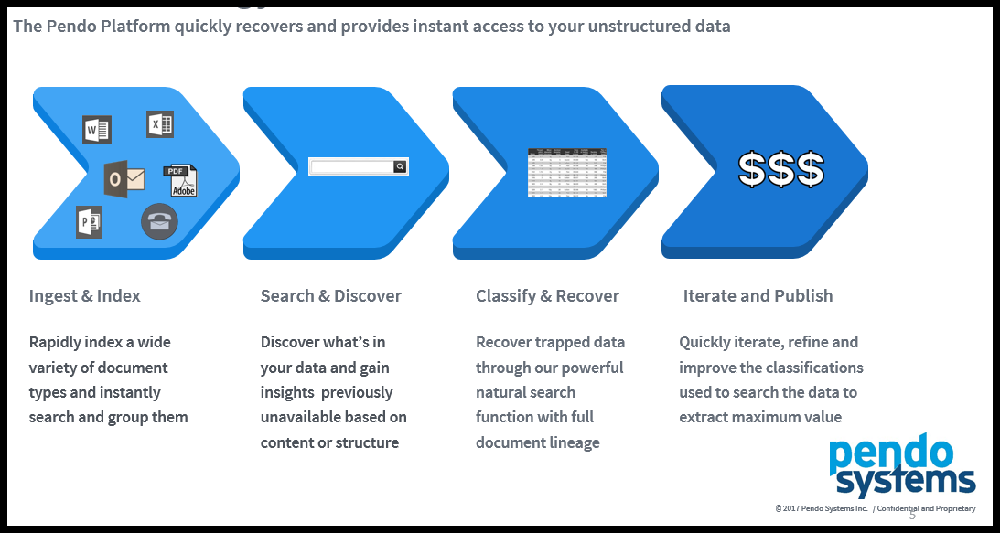
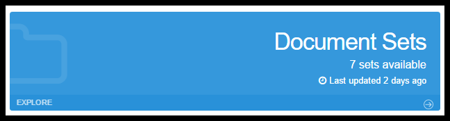

.. _document_set:

*Document Sets*
===========================

Introduction
--------------

This section focuses on *Document Sets*, but here is a picture of the the overall project processes for extracting data.

Please bear in mind that the *Pendo Platform* is a toolset. The exact functional flow and selection of components and the various options selected is dependent on the needs of your project.

In other words, the *Platform* is used to access and organize data needed by the business line from sources previously deemed too difficult, just impossible or time consuming to work with efficiently.

These next two sections, *Document Sets* and *Document Classes*, focus on the documents that have already been imported and how to get data out of them.

Document Sets Component
-----------------------

*Document Sets* are groups of non-database files that you have brought into the *Pendo Platform*. This is where can you *Edit, Delete, Reindex* and *Search* through any *Document Set or Sets. Document Sets* can be refreshed or updated by having the files in them updated and by changing the *Plugins and Plugin Options* used while *Indexing*. These documents would typically be spreadsheets, PDF files, email, word processing documents, etc.

Usage
-----

Click on *Explore* or on *Document Sets* . This will take you to the main *Grid*, which lists all the *Document Sets* that were created when you *Imported* the contents of a *Files and Folders* and *Remote Sources* into your *Workspace*.

Note: As soon as a *Document Set* is *Imported*, it is automatically indexed, allowing for searching through all data in the *Workplace* as if it was one big data source. See :ref:`unified-search`.

Any existing *Document Class* can be reindexed as described below. This allows for document refreshes, modifying the *Plugins* and/or options for the *Plugins* used, removal/retaining of *Labels* for Machine Learning, etc.

Document Sets Screens
-----------------------

Document Set Grid
~~~~~~~~~~~~~~~~~~~~~

This is the main *Document Set* grid. By default, it is grouped-by' the *Index State* and then sorted by *Document Set Name*. The concept presented is to quickly see which *Document Sets* are available vs. what is actively being indexed or has encountered a problem while indexing.

You can also see the number of 'rows' in the *Document Set*, which equates to the number of files and the date/time the set was last indexed.

Index states include:

- Pending
  - there is some issue with the options selected. For example, you did not click Force when you needed to in the Import Screen from Remote Sources.

- Pending rebuild
  - The job has been submitted and is waiting its turn for processing in the Job Queue. The Job Queue can be checked by going to the Admin menu (top-right under the user name) and selecting *All Jobs* or *My Jobs*.

- Discovering Files - the *Platform* is evaluating all the files in the *Document Set* to determine if new files were added or deleted from since last time the set was indexed, the number of files to process and the type of files found.

- Building
  - the files are being processed based on your selection of *Plugins*.

- Available - the set has been processed successfully and is available to the *User* and the *Platform*.

- Failed
  - the *Platfrom* encountered an error while processing the set. See the last line on that row for and error message in the *Last Error* column.

- Cancel Requested
  - The user has requested that the indexing job be canceled.

Edit Screens
~~~~~~~~~~~~~

Overview Tab
^^^^^^^^^^^^^^^^

.. image:: documentsetclass/51e480a6e1e9ca9842c9822ffb300bb1.png

-  You may edit the *Document Set Name* as desired.
-  You may enter/edit descriptive information about the *Document Set* (e.g. where did it come from, time span encompassed, how it will be used for your project, etc.)
-  You can see (but not modify) the *Source* of this *Document Set*.
-  *Source* gives you the name of the *Remote Source* if that is where the *Document Set* came from.

File Types Tab
^^^^^^^^^^^^^^^^^

-  This screen shows you what types of files are in the *Document Set*. You may make this list more inclusive as the Help Text indicates. All file types for a given *Document Set* should be covered under the same MIME type. The examples would be that the original folder that was imported with the Excel Plugin only had .xls files. Later a bunch more files were added to the folder and they included a mix of .xls and .xlsx files.

Documentation Tab
^^^^^^^^^^^^^^^^^^^^^

.. image:: documentsetclass/188cb39d03f35a80a6bdd4d5b26d3a74.png

Enter any desired project internal documentation notes about this *Document Set*.

.. _indexing:

Indexing Plugins Tab
^^^^^^^^^^^^^^^^^^^^^^^^

.. image:: documentsetclass/fb23d1179d55c9dd8eebe2428f7ea552.png

**NOTE: When editing *Document Sets*, the Pendo Platform will ensure that at least one Plugin is a Document Builder so that *Indexing* will work.**

-  Here you can see and alter which *Plugins* are being used for the *Document Set*. Select only those *Plugins* that are relevant to the type of data in the files of the *Document Set*.
-  Many *Plugins* have additional options. Some of these options are simply Yes/No while others may allow further interaction, such as creating scripts to extract targeted data out of a *Document Set*.

For lots of information on *Plugins*, please see :ref:`appendix_plugin`

Delete
~~~~~~~~~

Allows you to *Delete* a *Document Set* from the *Workspace*.

Reindex Selected
~~~~~~~~~~~~~~~~~~~~

- This allows you to select one *Document Set* at a time for reindexing.

**WARNING**: Whenever you *Reindex* any *Document Set* that had a *Document Class Attached*, the status of the attachment will become 'Stale', indicating that until you to rerun the *Attach* process, the extraction is out of sync with the updated *Document Set*. Please rerun the *Attach* process for the *Document Class*. This will ensure that the previous data that had been extracted to a *Target Entity* will be removed and the updated data will replace it. The *Document Class* itself is fine, you just need to attach it again.

For the most part, you will need to *Reindex* when you are  changing/modifying *Plugins* or when the data source has been updated.

If you highlight a *Document Set* and click *Reindex Selected*, you will see a popup screen.

**Reindex Options**

-  *Batch Size*: When dealing with *Document Sets* the *Batch Size* is the number of files that will be brought into memory at one time.
-  The ideal batch size depends on both the amount of memory in the server and the type and sizes of data with which you are dealing. The smaller the individual file sizes and the more memory your server has, the bigger the *Batch Size* can be.
-  The *Grid Size* determines the number of simultaneous threads that    will be used to process the data. The ideal size will depend on the number of processors your server has and what else may be running on the server at the same time.
-  Streaming:

  * If the checkbox is checked you will get Streaming delivery of the indexing or / attaching job, but not on the Discovery phase. The previous index is deleted and the system can display the extracted data as it is being built. Technically, there is no transaction, just delivery of data as it is processed and put into the index.
  * Checkbox unchecked - This is the previous behavior and thus the default setting for any new imports, indexing or attaching until you modify the setting. When Streaming is turned off, the prior result set is kept available for searching and you must wait until the indexing/attaching job to complete to see any new results.
  * You may monitor the progress of an Index by searching the Document Class with a filter of state:INDEXED.  When the option is turned on, you will see results as they come in. With the option off, you will see the old results until all the new results are ready.
  * You may monitor the progress of an Attach by Searching a Target Data Set. With the option off, the rows will contain the data that resulted from the prior Attach until the entire job complete.  With the option on, the rows will be populated as the data is extracted.
  * **Note: While monitoring with the Streaming option on you may hit the exact time the old index has been deleted and before the new index has been created.  If this happens you will get a technical error popup. The error is technically correct as you have requested a search for an index that no longer exists. Just close the error and search again.**

.. image:: data_exploration/streaming1.png
.. image:: data_exploration/streaming2.png

How to Monitor : As described above, for Importing or Indexing, search with a state:INDEXED.  For Attaching, you only need to search the Data Set.

.. image:: data_exploration/streaming3.png

-  *Shards* and *Replicas* allows you to use the UI to define storage  settings at the index level in the platform. This is a key capability as you start to work with larger ElasticSearch clusters. **Please do not change the setting for these unless advised by Client Services or you are an expert in ElasticSearch and the Pendo Platform.**
-  *Retain Labels*. Thru the use of the *Labels* component, you may have marked up documents and assigned various labels with the document. This allows you to clear (leave the checkbox empty) or retain these *Labels*. *Labels* and *Trainable Models* are covered in a different section of this manual.
-  *Force Settings*: The *Platform* will look at your entries and validate them. If the numbers entered above are too big, a maximum recommendation will be shown. You may overwrite the *Platform* recommendations, but be aware that this increases the chance that the server will crash. Please contact Client Services if you need help.

Reindex
~~~~~~~~
- This allows you to select multiple Document Sets to be reindexed from a single screen

- Clicking 'Reindex' brings up a popup screen showing all of the *Document Sets* in the *Workspace*.

- Here, you may select one or more *Document Sets* you wish to be reindexed.
- There is a filter box at the top of this screen, allowing you, for example, select only *Document Sets* that have the word 'excel' in the name.
- When you use a filter, the Select/Deselect All and Force/UnForce All buttons are disabled and you must make individual selections.

Search
~~~~~~~~~

Clicking the *Search* button invokes the *Unified Search* and filters the *Scope* to search only within the specific *Data and Document Sets*. This can be very helpful when you:

-  Don’t want to search through everything on the *Pendo Platform*.
-  Want to see the results of a specific *Document Set*.
-  You want to test scripts you are writing.

You may override this by clicking on the drop down arrow by the *Scope* box and selecting any combination of *Data or Document Sets* in your *Workspace*.

*Unified Search* is very powerful. To help get the most out of your searches, please be sure to see :ref:`unified-search`.

Flush a Document Set
~~~~~~~~~~~~~~~~~~~~~~~

You may now flush the contents of a *Document Set*, both thru the API and the UI.

- Using the API, you can call: - PUT /v1/documentSets/{documentSetId}?flush

- In the UI:

  - In *Document Sets*, if you highlight any *Document Set* you will See a new ‘Flush’ option. Any *Document Sets* that were flushed will now have an *Index State* of *Not Indexed* and a Row count of 0.

- In *Document Classes*, any *Document Class* that was using the flushed *Document Set* will show a *Document Sets State* of *Not Available*.

  The source of the data, *Files and Folders* or *Remote Sources* has not been altered.
  You may Reindex the *Document Set* if you wish. All the normal options you have with *Document Sets* are available to you.

