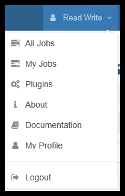
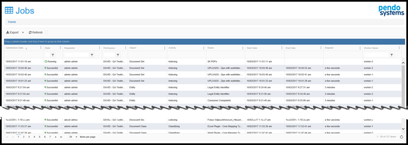
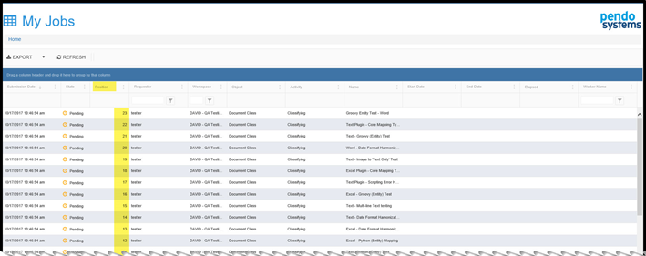
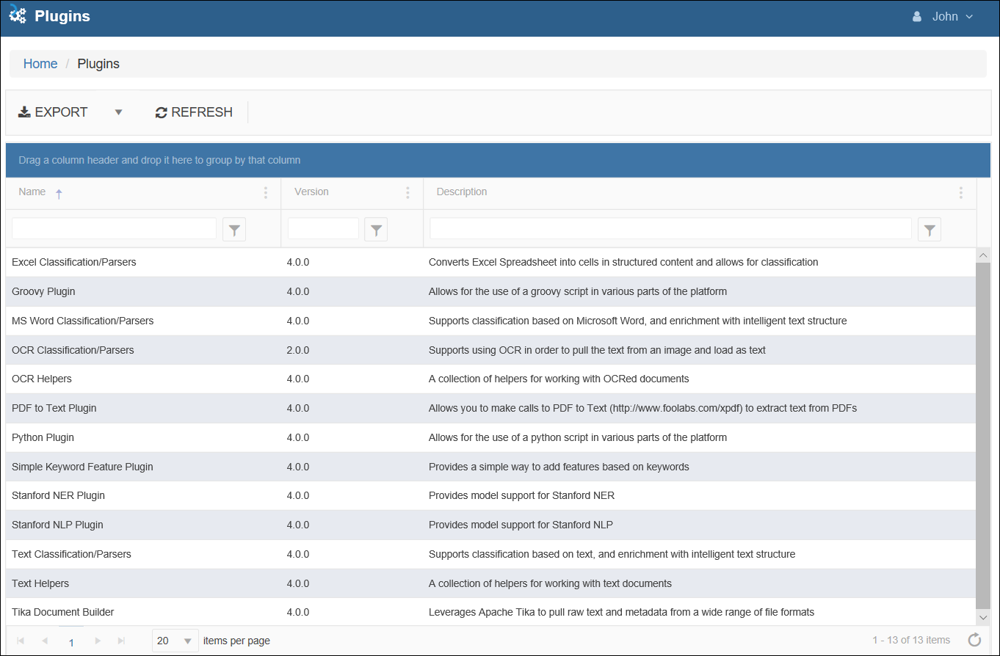
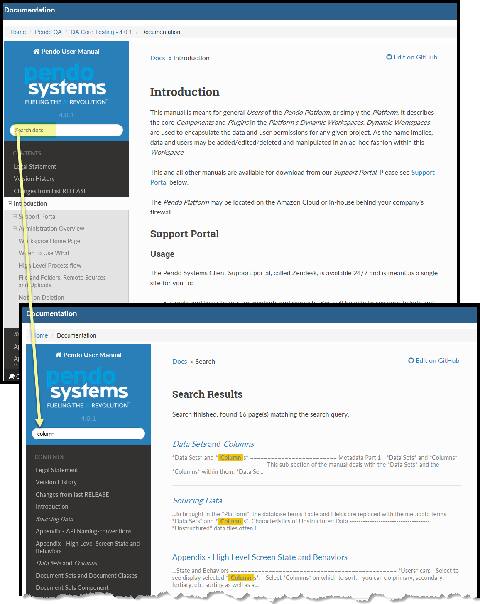
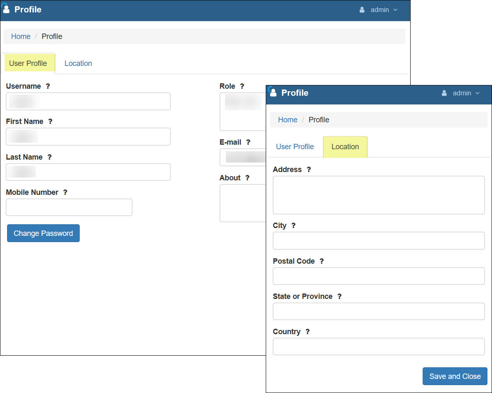

General User Administrative Functions
================================================

While *Users* who are *Platform Administrators* have many additional functions available to them, the general *User* has access to a limited 'Admin Menu'. 

The drop down menu is located at the upper-right side of the screen, directly under the *User Name* and is accessed by clicking on the chevron to the right of the *User Name*.

Terminology
---------------

Workers
~~~~~~~

Prior to Release 4.0.0, each server running the *Pendo Platform* had only a single worker to control the job queue for long running server-side jobs. While the Platform could always control the number of documents or database rows ingested into memory simultaneously for processing and the use of multithreading has been in place, there was only one worker.

The *Platform* now supports the use of multiple *Workers* to more efficiently utilize server memory. This will assist in dealing with the large job queues that result from having a multitude of Workspaces and Users on a given server. This feature can also reserve *Workers* for a particular *Workspaces*.

Setting up and configuring *Workers* is done by your technical staff. Assigning *Workers* is done by your *Platform Administrators*.

Jobs
~~~~

Jobs are defined specifically as:

-  Indexing or re-indexing *Data Sets* and *Documents Sets*.
-  Attaching or re-attaching *Document Classes*.

*Workers* are automatically assigned to a *Job* one a first-come, first-served basis. No *User* actions are needed. Any given *Job* will be assigned one and only one worker based on worker availability and the position of the Job in the Job Queue. For example if you have 2 workers available, 2 *Document Sets* can be indexed at the same time. 

Note that even if you have two workers available and a very large *Document Set* to index, only one worker will be assigned to that job. For that reason, setting up your Grid and Batch sizes is still important to get the most ‘bang for your buck’ from your servers.

All Jobs
---------

This option allows for basic job monitoring. ‘All Jobs’ shows a grid of Job history for all users on the server. This will allow insight into who started a job, what the job is, what worker has been assigned to the job and how long jobs that did run took to complete. No source data is displayed, just the names of objects, the job status and the name of the worker while processing.

My Jobs
--------

The ‘My Jobs’ option allows you to see the state of all your Jobs and where you stand in the queue. It is very similar to ‘All Jobs’ but filters out all Jobs except yours and provides an additional column called ‘Position’ that indicates how many jobs are in front of each of your jobs when your jobs are in any Pending.

Plugins 
---------

This option allows the user to see all the *Plugins* currently running in the *Platform*.

Understand that while the *Platform* may ship with many *Plugins* as part of a Release, *Plugins* may also be updated or added separately from a full *Platform Release*. This gives greater flexibility to Pendo's ability to respond quickly to specific project needs as they arise. Which *Plugins* are running is under the control of your technical staff.

Documentation
--------------

The User Manual is now included in the Platform.  Clicking on this option will open the web based manual.

**Helpful Hint 1**  You may wish to right-click on this option and open the manual in another tab on your browser!

**Helpful Hint 2**  You can search the User Manual.  Here you see the search results for 'Column'. 

About
-----

This option opens a pop-up with some information about the release of the *Platform* you are currently running.

My Profile
----------

Information about the user is displayed in a popup. Unless you are a *Platform Administrator*, you can not edit this information.

500 Server Error Handling
-------------------------

A 500 error can mean that a resource failed to execute, the server ran out of memory, or some other unusual or unexpected condition on the server caused the page in the UI to stop executing correctly. There have been cases when a server threw a 500 error and the user could not see what has happened. The UI would seemingly freeze or look like it was working but never fully populate the desired screen. This has been addressed for most but not all cases.

Now, if the Platform encounters a 500 error, the return object is captured and put into the UI in a 2 or 3-tab popup screen which includes:

  - An Overview tab which includes an Incident ID that will be in the server logs, making it easier to find.
  - A Technical trace which has the 500 JSON object.
  - A Stack Trace tab which includes the full stack trace of the error. In simple terms, a stack trace is a list of the method calls that the application was in the middle of when an Exception was thrown. This can help determine exactly where the exception was thrown in the application.

**This information does not persist. If this happens, please be sure to copy and paste the information so that the error-causing issue does not need to be duplicated in order to address the issue.**
