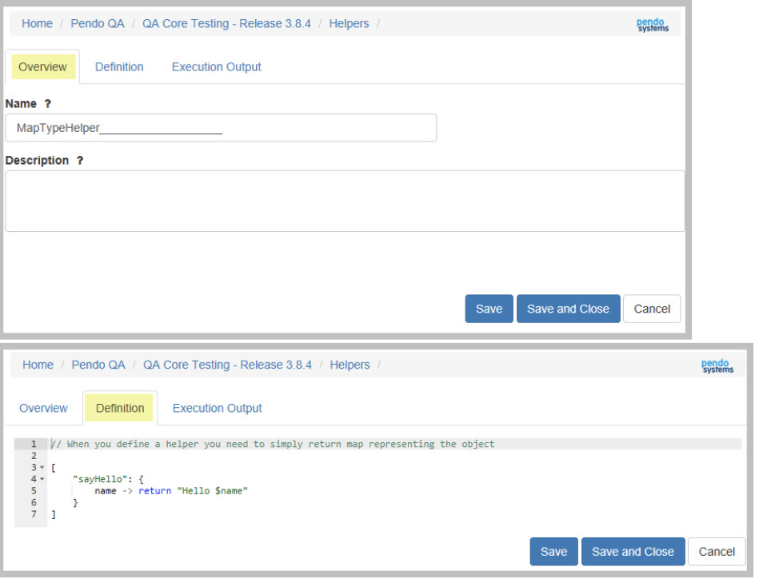
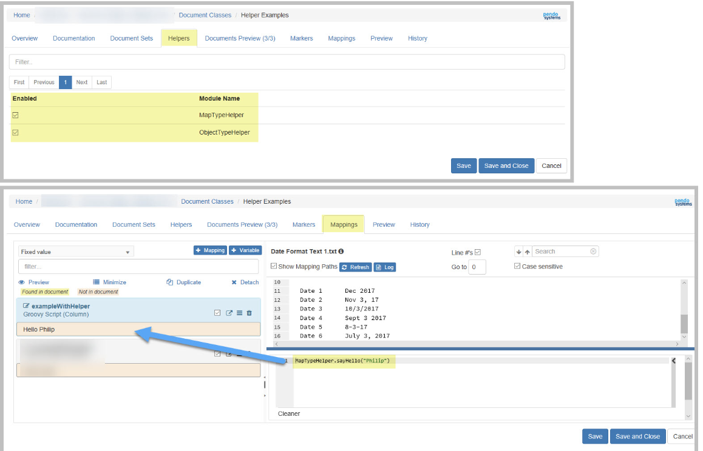
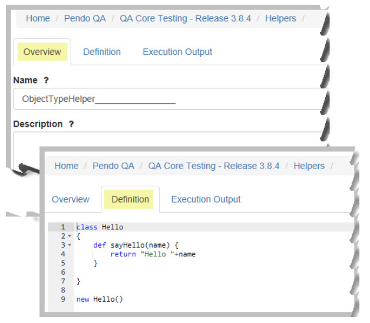
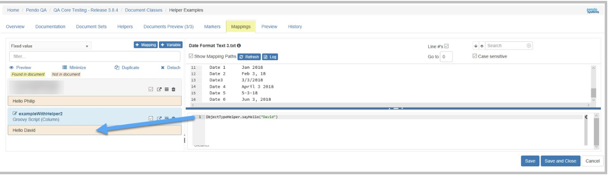

.. _helpers:

*Helpers*
==========

It has been determined that Users would benefit greatly if they could build reusable functions to handle processing of documents or applying logic. This would greatly increase productivity and uniformity across many different mappings within a Document Class as well as if across multiple Document Classes.  Copy and Paste functions no longer!

Previously, these functions needed to be defined in a mapping or by Pendo and then deployed as part of the Platform as a helper. You can now move these functions from a mapping to a shared "Helper". The Helper is then exposed to mappings.

To that end:

* A new module named ‘Helpers’ in available in the Workspace Home Page.

* The Document Classifications Edit screen has a new Helpers tab which allows Users to enable any available Helper and then use this Helper in Mappings..

* There are two different syntaxes available when defining Helpers. Examples are pictured below. Note that:

  1. Map syntax for simpler functions
      * When you define a helper you need to return a map representing the object.

  2. Object syntax for more control, use of the log output, etc.
      * If you want to have a groovy injectable helper then you simply need to declare an anonymous class with a getName method and the Platform will inject that name where the Helper is invoked.

|

In the  Helper -> Edit screens, you may execute the helper to ensure it is compiling and working without errors. Helper can be duplicated just like with Document Classifications and Target Data Sets.

Example 1: Map type syntax
~~~~~~~~~~~~~~~~~~~~~~~~~~~

1. Create a Helper
    * Provide a name and, optionally, a description
    * Define your Helper, this is an examples of Map type syntax where when you define a helper you simply return a map representing the object.

2. Use the Helper in a Document Class
    * Enable any Helper available in your Workspace using the new Helpers tab.
    * Refer to the helper as shown.

Example 2: Object Type Syntax
~~~~~~~~~~~~~~~~~~~~~~~~~~~~~~
1. Create a Helper
    * Provide a name and, optionally, a description
    * Define your Helper - this is an examples of Object type syntax where when you define a helper as an object with embedded variables.

2. Use the Helper in a Document Class
    * Enable any Helper available in your Workspace using the new Helpers tab.
    * Refer to the helper as shown.

Default Page size
~~~~~~~~~~~~~~~~~~

The injectable searchHelper functions (Data Set / Document Set) now accept an integer for pageSize. The default implementation returns 20

For example: searchHelper.searchDocumentSet(“ds1”,”hello”) will return 20 returns
