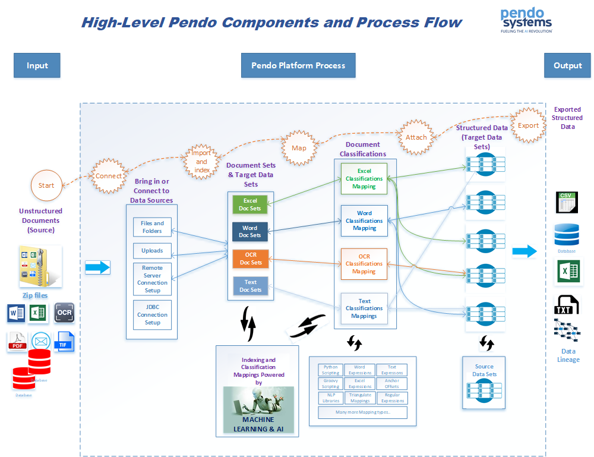

Introduction
============

This manual is meant for general *Users* of the *Pendo Platform*, or simply the *Platform*. It describes the core *Components* and *Plugins* in the *Platform's Dynamic Workspaces. Dynamic Workspaces* are used to encapsulate the data and user permissions for any given project. As the name implies, data and users may be added/edited/deleted and manipulated in an ad-hoc fashion within this *Workspace*.

This and all other manuals are available for download from our *Support Portal*. Please see Support Portal below.

The *Pendo Platform* may be located on the Amazon Cloud or in-house behind your company’s firewall.

Support Portal
--------------

Usage
~~~~~

The Pendo Systems Client Support portal, called Zendesk, is available 24/7 and is meant as a single site for you to:

  - Create and track tickets for incidents and requests. You will be able to see your tickets and those of your Organization.
  - Access the latest available version of the Platform’s documentation.
  - Access Release Notes.
  - Access the Platform’s Releases.
  - Visit the 'Support Articles' section of the Zendesk portal for FAQs.

**PLEASE REPORT ALL ISSUES AND REQUESTS VIA THIS PORTAL. THIS IS A KEY TO PENDO'S TRACKING THE ISSUES AND LINKS TO OUR INTERNAL DEVELOPMENT AND RELEASE PROCESS.**

Access
~~~~~~

You can access the support portal at
`Zendesk <https://pendosystems.zendesk.com/>`__.

You will be provided login credentials through your internal support staff. Pendo will not have access to production machines or be able to set up *Users* for your company.

Administration Overview
-----------------------

The *Pendo Platform* is used by three core types of users, each of which is often dealt with by different teams of people within a large organization. The exact types of users depends on your organization and the licensing agreement in place.

1. A company's technical infrastructure team would be involved with the installation and configuration of the *Platform*. This may include initial set up of servers and storage areas, control of permissions, Worker set up as well as routine maintenance of the infrastructure used by the *Platform*. Routine installation of software releases may also fall in this domain or the next type of user. These people may or may not actually use the platform itself on behalf of the business users, but usually not.
2. A special kind of *Platform User*, set up as a *Platform Administrator*, will need to set up *Workspaces, Users, Organizations, Groups and Roles*. A separate manual, *Platform Administration*, is available for *Platform Administrators*. *Users, Groups and Roles* may also be set up using your Single Sign ON (SSO) via LDAP and thus be under the control of your specialists in that area.
3. Business Users who may be Subject Matter Experts (SMEs). The skill set involved can range from non-technical business experts to data scientists. These are the users actually providing the business solution via use of the *Platform's* capabilities.

Logging in
~~~~~~~~~~

You will use a WEB browser to access the *Platform*. The URL you use will be provided to you by your administrator. The *Login Screen* will ask for your email and password or, if using LDAP, your SSO.

   After you log in, you will land on the *Home Page*.

*Platform Home Page*
~~~~~~~~~~~~~~~~~~~~

|platfrom home page|

The *Platform Home Page* has several sections:

The top window line is common throughout. Generally, you will see 'bread crumbs', telling you where you are in the Platform.

* On the upper left side, the drop down menu lets you go to the *Home Page* or select a specific a *Workspace*.

* On the upper right side, the drop down menu gives access to the *Administration Menu*. Depending on your / permissions, the *Administration Menu* may be limited or not even appear.

The middle-Left section of the screen shows you the Organizations available to you. Selecting a Organization will show you, on the right-side, all the workspaces that belong to that Organization.

Clicking on the *Workspace* takes you to that Workspace.

You will only see *Workspaces* to which you have been granted some level of access. Once you select a *Workspace*, you will go to the *Workspace Home Page*.

Usage of the *Administration Menu* is covered in a separate manual, *Pendo Platform Administration*. There are a few exceptions: Admin menu items to which everyone has access. They will be covered in the appropriate sections of this manuals.

Workspace Home Page
-------------------

Components of the Pendo Platform
--------------------------------
|image1|
   There may be other components on your screen.

A few definitions
------------------

-  **Data** is provisioned either by uploading it and persisting it on the *Pendo Platform*, by linking to it or by extracting information and storing it as metadata. Examples of *Data* include delimited files, both relational and non-relational databases, Spreadsheets, Word Processing Documents, PDFs, etc. The *Platform* supports flat files, any JDBC compliant database and various types of unstructured data(Metadata).

- **Data Sets** are a representation of specific structures (e.g.Tables or Row Headers) which store data acquired from various databases or flat files. *Data Sets* are made up of a logical collection of *Columns*, which represents the fields within the tables or columns found in flat files. For example the implied structure of data within the flat files or one of the tables in a relational database. There are two different types of *Data Sets*, *Source* and *Target*. More detail is provided in :ref:`dataset`.

- **Document Sets** are groups of unstructured data. This refers to pretty much any data not in a database, for example PDFs, Excel©,Word©, Google Doc©, or other files. More detail is provided in :ref:`document_set`.

When to Use What
----------------

A *Workspace* Overview
^^^^^^^^^^^^^^^^^^^^^^

When initially using a *Workspace*, using the *Components* in sequence is important.

Please bear in mind that the *Pendo Platform* is a toolset. The exact functional flow and selection of components is dependent on the needs of your project.

High Level Process flow
-----------------------

In other words, the *Platform* is used to access and organize data needed by the business line from sources previously deemed too difficult, just impossible or time consuming to work with efficiently.

File and Folders, Remote Sources and Uploads
--------------------------------------------

You will need acquire data for any given project. Depending on your organization's security requirements, it is possible that only certain administrators will be allowed to provision data for any *Workspace*. The components used are:

  **File and Folders**: This component uploads files into a file management system that is part of the *Platform*. Folder management, that is creating folders and sub-folders, is supported.

  **Remote Sources**: This component imports data that is accessed remotely, such as databases. This component is also used to import anything that was *Uploaded* via the *Upload Component*.

  **Uploads**: Uploads is currently used to upload zipped files to the platform's server.

Note on Deletion
----------------

Currently, if you wish to delete anything, you first need to delete everything *to which that item belongs*. For example, to delete a *Document Set*, you must first delete any *Document Classes* associated with that *Document Set*.

Initial Exploration of Data
---------------------------

**Unified Search**.
As soon as any data is imported and indexed, it may be searched.

  - If the data is structured, importing automatically creates one or more *Source Data Sets* (one per table or flat file) along with many *Columns* (one per column for each table). *Full-Text Indexes* will also be automatically created, allowing both simple and sophisticated searches across all *Indexed* data on the *Pendo Platform* as if it were one unified database.

  - If the data is unstructured, importing automatically creates *Document Sets*. *Full-Text Indexes* will also be automatically created, allowing both simple and sophisticated searches across all *Indexed* data on the *Pendo Platform* as if it were one unified database.

  - During and after import of unstructured data, you can elect to use some combination of *Plugins*, giving access to core *Platform* capabilities as well as advanced, optional capabilities. More on this topic can be found in the :ref:`datasource` and :ref:`appendix_plugin` sections below.

The **Data Sets** component has two main purposes:
  1. Allows you to view the structure of the *Data Sets* and *Columns* that were created when a database or flat file was imported. *Data Sets* created by importing databases are referred to as **Source Data Sets**.

  2. Allows for the creation and modification of **Target Data Sets** which are used to store the data that is extracted from **Documents Sets** during a **Document Classification**.

**Document Sets** are collections of unstructured files such as word processing documents, spreadsheets. etc.

**Document Classes** allows for the classification of **Document Sets** in order to group them, search and navigate through them to get to data that you wish to extract and organize.

