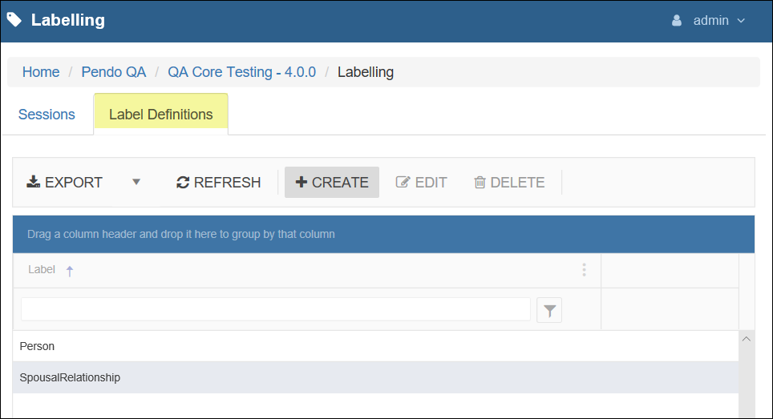

Machine Learning on the Pendo Platform
========================================

Introduction
-------------

This section of the manual opens the door for you to begin training *Machine Learning Algorithms* with your own data in an agile and cost-effective way. This feature means the *Pendo Platform* now offers a great foundation for companies who are working to quickly adopt

    Initial setup of data and Labels, when needed.

|

    Model Selection and Configuration

Labelling Component
---------------------

To access this component, click either the word *Labelling* or *Explore* in the blue *Labelling* component box. This will take you to the main grid.

Creating a Label
~~~~~~~~~~~~~~~~

This section allows the user to create *Labels* that can be applied to documents in order to *Label* words, sentences, paragraphs, or documents. *Labeled Documents* can then be used as supervised training data and consumed by machine-learning algorithms in the *Trainable Models* component.

From the main grid, click the *Label Definitions* tab.

The first step in using the *Labelling* component is to create *Labels*.

In order to create a *Label*, click the *Create* button and provide a name.

|

Parent-Child Labels
'''''''''''''''''''''

There may be some instances when two or more *Labels* may want to share the same content; in this case, a top-level, or *Parent Label*, should be created and two or more *Child Labels* should be added to the *Parent Label*. For example, if defining the relationship between two spouses, the following steps would be performed:

* Create a *Parent Label* to connect the *Child Labels*; in this case, we will call the *Parent Label* 'SpousalRelationship'.

* After saving the \_Parent *Label*, select that *Label* and click the    *Edit* button. A popup will open allowing the *User* to add *Child Labels*. In this example, two *Child Labels* are added in order to *Label* both spouses.

Once *Labels* have been added, a *Labelling Session* can be created. *Labels* can be used across multiple *Labelling Sessions*, allowing *Users* to reuse *Label* names over different *Data or Document Sets*.

Labelling Sessions tab
~~~~~~~~~~~~~~~~~~~~~~~~~

*Labelling Sessions* allow users to associate one or more *Labels* with one or more *Document Sets*. *Labels* may then be applied to the
unstructured text of a document in order to create supervised training data for machine learning algorithms to process.

* To create a *Labelling Session*, from the main grid click the *Create* button on the *Sessions* grid and provide a name for the *Session*.

* **Note**: *Session Names* cannot be changed after creation.

Editing a Labelling Session
~~~~~~~~~~~~~~~~~~~~~~~~~~~~

After a *Session* has been created, select the row and click the *Edit* button.

* The *Overview* tab has the *Session Name*.
* The *Documentation* tab is a place to enter any descriptive or internal notes about this *Labelling Session*.
* Select any *Labels* that should be available for labelling documents Within this *Labelling Session*.

Documents Sets tab
~~~~~~~~~~~~~~~~~~~~

Select all *Document Sets* that should be available for this *Labelling Session*.

Documents tab
~~~~~~~~~~~~~~

* From the *Documents* tab, select a document. The selected document will appear in the *Apply Labels* tab which is where *Labels* may be applied.

Apply Labels tab
~~~~~~~~~~~~~~~~~

* On the *Applied Labels* tab, find the portion of text to which a    *Label* should be applied. At the beginning of the text, click and hold the left mouse button, drag the mouse across the text to highlight the text (left-to-right), and release the left mouse button at the end of the text. Next, right-click on the text. A context menu will appear with the *Labels* designated for this *Labelling Session*. Select the correct *Label*. The page will refresh and the labeled text will be highlighted in green.
* If creating *Child Labels* that should share a common *Parent Label*,    each *Child Label* will be created individually, after which they can be dragged & dropped on one another in order to complete the desired relationship.

Models Component
----------------------------

The *Models* component allows the *User* to use training data that has been *Labeled* in a *Labelling Session* and feed it to a *Model*. 

Alternativly, the *Model* may already be 'pre-trained' and not need any User Labelling.

*Models* are provided as *Plugins* and may not be available for your installation. Your technical staff may also wish to use their own *Models*. 

Currently Provided Models:

- Spacy NLP – Supervised, no Labels needed
- Spacy Text – Supervised, needs Labels
- Space NER – Supervised, needs Labels
- Builtin – Supervised, no Labels needed

To access this component, click either the word *Models* or *Explore* in the blue *Trainable Models* component box.
