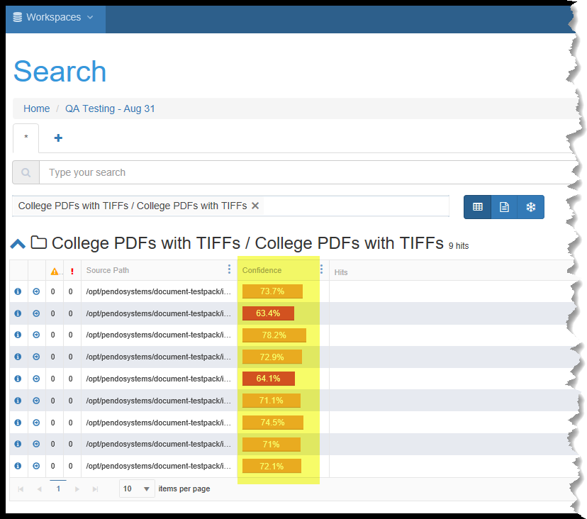
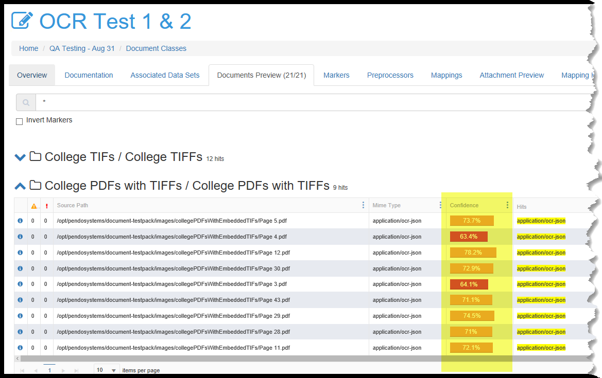

OCR related screens and Confidence numbers
==========================================

Introduction
------------

The OCR *Plugin* has the most options of any of the *Plugins*. Details of theses options can be found in 'OCR Classifications/Parsers Document Builder' when Importing or Reindexing.

Most of the time, the end result of OCRings will be a text document. Rarely will the results will be OCR mime type of documents.

When a document is OCRed, we make use of *Confidence* ratings.

*Confidence* ratings
-----------------------

For documents that have been OCRed, **word level confidence** is the probability that the imaged word was OCRed with no errors. **Document level confidences** is simply the aggregation of the confidence at the word level.  

For non-OCRed data (e.g. databases, Word, Excel, some PDFs), you will see a confidence of 100% since the platform will always correctly bring in the data from these other source types.

*Target Data Set Searches* display one or two different columns than other searches.
 - *Confidence* is always shown. *Source Confidence* is shown only for *Target Data Sets* that were populated from OCRed sources.
 - *Confidence* reflects the platforms’ aggregate confidence in the contents of the Columns of the Data Set.
 - *Source Confidence* indicates the platforms’ confidence in the accuracy of the transfer of data from the source of the Target Data  Set. Each row’s data could be from a databases’ fields or from *Attachments* from one or more *Document Classes*.

Search screens
----------------

*Document Set* Searches
~~~~~~~~~~~~~~~~~~~~~~~~~~~

*Document Set* searches display *Confidence*, which reflects the platform’s confidence in the correct parsing of data from the original source to the indexed metadata. This only relevant when reviewing OCRed files.

You may also search a Document Set within a Document Classification.

Search screen *Detail View*
^^^^^^^^^^^^^^^^^^^^^^^^^^^^^

The first ‘i’ icon on a search grid pops up a *Detail View* as is standard. However, for OCRed files, the first tab is ‘Parsed Content’.

| This tab has two sub-tabs:

 - *OCR* which shows the original image of the document.
 - *Text* which shows the results of the OCR process.

.. image:: Ocr/23fbe3bfbcd8765e6cc75fc2cff1d1fd.png
   :alt:

*Document Class* Screens
------------------------

*Document Class* Grid
~~~~~~~~~~~~~~~~~~~~~

The *Document Class* grid shows *Confidence* the same way that a Search* of a *Document Set* does. Please see above.

*Note In a search result grid, the ‘Document Classes’ column has been removed.  This was done to remove optimistic locking of the Document Classification Edit screens while indexing or attaching is occurring.*

*Attachment Preview* Grid
~~~~~~~~~~~~~~~~~~~~~~~~~

- In the *Attachment Preview* tab you have an option to *Highlight confidence*. This number reflects the aggregate confidence for this row of data that the mapping logic has worked correctly in extracting the data from the source file.

- You may also *Show Statistics* for each column. Columns are either an *Attribute* or a *Variable*).

.. image:: ocr/c7408dbdd35e4e8054ce252ef7cd87cd.png
