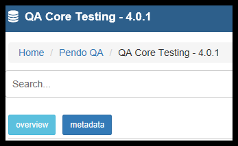
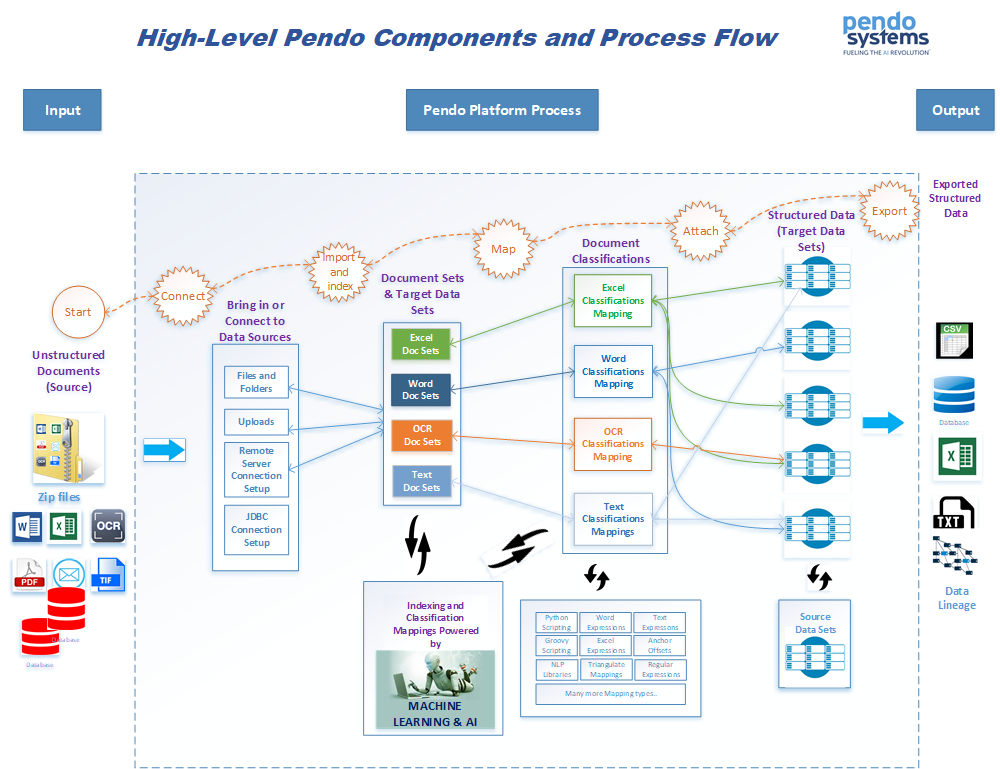
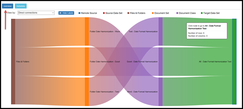
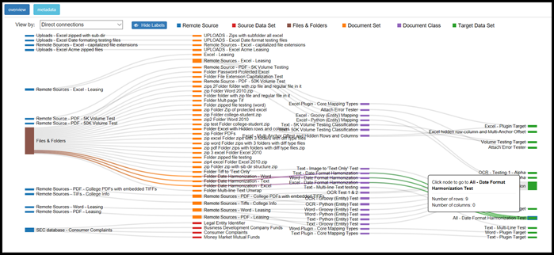

Sankey Functionality
====================

Usage
-----

On the *Home Page* of a *Workspace*, you see an option for ‘Metadata’ or ‘Overview’.

- Metadata (the default view) will show the components of the *Platform* as a collection of blue boxes that give access to the components of the *Platform*.

- The Overview option will provide the user with a graphical representation of the flow of data within the *Workspace* in the form of a *Sankey* diagram.

You will be able to visualize the flow of connections, or the volume of data between each of the *Platform’s* components. Between this feature and the existing *Document Class Statistics*, a full picture of work being accomplished can be available for managerial oversight. This also provides *Users* a tool to verify visually if the connections the *User* thinks are in place are actually in place. Plus, it is cool to look at.

Flow of Data
------------------

The flow of data is visualized as going thru all of the *Metadata Components*. From left to right:

  - Starts with the source of the data you are using: *Remote Sources* and / or *Files and Folders*.

  - The data then flow into one or more *Document Sets* or *Source Data Sets*.

  - *Documents Sets* then flow into one or more *Document Classes*.

  - *Document Classes* then flow into one or more *Target Data Sets*.

  - Each of these familiar components are called ‘nodes’ in the *Sankey* diagram.

Features
--------

Placing your cursor over a node (one of the boxes) and hovering gives some information about that node. You will also see a emphasized color gradient for all nodes related to the node you have selected, making it very easy to follow the data in a complex workspace. Hovering over a:

  - *Remote Source* gives you the name of the *Remote Source*. \

  - *Files and Folders* gives the number of folders, number of files, size and Last Modified date.

  - *Document Set* gives you the name of the *Document Set*, the Number of documents in it and the Last indexed date.

  - *Source Data Sets* gives you the name of the *Source Data Set*, the number of rows and the number of *Columns*.

  - *Document Class* gives you the name of the *Document Class*, Number of generated instances which is the number of rows generated when you *Attach* this *Document Class*, Number of enabled *Columns*, Number of disabled *Columns*, MIME type, Number of times *Attached* and *Last Attached* date and time.

  - *Target Data Sets* gives you the name of the *Target Data Set*, the Number of Rows and the Number of *Columns*.

Left-Clicking the node will take you to the most logical related part of the *Platform* based on which node you are clicking:

 - The *Data Sets* main grid.

 - The *Search* results screen of the selected *Document Set*.

 - The Edit screen of the selected *Document Class*. - The Search Results screen of a selected *Target Data Set*.

Right-Clicking the node gives you several options:
  - ‘Show only related nodes' restricts the diagram to show only those nodes that have a connection to the selected node. The remaining nodes will resize to take up the available space.
  - ‘Hide related nodes’ removes that node and anything connected to it from the diagram. This can help you narrow the focus of the displayed nodes by eliminating specific data flows.
  - ‘View all nodes’ returns the diagram to showing all nodes in the workspace.

Under the Overview button, there is an option to show the diagram by number of connections or number of documents. This will control the height of the connector between nodes to reflect the volume of data flowing from one *Component* to another.

Examples
--------

Below you see a *Sankey* diagram. We have selected to show only the nodes related to a particular *Target Data Set*. From left to right, you see there is 1 *Folder* that was used to create 3 *Document Sets* (one each for Text, Word and Excel). There were 3 *Document Classes* (one each for Text, Word and Excel), but these 3 *Document Classes* were all mapped to 1 *Target Data Set*. Since the cursor was placed over the *Target Data Set*, the popup tells us that there are 9 rows of data, each having 7 Columns.

Below you see the entire *Workspace* represented in the *Sankey*, including what is shown above.

There are many *Document Sets* and *Document Classes* that were mapped to many *Target Data Sets*. By hovering the cursor over a node, in this case the same *Target Data Set* from the above picture, you can see the complete flow thru the *Platform* of all related data that populated the *Target Data Set*.

