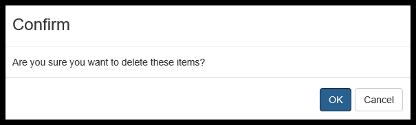
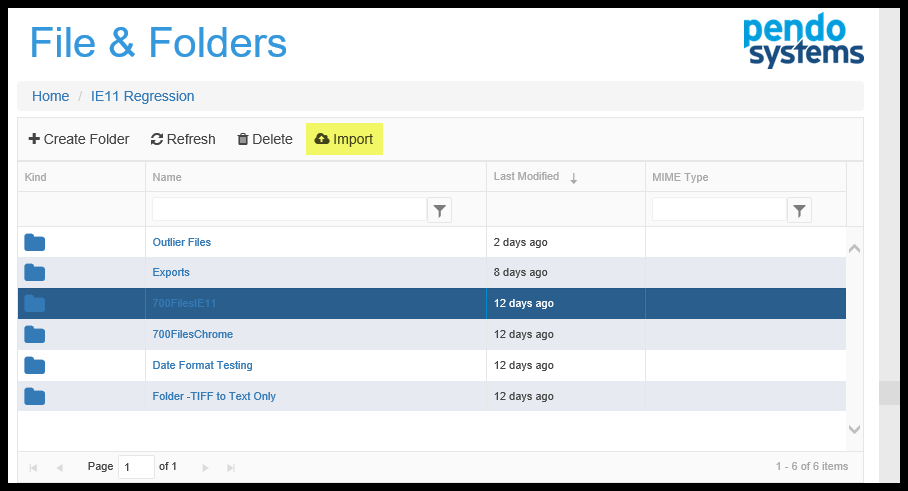
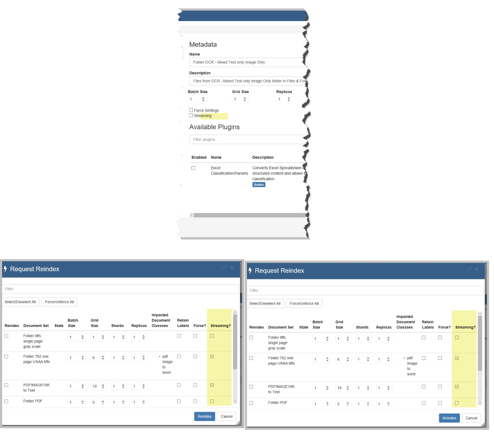
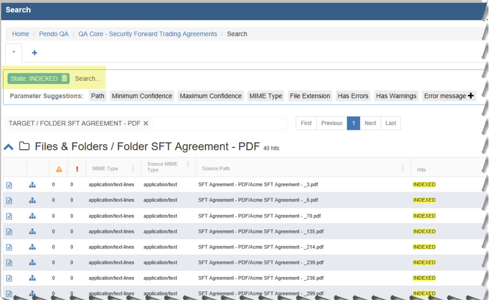
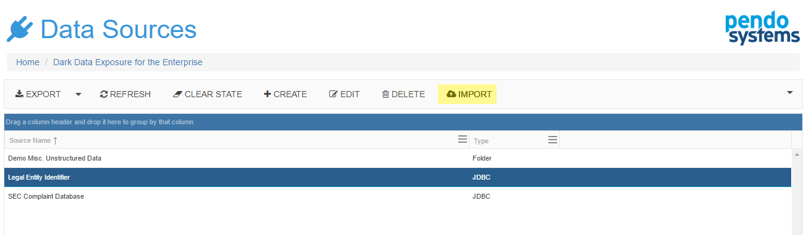

Sourcing Data
===============

Introduction
------------

These *Components* are used to upload data to the *Platform*.

At a high level, the *Pendo Platform* deals with two types of data: *Structured* and *Unstructured*. The *Platform* allows you to search through and explore any combination of *Structured* and *Unstructured* data via a :ref:`unified-search`.

Characteristics of Structured Data
~~~~~~~~~~~~~~~~~~~~~~~~~~~~~~~~~~~

Generally called databases, *Structured* data first depends on creating a data model. A model of the types of business data that will be recorded and how they will be stored, processed and accessed. This includes carefully defining what fields of data will be stored and how that data will be stored:

* Tables and Fields are defined and named.

* Tables are collections of fields.

* Fields are composed of specific data types such as numeric, currency, alphabetic, name, date, address.

* Field characteristics are specified such as the number of decimals stored, if no decimals are stored, number of characteristics in a string field and so on.

* Restrictions can be added on the data input (number of characters; restricted to certain terms such as Mr., Ms. Dr. or True of Falseand so on).

As you can see, databases need to be well organized, i.e. *Structured*, before any data is put in them.

**NOTE**: When structured data in brought in the *Platform*, the database terms Table and Fields are replaced with the metadata terms *Data Sets* and *Columns*.

Characteristics of Unstructured Data
~~~~~~~~~~~~~~~~~~~~~~~~~~~~~~~~~~~~

*Unstructured* data files often include text, tables and even multimedia content. Examples include e-mail messages and attachments, word processing documents, spreadsheets, presentations, webpages and many other kinds of business documents. Note that some of these files may have a basic internal structure: an email has a To, From, CC,BCC, Date and Body fields. Or a word processing document may have paragraphs and tables. However, they are still considered *Unstructured* or *Semi-structured* because the data they contain doesn't fit neatly in a database.

Experts estimate that 80 to 90 percent of the data in any organization is *Unstructured* and the amount of *Unstructured* data in enterprises is growing significantly, often many times faster than *Structured* databases.

The *Platform* allows you to search through, explore and extract any combination of *Structured* and *Unstructured* data.

IMPORTANT CONCEPTS
~~~~~~~~~~~~~~~~~~

*Unstructured* data can often contain vital information that:

1. does not exist anywhere else.
2. is needed to compare to data that exists elsewhere.
3. is needed to feed data to an existing system, such as a more complete risk model.
4. has data that you wish to extract and make into structured data.
5. all of the above.

The *Platform* allows you to Search the content of any of these files in the same way as searching for anything else on the *Pendo Platform*. A *Unified* *Search* on the *Pendo Platform* looks through ALL data, unstructured or structured.

Data can be extracted from an unstructured source and made to be structured. As an example, you may have thousands or millions of complex spreadsheets and want to retrieve a few targeted pieces of information from each of these spreadsheets, or a hundreds of PDFs that have tables containing important information. By extracting this information, it can be sent to other systems in the form of a file, database, etc.

*'Files and Folders'* Component
---------------------------------

How To Use
~~~~~~~~~~

Click on 'Explore' or the words 'Files and Folders' on the blue component tile. You will be brought to the main grid.

.. image:: sourcing_data/9f3c44821238c3ebd5068d6dc5ac3cae.png

This component is a directory management service within the *Workspace* and is managed by the *Platform*.

You can Create folders (and sub-folders) and then upload files into or download files from these folders.
  * Files uploaded here are actual copies of the files, maintaining NO LINK to the original source location.
  * if you uploaded a zip file that contains an embedded directory structure, this structure will be maintained when uploaded.
  * Folders you create here can be *Imported* from here, automatically creating a *Document Set* and indexing the data. You do not have to create a *Remote Source* and then import it like you do with the *Uploads* component.
  * Data can be 'refreshed'. To update a file(s), perhaps a newer version of the file, just *Delete* it from the folder and upload the newer version. As you will see later, Reindexing a 'refreshed' or updated *Document Set* will reimport all files being processed and update the metadata in the *Platform*.

Duplicate file detection:
  * When you upload a file with the same name as a file already in the folder, ‘-copy’ is added to the end of the imported file name.

| **NOTES:**

  * The process of 'Uploading' is followed by the process of 'Importing'.
  * Uploading places a copy of the file itself under the control of the *Platform* but does nothing with the file.
  * There is no link between the original source file and the uploaded file. You may delete a file here, and the original file will not be touched.
  * Importing the files processes them, creating metadata and allowing you to visualize, download and extract information from these files.
  * Once you Import a Folder, the *Document Set* that is created is linked to that Folder in *Files and Folders*. This allows you to alter the contents of the folder and then simply reindex the linked *Document Set*.
  * Folders may be renamed by highlighting a Folder and clicking the Edit button.
  * CSV files are not yet supported in *Files and Folders*. Please continue use the *Upload* component and then Create and Import a *Remote Source*.
  * When you export a *Workspace* you will also export the contents of *Files and Folders*, making migration of a *Workspace* to a different    *Workspace*, even on a different server, much less labor intensive.
  * *Exporting and Importing a Workspace* is covered in the *Platform Administration Manual*.

Creating / Deleting a Folder
''''''''''''''''''''''''''''

**NOTES: The process of 'Uploading' is followed by the process of 'Importing'.**

* Uploading places a copy of the file itself under the control of the *Platform* but does nothing with the file.
* There is no link between the original source file and the uploaded file. You may delete a file here, and the original file will not be touched.

* Importing the files processes them, creating metadata and allowing you to visualize, download and extract information from these files.
* Once you Import a Folder, the *Document Set* that is created is linked to that Folder in *Files and Folders*. This allows you to alter the contents of the folder and then simply reindex the linked *Document Set*.
* .csv files are not yet supported in *Files and Folders*. Please continue use the *Upload* component and then Create and Import a *Remote Source*.
* When you export a *Workspace* you will also export the contents of *Files and Folders*, making migration of a *Workspace* to a different *Workspace*, even on a different server, much less labor intensive. *Exporting and Importing a Workspace* is covered in the *Platform Administration Manual*.

Click on *'Explore'* or the words *'Files and Folders'* on the blue component tile. You will be brought to the main grid.

When you see the grid initially, only the 'Create Folder' and 'Refresh' options are available. Click the 'Create' button. In the popup, provide a name for the folder and click 'Create'. Note that you can create a Folder inside of another Folder.

.. image:: sourcing_data/b91354a34ee6d6288508cd69c551fb32.png

When you highlight a Folder, the 'Delete' and 'Import' options become available.

To Delete a Folder, highlight it and click the Delete option. A popup appears, asking you to verify your command to delete a Folder. Note that any files or sub-folders that are in that folder will be deleted. This is your chance to change your mind!
  * Ctrl key (press and hold) to select more than one one file for deletion.
  * Shift key (Press and Hold) to select a contiguous selection of files for deletion.

**HINT: Highlighting vs. Selecting a Folder.**

* To highlight a Folder, click on the blank space after the Folder Name. If you click the icon in the 'Kind' column or if you click on the Folder name, you are selecting the folder instead of highlighting it.
* Selecting a folder opens that folder and brings you to the next grid down showing you the contents of the Folder.
* You may highlight a Folder or a File and then Click the Edit button to rename these objects.

**Special Note about the Export Folder:**

|
|   **Please free up space no longer needed.!** When any *Data Set Search* is exported, or a *Workspace* is exported, a dialogue box pops up. The default Folder to which the file is to be exported is 'Exports', but you can change this, as well as the filename and other options.
|

In addition to csv and json formats, we support excel exports. **Note that an Excel cell may have more than one line of text in it.**

The term 'export' is used rather than 'download' because you are in fact exporting data from a *Platform Index* to a .csv file and placing this file *Files and Folders* component.

You may then download the file to any storage available to your PC.

It is good practice, after you download anything that you had exported, to remove the file from the *Platform* to free up storage space and prevent unneeded data from being exported as part of a *Workspace Export*.

Uploading / Deleting
''''''''''''''''''''

Clicking of the icon in the first column or the Folder name selects the folder and brings you to another grid.

When you first arrive on this grid, only the 'Upload Files, 'Create Folder', 'Refresh' and 'Up to Parent' options are available. After highlighting a file by clicking anywhere on a row, the 'Edit', 'Download' and 'Delete' options can be seen.

* To Rename a File, click the Edit button.
* To Create a sub-folder, click 'Create Folder'. The behavior is the same as above.
* To move back up to the parent folder, click 'Up to Parent'.
* To upload one or more files, click 'Upload Files'. You will see the following popup or one very similar, depending on the WEB browser you are using. The *Platform* currently runs on MS IE 11, MS Edge and Chrome.

*  If you wish to use any file explorer, such as MS Explorer or MAC File Finder, you may do so. Using the standard selection methods for your computer, you may select one or more files and 'drag and drop' them to the area that says' Drop File Here'.
*  typing in the blank box or clicking the 'Browse' button opens up a standard dialogue box, allowing you to move around and find the file or files you wish to upload into the folder.

The result is seen below. Note the three numbered sections.

**Note:** As the warning by the number 1 indicates, this component is limited to uploading 500 files at a time. You can upload more than 500, just do it in 500 files or less increments. You can select to Upload, Cancel or Remove any individual files from the queue in Section 2.

**Section 3** allows you to Upload All, Cancel All or Remove All files from the queue.

* Once you start uploading, there is a progress bar for each file as well as a status. The status will either be:

  * Blank meaning not yet processed.
  * A check meaning all went well.
  * A 'X' meaning something went wrong with this file and it is not uploaded.
*  When you are done uploading, click 'Up To Parent' so that you can proceed to Import your data.

Importing Folders
'''''''''''''''''

Once you have uploaded files into a folder, you will want to *Import* that data so that it can be searched and data can be extracted and organized. Select the Folder that has the data you wish to import into the *Platform* and click the *Import* button. Importing a folder creates a *Document Set* and Indexes it in one step.

You will go to the Import screen.

The *Platform* will:

* look in the Folder you created

* analyze the files and display them to you sorted by file type. You do not need to have only one file type in the folder, however you must only select one type of file to be imported at a time. For instance, if you have both word processing and spreadsheet files, you would select one or the other for any given *Import*. Variation of a file type, such as .doc and .docx can be imported at the same time as they are the same MIME type.

* For the technically curious, the MIME type is the mechanism to tell the client computer the variety of document transmitted: the extension of a file name has no meaning on the web.

Import screen details:

1. In Area 1, you may, optionally, enter a filter for the file types you wish, e.g. pdf. This is useful when the destination of the path contains many different types of files.
2. In Area 2, you may easily select/deselect all files types that were discovered.
3. In Area 3, you may override the *Platform* generated *Name* and or *Description*. The Name here will be the name of the *Document Set* that will be created. The default name appends the word 'Folder' to the front of your folder's name. For example, if the folder name was 'Month End Leasing Reports from Acme', the default Name will be 'Folder Month End Leasing Reports from Acme'. This is meant to help you remember that the source of data for the *Document Set* was a folder from 'Files and Folders'.

  * Hint: you may make the *Name* user friendly with upper and lower case letters, spaces and special characters like ‘-\_ and make the Description useful

  * Perhaps describe the data being brought in. For example ‘Loan Collateral spreadsheets from xxx business unit from date 1 through date 2’.

4. In Area 4, there are several options:

* *Batch Size*: When dealing with databases, the *Batch Size* is the number of rows that will be brought into memory at one time.

  * The ideal batch size depends on both the amount of memory in the server and the type and sizes of data with which you are dealing.  The smaller  the individual rows in the database and the more memory your server has, the bigger the *Batch Size* can be.
* The *Grid Size* is ignored when importing a database.
* *Shards* and *Replicas* allows you to use the UI to define storage settings at the index level in the platform. This is a key capability as you start to work with larger ElasticSearch clusters. **Please do not change the setting for these unless advised by Client Services or you are an expert in ElasticSearch and the Pendo Platform.**
* *Retain Labels*. Thru the use of the *Labels* component, you may have marked up documents and assigned various labels with the document. This allows you to clear (leave the checkbox empty) or retain these *Labels*. *Labels* and *Models* are covered in a different section of this manual.
* *Force Settings*: The *Platform* will look at your entries and validate them. If the numbers entered above are too big, a maximum recommendation will be shown. You may overwrite the *Platform* recommendations, but be aware that this increases the chance that the server will crash.
* *Streaming*:

  * If the checkbox is checked you will get Streaming delivery of the indexing or / attaching job, but not on the Discovery phase. The previous index is deleted and the system can display the extracted data as it is being built. Technically, there is no transaction, just delivery of data as it is processed and put into the index.
  * Checkbox unchecked - This is the previous behavior and thus the default setting for any new imports, indexing or attaching until you modify the setting. When Streaming is turned off, the prior result set is kept available for searching and you must wait until the indexing/attaching job to complete to see any new results.
  * You may monitor the progress of an Index by searching the Document Class with a filter of state:INDEXED.  When the option is turned on, you will see results as they come in. With the option off, you will see the old results until all the new results are ready.
  * You may monitor the progress of an Attach by Searching a Target Data Set. With the option off, the rows will contain the data that resulted from the prior Attach until the entire job complete.  With the option on, the rows will be populated as the data is extracted.
  * **Note: While monitoring with the Streaming option on you may hit the exact time the old index has been deleted and before the new index has been created.  If this happens you will get a technical error popup. The error is technically correct as you have requested a search for an index that no longer exists. Just close the error and search again.**

.. image:: data_exploration/streaming2.png

How to Monitor: As described above, for Importing or Indexing, search with a state:INDEXED.  For Attaching, you only need to search the Data Set.

5. In Area 5 you may filter by name any of the Plugins in the *Platform*.
6. In Area 6, you may select any of the *Plugins* that have been made available to you. Select only those *Plugins* that are relevant to the projects being worked on in a particular *Workspace.* Some *Plugins* will result in additional space being used and increased processing times. Note that you will be able to change your selections later via the *Edit* screens for *Document Sets*.

   **IMPORTANT NOTE: When importing data, the Platform will ensure you select at least one Plugin that is a Document Builder so that the Indexing will work.** Notice that each *Plugin* indicates what type of *Plugin* it is. When in doubt, please contact Client Services.

7. In Area 7, when ready to *Import* data and create *Document Sets*, click the *Create Document Set* button.

After the files are imported, you will be brought to the :ref:`document_set`.

.. _Downloading_Data_from_Files_and_Folders:

Downloading Data from Files and Folders
'''''''''''''''''''''''''''''''''''''''

Once files are in a Folder, you or any other user may wish to download these files.

Highlighting any file activates the *Download* button. A standard dialogue box will open allowing you to determine where to download the file.

Upload Component
------------------

Uploading Files
~~~~~~~~~~~~~~~~~~

This is where flat files (a.k.a. delimited files) or zipped Word, PDF and Excel files that are accessible from your PC can uploaded into the *Platform's* server. This is a required step before theses files can become a *Remote Source*. Pendo recommends you use the *Files and Folders* component for smaller, under 3000 files, *Document Sets*.

Click on the word *Explore* or *Uploads* in the *Uploads* Component. This takes you to the *Uploads* grid.

.. image:: sourcing_data/51dc1a2a09f158fc844cc39f8865e866.png

Next, click on *+UPLOAD* button. This opens the Upload dialogue screen.

* In Area 1, you have a choice of dragging the file(s) you wish to upload and/or clicking the 'Choose Files' button and opening a standard selection screen. If you click *Choose File*, just navigate to the location of the file, highlight it and click the *Open* button. The normal multi-select options work in your dialogue box.

  * for Windows PCs, the Shift and Ctrl keys allow for blocks of files or many individually selected files to be selected
  * for Macs, this would be the Control and Cmd keys.
* Repeat as needed to select as many files as you wish to upload. Note that zipped files that contain MS Word, MS Excel and/or PDF files can be uploaded and subsequently processed as a valid file while creating a *Data Source*. The *Platform* will unzip them.

* In Area 2 you will see a list of all the files that will be processed. You may elect to upload, delete (from the queue, not the source file) or cancel an upload that is in progress.

* In Area 3, you can upload all , delete all (from the queue, not the source file) or cancel the upload.

Downloading Files
~~~~~~~~~~~~~~~~~

Any file that was *Uploaded* can be downloaded to your local
PC.

Replace a File
~~~~~~~~~~~~~~

This allows you to replace a previously uploaded file.

.. image:: sourcing_data/7478e6adacf8a10b7d39ce91fe71d786.png

You may replace a file that was *Uploaded*, *Imported* and made into a *Document Set*. This process updates the contents of the *Document Set* without the user having to delete anything or modify any *Mappings* of a *Document Class*. This may be a ‘refresh’ or update of the same file or a complete replacement file of a different name. The file must be of the same type as the original, that is if the original files was .csv, then the replacement must be a .csv, if the original was a .zip of Excel files, then the replacement must be a zip of Excel files and so on.

Originally, you would have:

* Created a file and make a zip of it.
* Upload this file in *Uploads*.
* Created a *Remote Source* of Type=File, pointing to that file.
* Imported the *Remote Source*.
* You may have also already used the *Document Set* in a *Document Class*.

The procedure to replace an Uploaded file is:

* Go to *Uploads*.
* Select the original Upload by highlighting it and then click the Replace* button.
* Navigate to the new file, click the *Replace* button.
* Go to *Document Sets*.
* Highlight the *Document Set* in question and click *Reindex Selected*.
* Any *Document Classes* that used this *Document Set* will need to have an *Attach* run again.

Remote Sources Component
------------------------

The *Remote Sources* component is where all links are made to:

* Files that were uploaded using the *Upload* component.
* JDBC compliant databases such as Oracle, SQL.
* Files that were placed in a directory on the *Platform's* server by your internal staff.
* Web Crawlers
* CMIS sources of data
* Scriptable sources of data

**When the** *Remote Source* **is** *Imported* **, the** *Platform*:

* creates *Full-Text Indexes* automatically making all data available for *Unified Searching*.
* creates all *Metadata* (*Source Data Sets/Columns and Document Sets*).

Both structured data (coming from flat files such as .csv files or from any JDBC compliant database such as MYSQL©, MSSQL©, Oracle©, PostgreSQL©, etc.) and unstructured data (PDF©, MS Excel©, any MS Office© files, iWork’s, RTF, email, audio, image, etc.) can be brought onto the *Platform*. If you need support for a file type that is not currently available, please contact Client Services.

During actual importing of data, you will have the ability to invoke various *Plugins* that may be useful to your project. You can also invoke these *Plugins* when Editing a Document Set on the :ref:`indexing`.

Structured Data
~~~~~~~~~~~~~~~~

Structured data refers to any data that resides in a database, including relational databases and non-relational databases. Here are examples of different types of 'Source Types'.

Type=JDBC. Example for connecting to a JDBC database:
~~~~~~~~~~~~~~~~~~~~~~~~~~~~~~~~~~~~~~~~~~~~~~~~~~~~~~

Use this when you wish to connect to a specific JDBC compliant database. Note that this is different than Type=JDBC Query, which is used when you wish to write your own SQL to connect to multiple databases and/or select only certain fields from certain tables. JDBC Query is covered below

1. Click *Explore* or the words *Remote Sources* in the *Remote Sources* component of the *Workspace*.
2. You will land on the *Remote Source* grid, showing all existing data sources in your *Workspace*.

.. image:: sourcing_data/3fa74b3419111859c6b546986aad3f88.png

While viewing the *Remote Source Grid*, Click *Create*. You will then see the *Create Data Source* screen.

* Note that the *Create* and *Edit* screens are the same except for their title.
* Note that there are several tabs of information. Only the fields on the first tab are all required. All other information is optional.

We will use the *Edit* screens below.

Source/Access Tab
^^^^^^^^^^^^^^^^^^

The above screens fields are all required.

After giving a name to your *Remote Source*, select JDBC for the *Type*, and provide the driver class, URL, username and password required to access your data. This information must be provided by your administrator.

.. _documentationtab:

Documentation Tab
^^^^^^^^^^^^^^^^^^

The *Documentation* tab provides free form fields and may be used as   you please. Here are a few suggestions.

* *Internal Documentation* is a very large field. You may use this as you wish. One way would be to use this field as a place to make project specific notes on this *Remote Source*.
* *Data Lineage* is a very large field. In this particular case, the     word *lineage* cold be used to refer to what was needed to bring this *Remote Source* onto the *Platform*. Beyond any descriptive wording, you can also store SQL scripts, Data Joins or other activity that was used to make this *Remote Source*.
* Lineage can also refer to the process of determining the sources of the data held within a given database.

  * where did the data (price, policy type, location, transaction, etc.) come from? This can be accomplished by bringing in various source systems, comparing them, and searching for matches.
* *Notes* Provides another free form Notes field separate from Internal Documentation.

Business Info Tab
^^^^^^^^^^^^^^^^^^

Provides a place for business department/unit Information.

Technology Info Tab
^^^^^^^^^^^^^^^^^^^^

Provides a place for technology department/unit Information.

**Import Data Set and Columns**
^^^^^^^^^^^^^^^^^^^^^^^^^^^^^^^^

Highlight the *Data Source* that you want converted and Click *Import.* You are now on the *Import Data sets* page.

Here you select a *Data Source* that you want imported and converted to *Source Data Sets/Columns* onto the *Platform*.

When a JDBC compliant database is imported/converted, you will be able to select the specific tables you wish to deal with as opposed to automatically bringing all the tables into the Pendo Platform.

**1.** In Area 1, you may optionally filter table names and/or select all / deselect all tables.

**2**. In Area 2, you will see a list of all the tables from the database that can be selected to become new *Data Sets* that the *Platform* can create. You can easily select only the desired database tables you wish to import.

**3.** Here you will select the purpose of the new *Data Set* by indicating if it will be a *Source* or a *Target*.

* A *Source Data Set* is an existing database that is already populated with data, usually from production systems.
* *Source Data Sets* are read-only.
* A *Target Data Set* is a newly created index that is empty. The purpose of *Importing* and creating such *Data Sets* is to provide a place into which mapped data from a :ref:`documentclass` project will go. The *Data Set* will be populated by specified data that originates from any number of *Document Sets* that are in turn comprised of files such as spreadsheets, wordprocessing documents, PDFs, email, etc. The population of *Target Data Sets* and its associated *Columns* is part of the functionality of the :ref:`documentclass` Component, the purpose of which is to create structured data from unstructured data.

Here you also will accept or modify the naming of the *Data Set* that will be created. By default, the *Data Set Name* is the same as the table name in the existing database. You may override this and enter something more user friendly by using spaces, upper and lower case and special characters.

Remember to do this for every new *Data Set*, not just the first one.

**4.** Processing Options: You will see a section of the screen that looks like this:

.. image:: sourcing_data/a0cbbd46348bc45f1ce316fe244ca5fb.png

* *Batch Size*: When dealing with databases, the *Batch Size* is the rows that will be brought into memory at one time.
* The ideal batch size depends on both the amount of memory in the server and the type and sizes of data with which you are dealing. The smaller the individual rows in the database and the more memory your server has, the bigger the *Batch Size* can be.
* The *Grid Size* is ignored when importing a database.

  For the 'Skip Headers Records' checkbox, you may elect to import or ignore header information for *Data Source* Type=File.

**5.** This section allows you to optionally change the *Column Name, (Data) Type*, add *Internal Documentation Notes* and change the *Attribute API Name*. You may do this for selected or all fields, as desired. (Note: This can also be done at any later time by editing the *Data Set*)

When you are done with the above items, Click the *Import All Selected Data Sets/Columns* button at the bottom right of the screen.

**Type=JDBC Query**
~~~~~~~~~~~~~~~~~~~~

 Example for writing your own SQL to select data for Importing. Advanced: If you wish to write your own SQL against a database, for example to limit fields that are to be imported, you would use this selection. The only the differences in creating a *Type=JDBC Data Source* from a *Type=JDBC Remote Source* is an additional tab is made available that allows you to enter your query.

Instead of selecting one database and the choosing which tables to import, this option gives you full control of joins, aliasing, field selection, etc. You must know SQL in order to use this option.

* Examples of what you might put in the SQL box:

  * select ``*`` from databaseA a, databaseB b where a.zipcode =   b.zipcode
  * select ``*`` from database1 d JOIN database2 s ON d.stateOrProvCode   = s.stateCode;
  * select yearOf as y, timeOfDay as t, stateOrProvCode as s, fabricDye   as f from database1 where state Or ProvCode like 'A%'

**WARNING** When you go to *Import* this *Data Source*, it is possible that you have selected tables from different databases that have the exact same field names. You will need to identify these and rename the *Column Name* so that each *Column Name* is unique. The *Platform* will prevent duplicate *Column API Naming* within a given *Source Data Set*.

You may then proceed from :ref:`documentationtab` in the above Type=JDBC example .

Pendo now supports restartable queries so that an indexing doesn't fail due to scroll query timeout. The query will restart if the scroll query timeout hits.

**Type=File**
~~~~~~~~~~~~~~

Example of Flat File
^^^^^^^^^^^^^^^^^^^^^^^^^

Here we will point out the minor differences when dealing with a flat file instead of a JDBC compliant database. Flat files are single files with data that are delimited in some way such as with commas, pipes, tabs, etc. You would again click *Create* in the *Remote Sources* screen as you did above. You will then see the *Create Source* screen.

Only the differences in creating a *Type= File Data Source* are described below. The *Create* screen and the first tab of the *Edit* screens are identical.

1. Highlight the flat file you click *Edit.*

2. After providing a *Data* *Source Name*, select *Type* to be *File* and specify the data separator (e.g. comma, slash, tab) and a quote delimiter (e.g. ‘or “). Click *Save* when done.

3. You may then proceed from `Documentation Tab in the above JDBC compliant databases example: <#documentation-tab>`__.

Unstructured Data
~~~~~~~~~~~~~~~~~~

The phrase *unstructured data* usually refers to information that doesn't reside in a traditional row-column database. This refers such things as PDF©, MS Excel©, any MS Office© files, iWork’s, RTF, email, audio, image, etc. On the *Platform*, groups of unstructured data files are imported into *Document Sets*.

For the most part, *Document Sets* work in a very similar workflow as *Structured Data*, but there are several key differences on the Source/Access tab and in *Importing*.

Type=Folder
~~~~~~~~~~~~~~

Create / Edit
^^^^^^^^^^^^^^^

*Unstructured* data is usually a collection of many files, perhaps of the same type (e.g. PDF files) or a mixture of different file types. Someone in your organization may have moved a lot of files to the *Platform* erver and placed them in a direcxtory a.k.a. a Folder.

First, give your *Document Set* a *Name*, select *Folder* from the *Type* drop down and enter the location of the files you wish to import. In this case, location refers to where on the server the files located. All the other tabs work the same as above, allowing you to enter lineage, notes and data owner information.

Importing Documents
^^^^^^^^^^^^^^^^^^^^

Select the data source containing the *Documents* data you wish to  import.

* The *Platform* will look at the location of the files and display them to you sorted by file type and show the number of each type of file. You do not need to have only one file type in the target directory, however you must only select one type of file to be imported at a time. For instance, if you have both word processing and spreadsheet files, you would select one or the other for any given Import. Variations of a file type, such as .doc and .docx can be imported at the same time as they are the same mime type.
* If there are other file types that you need imported that do not display, please contact Client Services via https://pendosystems.zendesk.com and make a request. Hundreds of file types can supported, but not all may have been implemented or configured during your installation. Support of additional file types are done on an ‘as needed’ basis.

Import screen details:
^^^^^^^^^^^^^^^^^^^^^^^^

* In Area 1, you may, optionally, enter a filter for the file types you wish, e.g. pdf. This is useful when the destination of the path contains many different types of files. You may also easily select/deselect all files types that were discovered.
*  In Area 2, select the file types you wish brought into the *Platform*.
*  In Area 3, you may override the *Platform* generated *Name* and *Description*.

  **Hint**

  * make the *Name* user friendly with upper and lower case letters, spaces and special characters like ‘-\_ and make the Description useful
  * perhaps describe the data being brought in. For example ‘Loan Collateral spreadsheets from xxx business unit from date1 through date2.

-  In Area 4, you control the following, Batch, Grid, Shards, Replicas, Force Settings, and Streaming.

* *Batch Size*: When dealing with *Unstructured Data* or existing *Document Sets* the *Batch Size* is the number of files that will be brought into memory at one time..

  * The ideal batch size depends on both the amount of memory in the server and the type and sizes of data with which you are dealing.  The smaller  the individual rows in the database and the more memory your server has, the bigger the *Batch Size* can be.
* The *Grid Size* is ignored when importing a database.
* *Shards* and *Replicas* allows you to use the UI to define storage settings at the index level in the platform. This is a key capability as you start to work with larger ElasticSearch clusters. **Please do not change the setting for these unless advised by Client Services or you are an expert in ElasticSearch and the Pendo Platform.**
* *Retain Labels*. Thru the use of the *Labels* component, you may have marked up documents and assigned various labels with the document. This allows you to clear (leave the checkbox empty) or retain these *Labels*. *Labels* and *Models* are covered in a different section of this manual.
* *Streaming*:

  * If the checkbox is checked you will get Streaming delivery of the indexing or / attaching job, but not on the Discovery phase. The previous index is deleted and the system can display the extracted data as it is being built. Technically, there is no transaction, just delivery of data as it is processed and put into the index.
  * Checkbox unchecked - This is the previous behavior and thus the default setting for any new imports, indexing or attaching until you modify the setting. When Streaming is turned off, the prior result set is kept available for searching and you must wait until the indexing/attaching job to complete to see any new results.
  * You may monitor the progress of an Index by searching the Document Class with a filter of state:INDEXED.  When the option is turned on, you will see results as they come in. With the option off, you will see the old results until all the new results are ready.
  * You may monitor the progress of an Attach by Searching a Target Data Set. With the option off, the rows will contain the data that resulted from the prior Attach until the entire job complete.  With the option on, the rows will be populated as the data is extracted.
  * **Note: While monitoring with the Streaming option on you may hit the exact time the old index has been deleted and before the new index has been created.  If this happens you will get a technical error popup. The error is technically correct as you have requested a search for an index that no longer exists. Just close the error and search again.**

.. image:: data_exploration/streaming2.png

How to Monitor: As described above, for Importing or Indexing, search with a state:INDEXED.  For Attaching, you only need to search the Data Set.

* *Force Settings*: The *Platform* will look at your entries and validate them. If the numbers entered above are too big, a maximum recommendation will be shown. You may overwrite the *Platform* recommendations, but be aware that this increases the chance that the server will crash.

* In Area 5, select the appropriate *Plugins* that have been made available to you. Select only those *Plugins* that are relevant to the projects being worked on in a particular *Workspace.* Some *Plugins* will result in additional space being used and increased Indexing times. You will also be able to change your selections later via the *Edit* screens for Unstructured Data Sets*.

  **IMPORTANT NOTE:**

  When importing *Unstructured Documents*, the *Platform* will ensure at least one *Plugin* is a *Document Builder* so that the *Indexing* will work. **Notice** that each *Plugin* indicates what type of *Plugin* it is.  Depending on the *Plugin* selected, you may also need to select an *Enricher Plugin*. When in doubt, please contact Client Services.

* In Area 6, when ready to import data and create a Document Set , Click 'Create Document Sets'.

  After the files are imported, you will be brought to the :ref:`document_set`.

MS Outlook Email
~~~~~~~~~~~~~~~~~~

*Microsoft Outlook .pst Files can be imported. Emails can be quite  complex as they may include the entire conversation thread (replies back and forth) and any number and variety of attachments.
* The *Plugins* selected will vary depending on the nature of the project, but often the combination of the 'Tika Document Builder' along with an enricher such as 'Text Classification/Parsers' will work to bring in the email body and all attachments into a single *Document Set*, which can then be reindexed as needed to access any particular attachment.

Future capabilites to more easily and thouroughly deal with the complex subjet of emails and related attachments will be in subsequent releases.

Other Sources of Data
~~~~~~~~~~~~~~~~~~~~~~

Other types of data or methods of getting to the data can also be used by the *Platform*. Instead you may with to point to or link to the data.

CMIS (Content Management Interoperability Services) BETA
~~~~~~~~~~~~~~~~~~~~~~~~~~~~~~~~~~~~~~~~~~~~~~~~~~~~~~~~~~~

You may import files via Content Management Interoperability Services. CMIS is an open standard that allows different content management systems to inter-operate over the Inter/Intranet.

* For the techies, CMIS defines an abstraction layer for controlling diverse document management systems and repositories using web protocols.
* For the non-techies, what this means is that systems like SharePoint, ECM, Alfresco and other document management systems can be used directly as sources for documents without having to copy/download them first.

.. image:: sourcing_data/remotesourcescmis.png

Web Crawler BETA
~~~~~~~~~~~~~~~~~~

The *Platform* supports the ability to connect to and crawl a website. The web crawler can be configured using Groovy code to decide what links to follow and download.

Note that when the Type = Web, two new tabs become available.

These two tabs allow you to script and set various parameters to determine the web sites visited, depth of links to follow, set the maximum number of pages per to gather, etc.

|

Script(able)
~~~~~~~~~~~~~~~~

|

MS Outlook Email
~~~~~~~~~~~~~~~~~~~

* Microsoft Outlook .pst Files can be imported. Emails can be quite  complex as they may include the entire conversation thread (replies back and forth) and any number and variety of attachments.
* The *Plugins* selected will vary depending on the nature of the project, but often the combination of the 'Tika Document Builder' along with an enricher such as 'Text Classification/Parsers' will work to bring in the email body and all attachments into a single *Document Set*, which can then be reindexed as needed to access any particular attachment.
