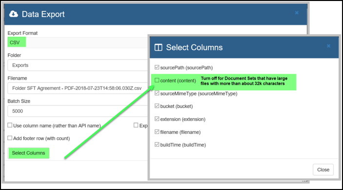
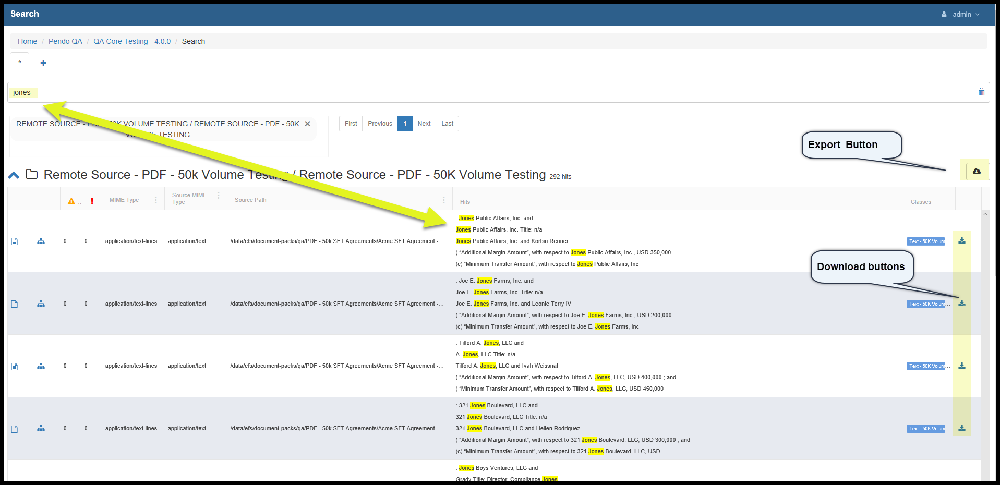

.. _unified-search:

Unified *Search*
======================

Usage
-----

As soon as you *Import* any *Data Sets* and/or *Document Sets,* the *Pendo Platform* creates *Metadata* and all the data is *Indexed*. The *Indexing* allows for several features of the *Pendo Platform* to be realized, including *full-text searches*. This means you can search for words or phrases as if all your varied databases and documents were all one big source of data. You search the data using simple terms such as names or identifiers and the *Pendo Platform* will find all occurrences across all of the Indexed data. More complex searches can be done. The following sections detail examples of how you can use the *Unified Search* box.

There are two different types of searches:

  **1.** 'All-Inclusive’ search – the default search will take your search string and look at **all indices**. This would be the indices from all *Data Sets and Document Sets*.

  **2.** ‘Focused Search’ – the search will take place looking through any **user selected indices**. Please see `focusing a search`_ below.

Search Screen Functional Areas
------------------------------

There are several parts to a search results screen.

**Area 1.** Enter your search string here. There are more details on your syntax options below at :ref:`syntax`

When doing a search of a Data Set or Documents Set, as soon as you put your cursor in the search box, you will see some pre-selected options that experience has shown to be frequently made searches. You can ignore these or use them to help speed things along. Some of these options will have drop-down boxes and some will allow free form text to be added in.

In the example below, the ‘File Extensions’ quick select was chosen. The item came up into the search bar and ‘PDF’ was entered to find all the PDF files in my workspace.

**Area 2.** Focus your search here. The default is to search everything on the *Pendo Platform*, however you may elect to narrow the search. Please see `focusing a search`_ below.

**Area 3.** Results Areas. Here you will see a list of indices that had a match on the search string. The chevron on the left allows you to open/collapse the result set for that index which correlates to that particular *Data Set* or *Document Set*. The icon to the right of the chevron indicates the type of documents or a database.

**Area 4.** If a Search results in more then 10 objects (*Data Sets and Document Sets*), you can paginate to the additional screens.

**PLEASE NOTE**: the pagination boxes at the top of the screen is for paging through **different Data and Document Sets**.

In order to **page through the rows of any given Data or Document Set**, use the area at the bottom of the screen. Also, note that at the far-right end of the search area, there is a trash can that can be used to delete the current search.

**Area 5.** There are one or two buttons here. The search screen for a *Source Data Set* has a button that toggles the column headers between ‘API Name’ and ‘Full Name’.

Exporting Data Sets
~~~~~~~~~~~~~~~~~~~

The *Export* icon |exporticon| exports the contents of the grid to the *Files and Folders* into a folder called *Exports*. You will have the chance to accept or change either the Folder or rename the file being created. To get this file onto your PC, go to *Files and Folders*, open the *Exports* folder, highlight the files and click the 'Download' option. There is no limit to the number of rows that will be available to you.

- **Note:** When exporting, you may specify the folder name into which the data will be put. If you leave the default ‘Exports’, there will be a Folder called Exports and that is where the data will be. If you entered ‘Tom/Jones’, there would be a Folder called Tom, under that would be a Folder called Jones and that is where the data will be.

When you download a Data Set, you may select the columns you wish to download. The default is to export all columns.

the following columns are provided for each row of an export:

* sourcePath - the path of the original file’s location
* content - the test content of the source file. In the case of OCRed documents, the raw result of OCRing
* sourceMimeType= the mime type and character set of the source document
* Bucket - the random bucket assigned to a documents as it is being assigned to an executor for index processing
* filename - name of the original file
* buildTime- time to build the export in milliseconds

**Note**:
  * This feature works best in Data Sets.
  * In Document Sets, the Excel output option will work best.
  * The CSV output option for Document Set will not be formatted correctly when there are files with more than 32,767 characters.  **IN THESE CASES, SIMPLY TURN OFF THE  ‘Content’ COLUMN AS PART OF THE EXPORT** if you need the csv file as opposed to an Excel file. See picture below.
  * The maximum number of characters that can fit in an Excel cell is 32,767.   So the ‘content’ output cells of a Document Set will be truncated at that point, not matter how large any particular Document is.  For example, if you have a 14 page PDF that has been OCRed, the entire content of that file will not fit in one cell.

Please note the slash to be used is / not \\

+------------------------------------+----------------------------------------------------------------------------+
|Folder name used                    | Result                                                                     |
+====================================+============================================================================+
|Tom/Jones                           |'Tom' will be the top lever folder name with 'Jones' as a subdirectory name.|
+------------------------------------+----------------------------------------------------------------------------+
|Tom\\Jones (Please do not do this)  |'Tom\\Jones' is the name of the folder. There is no subdirectory.           |
+------------------------------------+----------------------------------------------------------------------------+

-  A *Manifest* option is available giving the user the option of downloading a JSON file that provides expanded data lineage tracking of the data being downloaded, starting with the source(s) of the data all the way to the data being put into a *Target Data Set*. One of the uses of this is to feed downstream systems such as Ab Initio.
-  To this end, the *Edit Manage Organizations* screen has a field called *Division* that can optionally be filled in. *Division* is a new, non-mandatory level exists outside the *Platfrom* workspace hierarchy, exisitng only in metadata so it can be used as desired by various clients.
-  The *Edit Columns* screen in *Data Sets* also has a tab called *Manifest*. Allowing for additional lineage data tags to be added to the *Column* and exported as part of the *Manifest*.

-  You may wish to be able to *Export* data from a *Data or Document Set* as a JSON file. If you select this option, an additional file with the .json extension will be created in the *Exports Folder*.

Footer
^^^^^^

You have an option to add a Footer row to a .csv export that will have a row count of the export.  The row count does NOT include the header or footer rows, only the data rows. This option only works for the .csf form export.

.. image:: unified_search/exportfootertwo.png

Other Results Area Options
~~~~~~~~~~~~~~~~~~~~~~~~~~

Clicking on the chevron on the far left opens up details of the findings for each *Data Set or Document Set*. Some of the screen options depend on the type of source you are looking at.

Data Set Search Results Areas
---------------------------------

Search Screen Main Areas
~~~~~~~~~~~~~~~~~~~~~~~~~

There are 5 areas highlighted below.

**1.** The icon in the first column will popup a *Detail View* of that record. The next two icons indicate if there was a *Warning* or *Error* that occurred during the processing of that row.

**Hint:** if you want to find all the rows with errors or warning even though you can only see a maximum of 50 rows at a time, you can do a special search of *hasWarning:true* OR *hasErrors:true*. The details of any error or warning can be found in "The Details Button button".

**2.** If a Search results in more then 10 objects (*Data Sets, Document Sets, Document Classes*), you can paginate to the additional screens. Also, note that at the far-right end of the search area, there is a trash can that can be used to delete the current search.

**PLEASE NOTE:** this pagination is for paging through **different Data or Document Sets**. **For any given Data Set**, the area at the bottom (Area 4) allows you to page through the rows in that *Data Set*.

**3.** **Follow the data function**: when you hover your mouse over any row in any column of a *Source Data Set* result, it becomes underlined. Clicking will result in a new search of whatever words were underlined.

**4.** For any given *Data Set* the area at the bottom allows you to page through the rows in that *Data Set*. Hint: remember that despite the fact you are seeing a specified number of rows, if you sort a column you are sorting against the entire result set, not just what you are seeing.

Here you see one or both of the following icons.

The *Export* cloud icon with the arrow exports the contents of the grid to the *Files and Folders* into a folder called *Exports*. You will have the chance to accept or rename the file being created. To get this file onto your PC, you will

- Go to *Files and Folders*
- Open the *Exports* folder
- Highlight the files and click the 'Download' option. There is no limit to the number of rows that will be available to you.

Please see :ref:`Downloading_files` for more details.

**5.** The other button toggles the column header between raw *API Name* and the more user friendly *Name*.

Document Set Search Results Areas
---------------------------------

While the search result area is similar to what is described above, there are several differences.

Export and Download Buttons, "Hit" area
~~~~~~~~~~~~~~~~~~~~~~~~~~~~~~~~~~~~~~~~

"Note: The Document Class Column has been removed for technical reasons"

The *Export* icon |exporticon| exports the contents of the grid to the *Files and Folders* into a folder called *Exports*. You will have the chance to accept or change either the Folder or rename the file being created. To get this file onto your PC, you will

- Go to *Files and Folders*
- Open the *Exports* folder
- Highlight the files and click the 'Download' option. There is no limit to the number of rows that will be available to you.

Please see :ref:`Downloading_Data_from_Files_and_Folders` for more details.

-  The Export button allows you to specify the folder names into which the data will be put. If you leave the default ‘Exports’, there will be a *Folder* called *Exports* and that is where the data will be. If you entered ‘Tom/Jones’, there would be a Folder called Tom, under that would be a Folder called Jones and that is where the data will be.

Please note the slash to be used is / not \\

+-----------------------------------+----------------------------------------------------------------------------+
|Folder name used                   | Result                                                                     |
+===================================+============================================================================+
|Tom/Jones                          | Tom will be the top lever folder name with 'Jones' as a subdirectory name. |
+-----------------------------------+----------------------------------------------------------------------------+
|Tom\\Jones (Please do not do this) | Tom\\Jones is the name of the folder. There is no subdirectory.            |
+-----------------------------------+----------------------------------------------------------------------------+

|
| - A *Manifest* option is available giving the user the option of downloading a JSON file that provides expanded data lineage tracking of the data being downloaded, starting with the source(s) of the data all the way to the data being put into a *Target Data Set*. One of the uses of this is to feed downstream systems such as Ab Initio.
|
|   - To this end, the *Edit Manage Organizations* screen has a field called *Division* that can optionally be filled in. *Division* is a new, non-mandatory level exists outside the *Platfrom* workspace hierarchy, exisitng only in metadata so it can be used as desired by various clients.
-  The *Edit Columns* screen in *Data Sets* also has a tab called *Manifest*. Allowing for additional lineage data tags to be added to the *Column* and exported as part of the *Manifest*.
-  You may wish to be able to *Export* data from a *Data or Document Set* as a JSON file. If you select this option, an additional file with the .json extension will be created in the *Exports Folder*.
-  The download button allows you to download a specific file to your PC.
-  The 'Hits' column highlights in yellow any occurrences of the search term you had entered.

After the first search - how to do more searches
------------------------------------------------

Once you have done the first search, you can initiate a new search in three ways:

1. Enter a new search string, replacing the current search.
2. Click on the + and enter a new search string.
3. ‘Follow the data’ by clicking on almost anything you see.

.. _syntax:

Examples of Search Syntax
-------------------------

There are many types of searches supported.

.. image:: unified_search/45b6bf6b0a0ef640fb8ad1fd27ed4026.png

Here is the syntax supported by the *Platform* Search Engine.

Wildcard Searches
~~~~~~~~~~~~~~~~~

Both single and multiple character wildcard searches within single words is supported.

-  To perform a single character wildcard search use the "?" symbol.
-  To perform a multiple character wildcard search use the "\*" symbol.
-  The single character wildcard search looks for terms that match that
   with the single character replaced.

For example, to search for "text" or "test" you can use the
search:"te?t"

Multiple character wildcard searches looks for 0 or more characters. For
example, to search for test, tests or tester, you can use the search:
test\*.

You can also use the wildcard searches in the middle of a term: "te\*t".

Note: You cannot use a \* or ? symbol as the first character of a search.

Regular Expression Searches
~~~~~~~~~~~~~~~~~~~~~~~~~~~

Regular expression searches matching a pattern between forward slashes "/". The current supported syntax is documented in the RegEx class. For example to find documents containing "moat" or "boat": /[mb]oat/

For more information, please go to `Regular Expression Reference Page <http://www.regular-expressions.info/>`_ for all available syntax options. This is a very feature rich syntax. Please be sure to select **Java** as the flavor of RegEx.

Fuzzy Searches
~~~~~~~~~~~~~~

Fuzzy searches based on Damerau-Levenshtein Distance. To do a fuzzy search use the tilde, "~", symbol at the end of a single word term. For example to search for a term similar in spelling to "roam" use the fuzzy search: "roam~". This search will find terms like foam and roams.

An additional (optional) parameter can specify the maximum number of edits allowed. The value is between 0 and 2, For example: roam~1

The default that is used if the parameter is not given is 2 edit distances.

Proximity Searches
~~~~~~~~~~~~~~~~~~

Finding words that are a within a specified distance away. To do a proximity search use the tilde, "~", symbol at the end of a Phrase. For example to search for the words “loan" and "bank" to be within 5 words of each other in a document use the search: "loan bank"~5.

Boolean Operators
~~~~~~~~~~~~~~~~~

Boolean operators allow terms to be combined through logic operators. Supported Boolean operators are AND, "+", OR, NOT and "-". (***Note: Boolean operators must be ALL CAPS***).

OR
'''

The OR operator is the default conjunction operator. This means that if there is no Boolean operator between two terms, the OR operator is used. The OR operator links two terms and finds a matching document if either of the terms exist in a document. This is equivalent to a union using sets. The two symbols \|\| can be used in place of the word OR.

To search for documents that contain either "bank of america" or just "bofa" use the query:

"bank of america" bofa

or

"bank of america" OR bofa

AND
'''

The AND operator matches documents where both terms exist anywhere in the text of a single document. This is equivalent to an intersection using sets. The symbol & can be used in place of the word AND.

To search for documents that contain "bad" and "student loan" use the
query:

"bad" AND "student loan"

**+**  (the plus sign)
'''''''''''''''''''''''

The "+" or required operator requires that the term after the "+" symbol exist somewhere in the field of a single document.

To search for documents that must contain "student loan" and may contain "bad" use the query:

+”student loan” bad

NOT
'''

The NOT operator excludes documents that contain the term after NOT. This is equivalent to a difference using sets. The symbol ! can be used in place of the word NOT.

To search for documents that contain "loan" but not "mortgage" use the query:

"loan" NOT "mortgage"

Note: The NOT operator cannot be used with just one term. For example, the following search will return no results:

NOT mortgage

**-** (minus sign)
''''''''''''''''''

The "-" or prohibit operator excludes documents that contain the term after the "-" symbol.

To search for documents that contain "student loan" but not "home loan" use the query:

"student loan" -"home loan"

Grouping
~~~~~~~~~~

Supports using parentheses to group clauses to form sub queries. This can be very useful if you want to control the boolean logic for a query.

To search for either "student" or "home" and "loan" use the query:

(student OR home) AND loan

Field Grouping
~~~~~~~~~~~~~~~

Supports using parentheses to group multiple clauses to a single field.

To search for a title that contains both the word "return" and the phrase "pink panther" use the query:

title:(+return +"pink panther")

Escaping Special Characters
---------------------------

The *Platform* supports escaping special characters that are part of the query syntax. The current list special characters are

   -  && \|\| ! ( ) { } [ ] ^ " ~ \* ? : \\ /

To escape these character use the \\ before the character. For example to
search for (1+1):2 use the query: \\(1+1\\)\\:2 because the parentheses
and the colon are special characters.

Advanced Searches
------------------

Beyond Google-like searches across all the data in your *Workspace*, here are several advanced search methods:

- Focusing a search to a specific object such as an *Data Set* or a *Document Set*.
- Focusing a Search to a specific *Column*.
- Focusing a Search to a *Warning* or *Error* condition
- Taking advantage of cross-referencing abilities between a specified *Target Data Set, Document Sets* and all *Target Data Sets* that have had data extracted from a *Document Set*.

.. _focusing a Search:

Focusing a Search
~~~~~~~~~~~~~~~~~

After doing a general search across all data, putting a filter, or *scope* in place is easy.

Note that the 'Scope' section of the screen is directly below the 'search text box'. When the scope box is empty, using all sources is the default behavior.

Just click in the scope box to see a list of all the *Data Sets* and *Document Sets* that are in your *Workspace* and select one of them. This limits your search to the item or items selected.

You may continue to click in the scope box to select as many items as you wish as seen below. Just select whatever you wish in the 'Select Indices' drop-down' as seen in 'Area 1' below. When you are done selecting the scope, move your cursor up to the search text box, 'Area 2' below, and press Enter to re-invoke the search with the new scope.

Another way to focus a search is automatic. From within any of the *Components* that have a *Search* option, clicking the *Search* button will automatically invoke the *Unified Search* with a context-sensitive *Scope* already in place.

.. image:: unified_search/2f5da943cc15b29594466aff3383c625.png

Limiting the Scope of a Search to a specific *Column*
~~~~~~~~~~~~~~~~~~~~~~~~~~~~~~~~~~~~~~~~~~~~~~~~~~~~~

|
| You may wish to restrict the *Scope* of a search to a specific *Column  Name*. This can be done by following this layout in the search box:
|  Column api name: search syntax.
| Note that nothing is case-sensitive. For example, you could type
|  city:"new york"
| and produce a result set as shown below. NOTE: If more   than one *Data Set* has the same field name, they would all be displayed.
|

|
| Note the difference between just entering
|   "new york"
|  and entering
|   city:"new york"
|
| - Entering just "new york" would return a hit for both the word 'new' and 'york', even if not together and no matter what Column the data is in, no matter what field 'new york' was found in.
| - Entering city:"new york" would return results only when the phrase "new york" is in a *Column* with the exact name of *city*.
|
| - This approach can be combined with the others mentioned above. For example:
|   loan_type:"Loan Agreement" NOT Construction
| would give results for text "Loan Agreement" found in the column loan_type so long as the word 'Construction' was not also in the same field.
|

Limiting the Scope of a Search to a *Warning* or *Error* condition
~~~~~~~~~~~~~~~~~~~~~~~~~~~~~~~~~~~~~~~~~~~~~~~~~~~~~~~~~~~~~~~~~~~

You can search for Warnings or Errors. Sometimes, when a Document Set    data is *Indexed*, or when a *Document Class* is attached there is an    issue. There may be a warning or error generated by the *Platform*. Such errors can occur when a file being indexed is corrupt, not eligible for the selected *Plugin* or when there was an error in a manually entered *Python, Groovy, RegEX* or other script. The *Pendo Platform* is designed to note the error and continue Indexing. You may enter either of the specialized search strings

  ‘hasWarning:true’ or

  ‘hasErrors:true’ without the quotes.

If you want both in a single search, just enter

  'hasErrors:true OR hasWarnings:true' without the quotes.

If there are *Warnings* or *Errors* you will get results and can act on them.

Specific *Target Data Set -> Source Documents -> any Target Data Sets* connected to the *Document Class*
~~~~~~~~~~~~~~~~~~~~~~~~~~~~~~~~~~~~~~~~~~~~~~~~~~~~~~~~~~~~~~~~~~~~~~~~~~~~~~~~~~~~~~~~~~~~~~~~~~~~~~~~

When searching an *Data Set Type = Target*, the *Platform* has extensive cross-referencing, allowing you to easily move from viewing any row in *Target Data Set* to being able to download the *Source Document* to being able to see all *Classifications* in which the *Source Document* is participating.

Doing a *Search* on a *Target Data Set* would show a screen like this, with the *Details* and *Directed Search* buttons are located toward the left
side of the Data Set Grid.

.. image:: unified_search/40d862d7427cc369e99303eef0a272d0.png

The *Details* Icon
'''''''''''''''''''

This invokes a popup with several tabs.

*Source Document* gives a representation of the original documents as the *Platform Index* interpreted it during import. The visualization will look very similar to the original document without any format related information (font, size, color, bold, etc.). This screen will look like an Excel spreadsheet if the original document was a spreadsheet, like a Word document if the original document was a Word file, etc.

* *Metadata* gives the platform's stored metadata about the file in question. There is *Platform* generated 'File Metadata', and, if elected during the plugin selections, 'Extracted Metadata' from the source such as Author, Date Created, Last Updated and so on.
* *Raw* shows the information stored in the index. This can be very useful for technical people when making a *Document Class*.

* *Features* give specialized input provided to certain Plugins that may be installed in the future.

* *Warning and Errors* shows *Warnings* or *Errors* that occurred during import, indexing or *Attaching* of this file.

* *Technical* gives some technical information about the file.

The Directed Search icon
~~~~~~~~~~~~~~~~~~~~~~~~~~

Doing a *Search* on a *Target Data Set* would show a screen like this:

.. image:: unified_search/40d862d7427cc369e99303eef0a272d0.png

Clicking the *Directed Search* icon the first time takes you to *Search* which show the *Source Document* - which can be downloaded by clicking the right-most icon. If the *Directed Search* button is clicked again, the *Search* returns all *Target Data Sets* into which the data from the *Source Document* has been extracted via a *Document Class Attach*

Metadata Enhancement
---------------------

You may need to know how large an incoming file was or how many pages were contained in it. This is populated in the metadata object on the document when the Platform is reading from the file system (F&F) or a Remote Sources of file type = folder.
The information can be found when doing a Search of any available Document Set that was processed with LeadTools and had the option turned on.  Open the Detail view, go to the RAW tab and search for ‘metadata’ using Ctrl-F.

.. image:: data_exploration/metaexport.png
